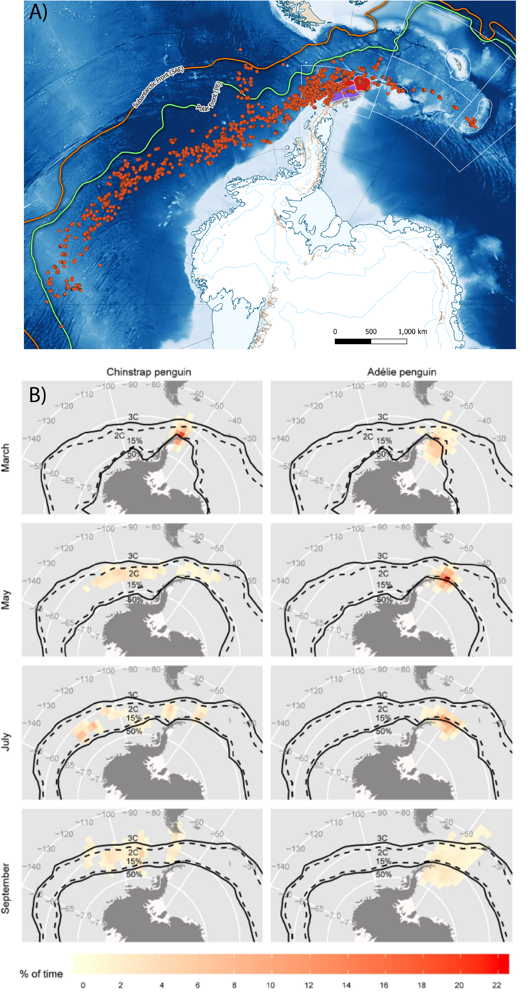
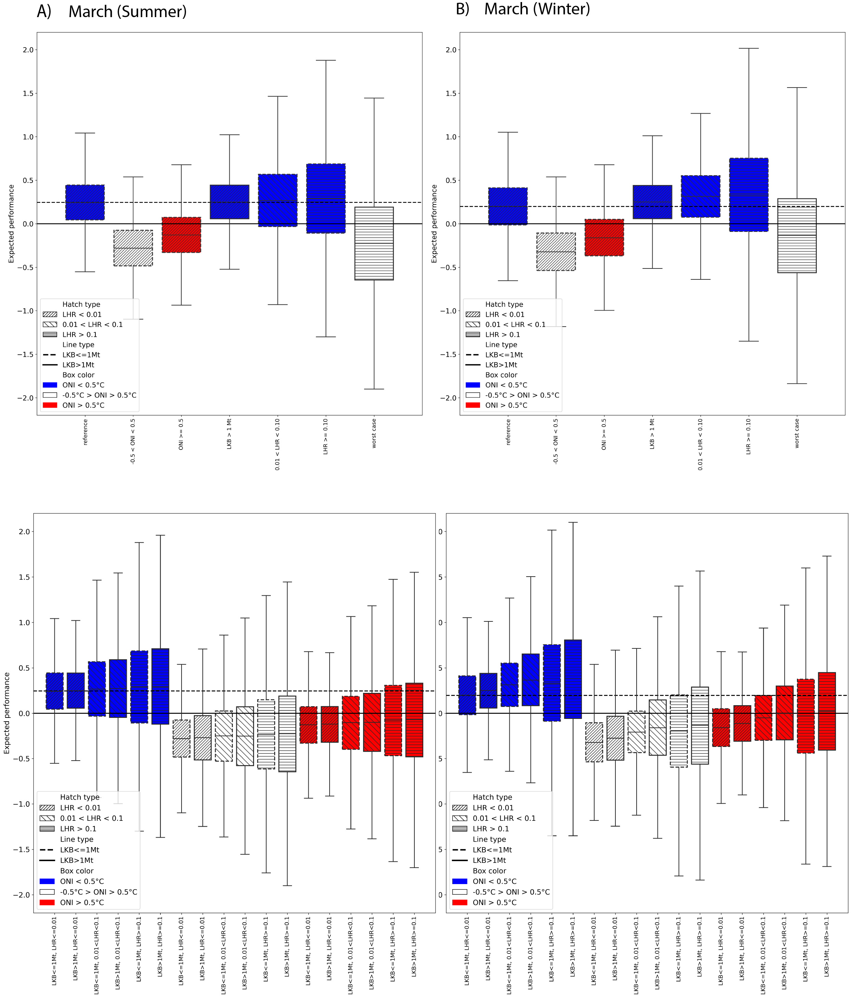
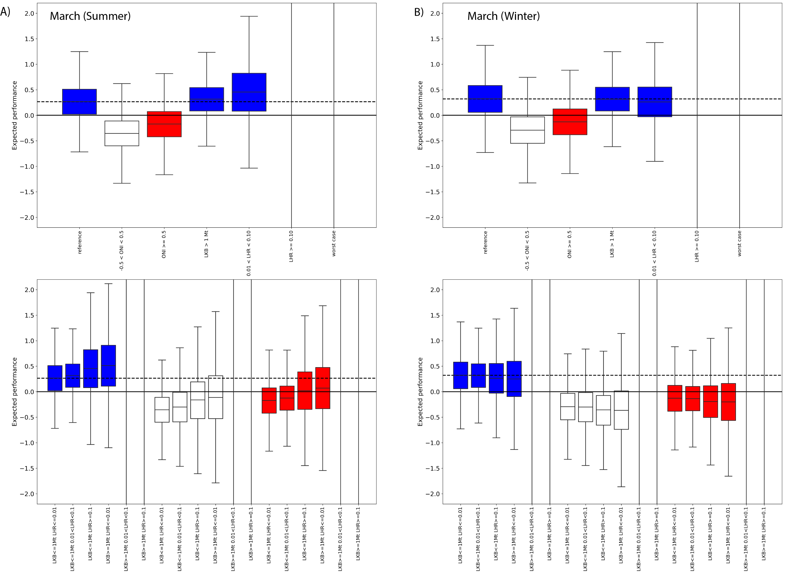
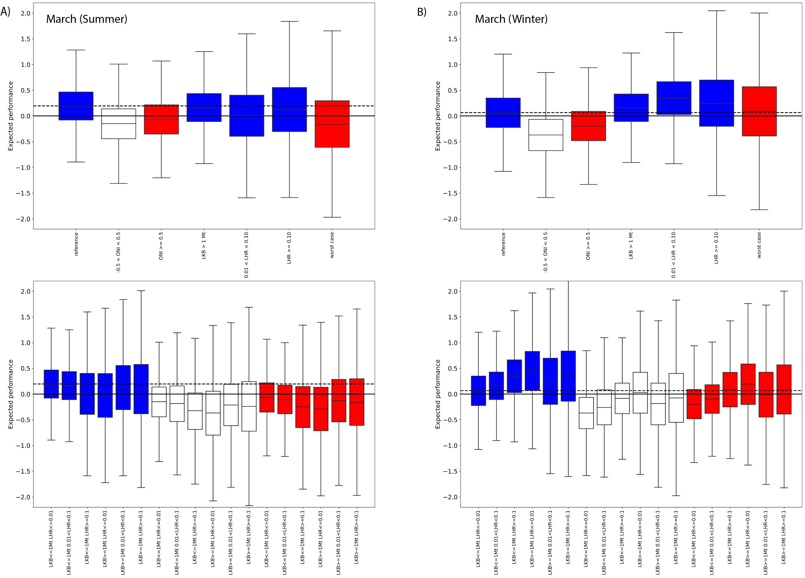
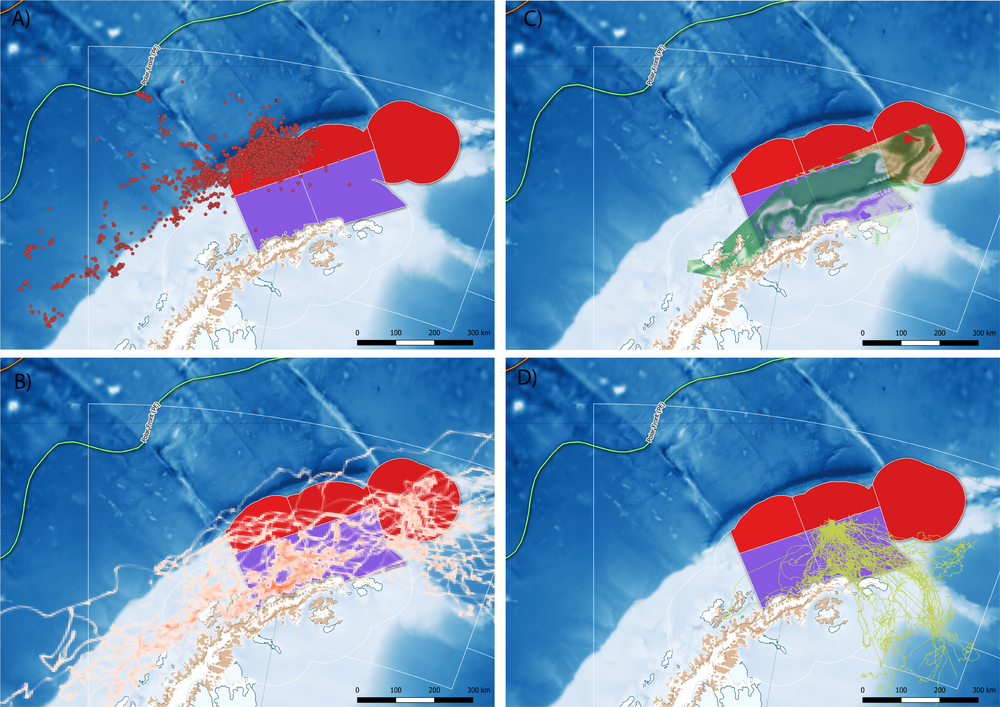
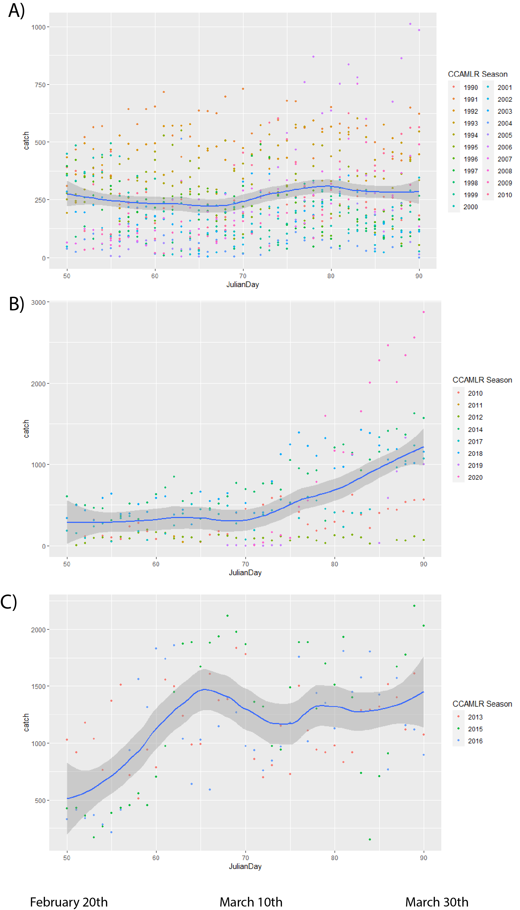
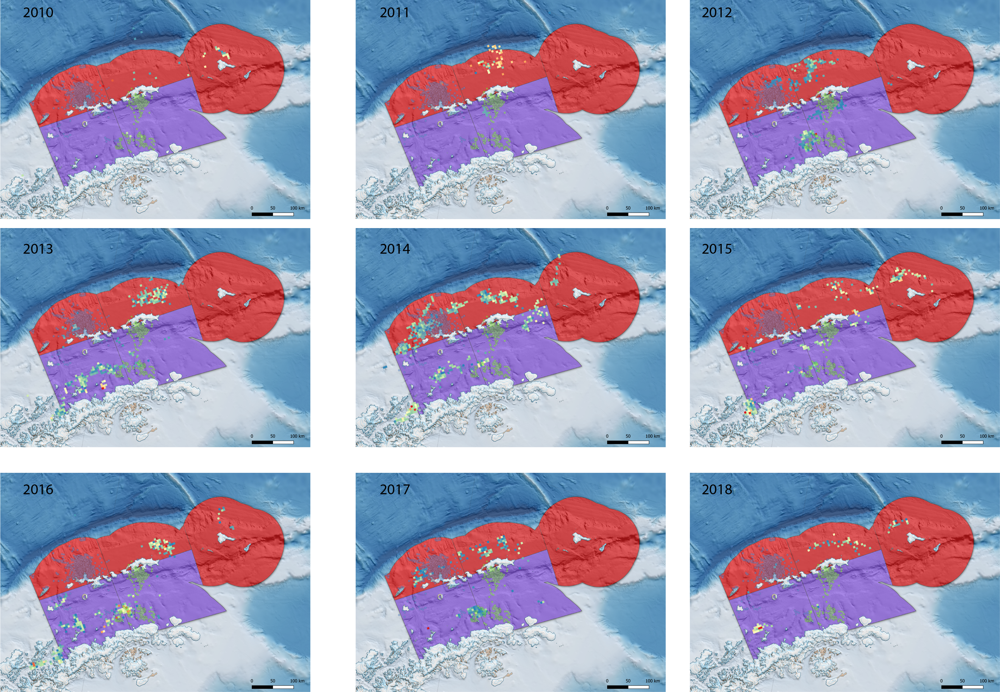

````{r setup, include=FALSE}
knitr::opts_chunk$set(echo = TRUE, comment=NA)
options(knitr.kable.NA = '\\-')
library(trip)
library(raster)
library(rgdal)
library(lubridate)
library(tidyverse)
library(sf)
library(raster)
library(kableExtra)
library(RefManageR)
library(bibtex)
library(rbbt)
library(pander)
library(track2KBA)
library(knitr)
library(lmerTest)
library(tabulizer)
library(tabulizerjars)
````

````{r read in content, include=FALSE}
#table original
d.org = read_csv("hr_derived_s_original.csv",col_types="dddfd")
#table 37a
d37a = read_csv("hr_derived_s_37.csv",col_types="dddfd")
#table 37b
d37b = read_csv("hr_derived_s_37b.csv",col_types="dddfd")
#table 38
d38 = read_csv("hr_derived_s_38.csv",col_types="dddfd")
#table 39
#d39 = read_csv("hr_derived_s_39.csv",col_types="dddfd")
#table 40
#d40 = read_csv("hr_derived_s_40.csv",col_types="dddfd")
#table 41
#d41 = read_csv("hr_derived_s_41.csv",col_types="dddfd")
source('KrugerAnalyses.R')

````

Introduction
============

Concerns over the potential impact of localised depletion of krill through concentrated fishing effort on krill-dependent predators has been a topic of debate within SC-CAMLR and its Working Groups for many years.  Recently, two studies have been presented that suggest that local harvesting rates can impact predator performance to the same degree as poor environmental conditions [@Watters2020] and when poor climactic conditions are coupled to locally high harvest rates the synergistic impacts on predators are evident [@Kruger2021].  

While both studies attempt to tackle the same overall problem, they do so using very different methodologies. @Watters2020 exploit a considerable dataset; a substantial multi-species time series of a large number of penguin performance indices (including those collected under CEMP) collected over three decades at two sites (Cape Shireff on Livingstone Island and Copacabana on King George Island, South Shetland Islands; Figure 1) and over a decade of summer acoustic krill surveys that cover the at-sea distributions of Chinstrap, gentoo and Adélie penguins. Drawing in monthly krill catch statistics from the C1 Catch and Effort dataset and climactic data (Oceanic Niño Index; ONI), the authors use a hierarchical analysis of variance approach to estimate the variance in performance indices as a function of Local Krill Biomass (LKB), Local Harvesting Rates (LHR; the ratio of krill catch to LKB) and ONI.  In contrast, @Kruger2021 utilise a broader range of penguin colonies across the same three species throughout the Antarctic Peninsula area, in combination with their respective abundance survey estimates (number of occupied nests) from an open-source database (www.penguinmap.org).  The authors calculate population trends for appropriate sites, and using the CCAMLR C1 Catch and Effort data to extract annual catch values within a 30km radius of each colony.  Finally, @Kruger2021 use the sign of the difference in the number of nests between annual surveys as a response in a binomial generalised linear mixed effects model using the accumulated annual catch and the mean wintertime Southern Annular Mode (SAM) to determine the relative contributions of each predictor and their interactive effects on population abundance trends. Both studies draw similar conclusions; that local harvesting levels of krill impact predators, and the degree of impact can either be similar to that of poor environmental conditions or have a synergistic impact when high local harvesting coincides with poor conditions. 


These conclusions have been propagated into Commission documentation supporting the reformulation of the D1MPA proposal (CCAMLR-39/BG/02) as well as into Commission discussions (CCAMLR-39, Para 5.48 & Para 5.51). However,  while the two studies have moved from Working Papers of EMM into the realm of the peer-reviewed literature, there are some areas of concern regarding the structuring of these studies that we think deserve attention.  Some of these concerns are unique to each study while others are common across both, and we structure our paper accordingly.  Firstly, we review @Watters2020 and @Kruger2021 through the lens of some of the ecological assumptions made versus the available evidence pertaining to them.  Within the constraints of the data and analytical methods that are available from the studies, we also quantify how rationalising these assumptions to the evidence available impacts on the conclusions drawn.  We then highlight some overarching concerns applicable to both papers. 

@Watters2020 / WG-EMM 2019/11
================================
A key goal for the paper is to highlight the mismatch between the areal scales of fisheries management and ecological interactions between fishing extractions and dependent predators. To do this, the authors create two strata aligned with groups of SSMU (gSSMU); gSSMU #1 including those SSMU inside the Bransfield Strait (APBSE and APBSW) and gSSMU #2 incorporating SSMU north of the South Shetlands, including Elephant Island (APDPE, APDPW and APEI) represented in Figure 1. These gSSMU cover $15,500nm^2$ and $20,600nm^2$, respectively, and are used to characterise both krill biomass and harvesting rates that are "local" to the penguin colonies for which performance data are used. The reasoning behind scaling to gSSMU are linked to the foraging behaviour of the penguins for which performance data area available i.e. breeding, adult pygoscelids.  The authors cite @Hinke2017 as the evidence supporting usage of the two gSSMU as appropriate strata. 

Pygoscelid penguins exhibit staggered breeding, with Adélies commencing first, followed by Chinstraps then Gentoos [@Black2016].  Adélie penguins are the first to fledge their chicks and thus cease to be centrally foraging, typically departing mid-February for their moulting grounds on the sea ice.  Chinstrap penguins depart for a pre-moult foraging trip towards the end of February and return to land in order to moult, before departing again for their overwinter trip [@Hinke2015; @Hinke2019](Figure 2).  Conversely, Gentoo penguins appear to remain in close proximity to their breeding colonies overwinter [@korczak-abshireCoastalRegionsNorthern2021].

We use the Argos-CLS PTT telemetry data provided by the supporting studies to characterise the actual at-sea habitat used, in the context of the relative stage of breeding for each species (though we also recommend @Warwick-Evans2018 and Lowther et al. (this meeting) amongst other work, for further quantification of foraging behaviour of breeding penguins in this area). For each species, we refrain from undertaking extensive state-space modelling of location errors and merely exclude locations with a "Z" error class, accepting the remaining locations had varying degrees of uncertainty around them, then calculated the 99% Minimum Convex Polygon (home range) using the R package *"adehabitatHR"*and their  associated areas in $nm^2$. For Chinstrap penguins at Cape Shireff, this equated to a home range area of ~$4,782nm^2$, or only 23% of the gSSMU to which their performance metrics are indexed against [@Watters2020].  For the same species at Copacabana the 99% MCP home range is 2,905$nm^2$, or ~19% of gSSMU 1 in the Bransfield Strait. Similarly for Adélie penguins, the breeding foraging range occupied 1,139$nm^2$ or only ~7% of the area of gSSMU #1. After breeding, available overwinter PTT telemetry and light geolocating data on chinstrap and Adélie penguins suggests a wide dispersal westwards into the Pacific sector of the Southern Ocean, and eastwards into the Weddell Sea and Atlantic sectors, with a relatively small proportion of chinstraps from the study sites remaining within 500km of their breeding colonies [@Hinke2019].  Yet despite the evidence supporting widescale post-breeding migration of both Adélie and Chinstrap penguins, the model used by @Watters2020 constrains both species from Copacabana to gSSMU 1 and Chinstraps from Cape Shireff to gSSMU 2 over winter (Supplementary Material 1 & 2, code lines 258 to 259).  This has the effect of constraining the variability in performance indices from these species to LHR, LKB and ONI over winter in areas where the species has a demonstrated tendency to migrate away from.  This is particularly important given that the fishery can now be characterised with a late autumn/early winter start which places a seasonal element on LHR towards increased values in the winter (Figure 4). 

Our preliminary review thus far raises two areas of concern.  Firstly, that the scales at which "local" predictors are summarised are in some cases five times larger than the habitat exploited by the penguins monitored. Local Harvest Rate is a function of the catch and its distribution;  we demonstrate catch variability across breeding seasons within the original gSSMU, using available C1 Catch and Effort data during the austral summer period, relevant to the breeding season and thus centrally foraging Adélie and Chinstrap penguins between 2009 and 2018 for Subarea 48.1 (Supplementary Figure 1). 

Secondly, that the known overwinter migratory behaviour of Adélie and Chinstrap penguins are poorly reflected in the model formulation.  To demonstrate the impact that these ecological assumptions have on the model output, we rerun the model of @Watters2020 with modified code.  To avoid an overly burdensome paper, we shortly summarise those code changes here, and if requested during the meeting we are happy to include the rmarkdown version of this paper with the modified code in place, or submit the modifications to the meeting in some other format. 

We also note an additional coding error that may influence how the original, unmodified results are interpreted.  In summarising the model outputs into boxplots, the code relating to developing Figure 2 (Supplementary Material 1, lines 661-665) seemingly classifies the "Worst Case" with "neutral" ONI (${-0.5}$ $^{\circ}$C < ONI < 0.5 $^{\circ}$C; LKB > 1 Mt; and LHR $\geqslant$ 0.1) using Parameter set 36 from the output dataframe, which actually reflects a "warm" ONI component (> 0.5 $^{\circ}$C; LKB > 1 Mt; and LHR $\geqslant$ 0.1). Yet the discussion in @Watters2020 suggests that the likelihood of their "Worst Case" includes future warming.

We agree that any "Worst Case" should reflect ENSO conditions into the future under a warming climate.  However, climate change is likely to increase ENSO in amplitude - both El Niño (ONI "warm") and La Niña (ONI "cold") [@capotondiUnderstandingENSODiversity2015]. How this increasing amplitude can be integrated appropriately into the presented modelling framework to match with long-term predicted mean performance of predators has not been explored yet. As such, and for the sake of comparison with the original study, we maintain the authors designation of ONI "neutral" when rendering the "Worst Case" boxplots, though caution that this is unlikely to be a realistic expectation.  
\newline
*Modifications*  
1. We scale the gSSMU LKB to the SSMU that the summer tracking data indicate penguins occupied. To do this, we calculate the area ($nm^2$) of the SSMU for which the predator occupies and the gSSMU to which it is assigned, then create a scaling ratio.  For example, we scale LKB for Cape Shireff Chinstrap penguins solely to ADPDW (Figure 1) by multiplying the gSSMU LKB by the areal ratio of ADPDW/gSSMU #2. We then select the corresponding SSMU catch values provided in @Watters2020 to estimate SSMU-scale LHR.  We also caution that while considering the gSSMU scale of harvesting as inappropriate for "local" effects, even the SSMU-scale catch levels likely do not reflect pressures at scales relevant to breeding penguins (Supplementary Figure 1). 
2. We remove Adélie and Chinstrap penguins from the model formulation over winter; that is, we attribute each species as "NA" during winter (to account for dsipersal after breeding), thus removing them from association with any gSSMU.  
3. The authors place LKB/LHR values in March into the "summer" period. However fishing effort over the period that performance indices are available is not uniform over the thirty year period, with catch over the preceding decade showing a nonlinear increase from the middle of March and three years where catch rates increased rapidly from the beginning of the month (Figure 4).  Given the highly variable rates of catch throughout the study period, we run scenarios that classify March as either summer or winter to reflect the linkage between March and the breeding state of penguins i.e. Adélie and Chinstrap penguins have either migrated out of the area or have ceased to be centrally foraging species by March.    

Thus we reformulate the underlying assumptions above into a new model construct, in which performance indices from all three species during the summer are included, but Adélie and Chinstrap penguins cease to be centrally foraging species after breeding and migrate out of the area. The performance indices are matched in space and time but using SSMU level estimates of LKB and LHR.  We re-run this reformulation using the original analysis of variance model framework that includes imputed values for LKB in years where survey data are missing. We further consider two alternatives for considering March, either in a) summer or b) winter.

We present the outputs both in the same boxplot format as Figure 2 in the original manuscript, and as individual cases grouped and colour-coded as ONI "warm" ($\geqslant$ 0.5; red), ONI "neutral" (-0.5 < ONI > +0.5; white) and ONI "cold" (< -0.5; blue).  We also recreate the original marginal probabilities in Table 1 of @Watters2020, and two additional tables in the same format with the probabilities extracted from our reformulated model, the difference between the latter two tables reflecting whether March is in summer or winter.    
\newline  
*Results*  
From the original @Watters2020 model, the probability that the Worst Case would cause penguin performance indices to drop below their long-term mean was 77%, while relative to the Best Case there was a 93% probability that penguin performance would decline as a response to high LHR.  Similarly, there was a 99% probability that high LHR and LKB under neutral ONI ("Worst Case", though see above for comments on this) would drive penguin peformance to fall below its long term mean (Table 1). 

Our reformulation paints a very different picture, and while we refrain from providing an exhaustive in-text comparison, we highlight a few examples here. Comparing the original model outputs with ours, relative to the Best Case, the probability of negative impacts to penguins due to high LHR dropped precipitously from $\geqslant$ 93% to 37% (Table 3). In other words, considering the migration of penguins in accordance with their known ecology, the relative probability of negative impact of LHR drops from a near-certainty to 1-in-3 (Table 2 and 3). Given the temporal separation between fishing and penguin breeding over the preceding decade, our results are unsurprising.  

The probability that the effects of warm or neutral ONI would be more detrimental to penguin performance were greater than for the Worst Case (Table 2 and 3). When we consider the marginal effects of neutral ONI and high LHR, the probabilities that the former would negatively impact penguin performance below the long-term mean was x4 greater than the impact of high LHR (Table 2 and 3).  Looking at the case-by-case and selected plots in Figure 3 the overwhelming dominace of the ONI state can clearly be seen. La Niña ("cold" ONI) conditions resulted in predictive probabilities of performance that were equal to, or surpassing, those of the Best Case irrespective of increased LKB or LHR. Even more bizarrely, an increase in LHR to even high levels has a lower probability of decreasing penguin performance than the Best Case (Table 2 and 3).  It is important to note that, overall our intention is not to suggest that increased fishing is beneficial; merely that when the model is reconditioned on ecological knowledge, the outputs in its current formulation should be treated with caution. 

Thus while the authors contend that they have little doubt that penguins are responding to both the environment and fishing, we contend that they are reacting to the environment, and the scales at which their model incorporates fishing bear no relevance to the scales at which penguins exploit.   The authors of the original model also identifying an insensitivity of penguin performance to marginal changes in LKB and as reflecting previous failed attempts to parameterise functional responses of penguins - we fully agree as our reanalysis draws similar conclusions of insensitivity, but we propose that even the SSMU scale is inappropriate for matching food availability and harvesting pressure to predator performance (Figure X).  

@Kruger2021 / WG-EMM 2019/10
============================
The key objective of the paper by @Kruger2021 is to examine the potential synergistic effects of climate change and increased fishing activity in recent decades on the breeding performance of Chinstrap and gentoo penguins. The authors make  the implicit assumption that there has been a general decrease in krill density in response to climate change, although this is still a topic of debate and is not supported by recent large-scale surveys in the Scotia Sea (SG-ASAM 2019/08 Rev.1).

***Perhaps describe the model already here, to set the scene for the data input issues? - YEP***

To address this topic, the authors use data on the number of occupied nests (breeding pairs) counted at a large number of sites throughout the Antarctic Peninsula between 1980 and 2017. These data are available from the Mapping Application for Penguin Populations and Projected Dynamics (MAPPPD) data archive (www.penguinmap.com; @Humphries2017). @Kruger2021 include count data on occupied nests based on surveys carried out in November or December, reflecting the early breeding season. They further subset the data to include only colonies for which at least 2 survey estimates are available throughout the 38-year period under consideration (i.e. 1980-2017). These data are provided in the supplementary materials for the paper. Based on the raw counts, they calculate an index of temporal variation in population growth rate using: 
$$\lambda_{std}=((n_b/n_a)/years_{b-a}-1$$
where $n$ is the number of breeding pairs counted in Nov-Dec of a given year, $b$ and the number of breeding pairs counted in the nearest previous year $a$ in which a Nov-Dec survey was conducted, divided by the interval between surveys (i.e. $b-a$). While this index may be a robust index of population change, the authors then convert $\lambda_{std}$ into a binary index, $bin\lambda_{std}$ that takes the value 1 for negative growth and 0 for positive growth. The rationale is that this value can be interpreted as the probability of population decline (irrespective of its magnitude) in response to catch and environmental change.  However by only taking the sign of the change and creating a binary response the authors completely ignores the magnitude of the absolute or relative this change in population size; that is, a decline of 1% or 99% is considered equivalent in the model. 

Another problem with this index is the interval between consecutive surveys. Based on the @Kruger2021 supplementary dataset, intervals between surveys exceeding one year are relatively common (intervals >1 year: `r round(gaptab[2,1])`% for `r colnames(gaptab)[1]`s and `r round(gaptab[2,2])`% for `r colnames(gaptab)[2]`s; intervals >2 years: `r round(gaptab[3,1])`% for `r colnames(gaptab)[1]`s and `r round(gaptab[3,2])`% for `r colnames(gaptab)[2]`s, Table 1). As we describe below, these larger intervals may represent a temporal mismatch problem, given the fact that response variables only represent conditions within the one year prior to the breeding season.  

As in the case of @Watters2020, @Kruger2021 also use CCAMLR C1 Catch and Effort data from the krill fishery to estimate fishing pressure, but in this case only hauls within a 30km radius are considered for each specific colony. This selection is based previous observations that foraging of pygoscelid penguins is more probable within 30 km of the colonies during the breeding season [@Warwick-Evans2018]. While they initially summarise these data within distinct time periods (reflecting different important stages of the penguin annual cycle), these are only used for illustrative purposes [Fig 3 in @Kruger2021]. When modelling the effect of fisheries on population response, the authors then use accumulated annual catches within these 30km areas, making the assumption that the number of breeding penguins counted in a given survey is affected by resource availability in the immediate vicinity of their specific breeding colonies during the non-breeding period in winter. While this might be valid for gentoo penguins which appear to remain close to the breeding colonies also outside the breeding season [@korczak-abshireCoastalRegionsNorthern2021], it is questionable how appropriate this is for Chinstraps that disperse much more widely during winter (see above section and references therein). This spatio-temporal mismatch problem is further exacerbated in cases where intervals between consecutive breeding population surveys exceed one year (Table 4).

The authors use monthly data on the Southern Annular Mode (SAM) index to represent environmental variability  [@doddridgeModulationSeasonalCycle2017; @kwokSpatialPatternsVariability2002]. Based on an observed 0-3 month lagged correlation between SAM and relevant local climate variables (fractional sea ice cover, open water sensible heat flux and sea level air pressure), the authors exclude SAM values for months coinciding with the breeding season. As discussed in the review of @Watters2020 above, the climactic conditions over the WAP are a function primarily of the Amundsen Sea Low and its interactions with both ENSO and SAM as well as the bathymetry of the local areas.  There is a rich scientific literature addressing climate-driven hydrographic variability in the WAP , none of which is considered in this paper. 

To test statistically the effects of local fishing pressure and environmental conditions on penguin breeding performance, @Kruger2021 fit a binomial Generalized Linear Mixed Effects model of the form:
$$bin\lambda_{std}=catch_y*SAM+(1|colony\text{ }ID)$$
where $catch_y$ is the accumulated krill catch within 30km of each colony during the year immediately leading up to the second survey in an interval (i.e. equivalent to $year_b$ in the population growth rate equation above), SAM is the SAM index  during the winter prior to the same survey (i.e. temporally overlapping with most of the catch data accumulation period) while the term in brackets indicate a random intercept effect on colony. Fundamentally, unlike in the case of @Watters2020, scripts are not provided for the analyses done by @Kruger2021, and therefore we have not been able to recreate the original dataset, their analyses or test various aspects of data input, underlying assumptions and alternative model formulations. Over 50% of the gentoo penguin colonies examined have never been exposed to positive catch rates within the 30km radius.  As such, our concerns lie in the underlying assumptions, and we would welcome the opportunity to collaborate openly on a) recreating these analyses and b) testing their sensitivity to the assumptions made.

3. The validity of linear interpolation across multiple years (>1) has not been analysed.

7. No consideration of lagged recruitment (fledging to reproductive age) nor ability to detect lagged recruitment with irregular surveying effort / lack of banding

**Problem 1: There's clearly some discrepancies in amounts of data here that we may need to approach the authors about.**

**Problem 2: How representative is this rate value for a specific year, in the cases where it has been calcluated as a linear change over a period of several years between surveys?**

**Problem 3: Is it appropriate to use annually accumulated catch as an explanatory variable to explain number of breeding pairs observed in Nov-Dec?**

**Problem 4: In the case of gentoos, half of the sites never have positive catch rates within 30 km, while for chinstraps the situation is not so bad. How does this explain the model fits and conclusions of Kruger et al.?**

**Problem 5: If no other climate variables are included in the model, does their argument really make sense? Why exclude SAM during the breeding period?**

**Problem 6. According to the documentation ,this package only appears to have the capacity to fit a simple LMME, which does not allow for a binomial response - SEE ABOVE COMMENT - lmerTest loads in lmer4 which as binomialGLMM capability ?**

Discussion
==========
Our preliminary review of the evidence supporting localised effects of fishing coupled with broad-scale climactic phenomena having an impact on the vital statistics of pygoscelid penguins (performance and demographic trends) are based on assumptions that potentially do not reflect current knowledge of penguin breeding phenology and movement.  
  
Of greatest concern, however, is that the interpretation of model outputs from both approaches (either from both the original studies or the modified parameters we describe) are under boundary conditions that we feel are not appropriate. Both approaches consider only the fishery and broad-scale climate phenomena as the only two causes of krill abundance variability at geographic scales relevant to penguins.  Neither study considers, for example, the impact of rebounding baleen whale populations or migratory male Antarctic fur seals beyond brief mentioning. HUmpback whales have increased in abundance throughout the life of the krill fishery, and there are sufficient telemetry and distance sampling studies in the scientific literature to demonstrate the degree and significance of spatiotemporal overlap with breeding penguin populations (see @Santora2013, @Lowther2020, Oosthuizen et al., Johannessen et al. and Lowther et al. submitted to this meeting, and Figure 3 as examples). Importantly, the distribution of these and numerous other unconsidered competitors is not uniform in either space or time, and their impact on local availability of krill is likely to be considerable.

Similarly, the utilisation of broad-scale climatological phenomena to characterise impacts at scales that predators are dependent upon is problematic. The Amundsen Sea Low (ASL) is the dominant climate feature for the western Antarctic Peninsula.  The El Niño Southern Oscillation (ENSO) modulates the the ASL, with El Niño (La Niña) shallowing (deepening) its pressure, causing more northwesterly (southeasterly) winds and upwelling (restricted influx) of Circumpolar Deep Water onto the shelf. The Southern Annular Mode also influences the pressure of the ASL, with the current trend of negative SAM constructively (destructively) interfering with ASL when in phase with El Niño (La Niña) events (e.g. @Clem2016). The result is a set of above-surface climate conditions that drive changes in water mass intrusion that is in turn dependent on *interactions* between two climate processes. The bathymetry of the Antarctic Peninsula which also influences the hydrographic conditions is complex (particularly at scales that are important to centrally-foraging predators such as penguins) and the structuring of krill aggregations in time and space in the WAP have been linked to mesoscale circulation processes [@santoraKrillSpaceComparative2012], which are unlikely to be uniformly affected by macroscale processes. 

Our work into the future will progress along three lines, and we welcome any and all offers of collaboration into this work.  Firstly, we will progress this debate into the scientific literature in order to ensure a balanced discussion occurs in that forum.  Secondly, we will be examining in further detail some of the additional predictors used and their efficacy, the modelling frameworks into which they are brought, and how their incorporation influences the interpretation of the responses.  Finally, we shall also be exploring alternative modelling approaches that reflect more of the physical and biological complexity of the system in question. In all cases, our goal is to ensure that the best available objective scientific evidence is presented to our environmental managers and, where appropriate, flag that disagreement exists.  Our paper should be viewed in this light to generate constructive dialogue that addresses our common concern of the potential for localised fishing to impact dependent aspects of the ecosystem.
\newpage  
````{r Penguin distribution plots, out.width="65%",fig.align="centre",fig.cap="Penguin foraging behaviour during summer breeding, derived from available ARGOS-CLS PTT data presented in Hinke et al. 2017. A) Chinstrap penguins from Cape Shireff (blue) and Copacabana (green) truncated at $10^{th}$ March in line with known phenology (Black 2016; Lowther et al.(this meeting).  Elongated grey track represents a single animal) B) Adélie penguins truncated to the end of January and C) Gentoo penguins until \\textasciitilde{}August, representing all available PTT data provided. The SSMU are combined and coloured according to gSSMU (red; gSSMU 2, purple; gSSMU 1) with Chinstrap and Adélie penguin 99\\% MCP home ranges occupying between 7-19\\% of the gSSMU to which they were assigned.", echo=FALSE}

knitr::include_graphics("./Watters EMM figures/Penguin distributions.png")

````

````{r Overwinter penguin  plots, fig.align="centre", fig.cap="A) Distribution of overwinter movement for Chinstrap penguins, relative to the gSSMU's to which they were attributed, created from telemetry data available in Hinke et al. 2019.  B) Adélie and Chinstrap penguin movement recorded by light geolocators, highlighting the large longitudinal range both species disperse through at the end of breeding (taken from Hinke et al. 2015).  In the original model formulation by Watters et al. 2020, the performance indices for both species are matched to gSSMU-scale estimates of LKB and LHR and macroscale levels of ONI variability.", out.width="75%", echo=FALSE}


````

````{r Watters original and mistake, echo=FALSE, fig.align="centre", out.width="75%", fig.cap="Original Figure 1 plot from Watters et al. 2020 with A) Neutral ONI and B) B) Warm ONI constituting the Worst Case selected.  C) Displays the original case-by-case plots recreated from the paper, with Case 12 representing the intention while data from Case 18 was selected for rendering the boxplot.  Henceforth, to facilitate comparison, we refer to the ONI Neutral plot however we consider this unrealistic if the intention is to portray a Worst Case of a continuing warming climate."}

knitr::include_graphics("./Watters EMM figures/Watters original and mistake.png")

````

````{r Scenario plot 1, out.width="100%", fig.align="left", echo=FALSE, fig.cap="Model output for the alternatve Watters et al. 2020 scenario outlined above (all species initially present, Adélie and Chinstrap penguins migrate out of the area after breeding, LKB and LHR rescaled to SSMU and March included in summer or winter).   Selected cases as per Watters et al. 2020 for March in A) Summer and B) Winter are provided, with the corresponding case-by-case boxplots presented beneath.  Boxplots are colour-coded by ONI state (red=warm, white=neutral, blue=cold).  In all cases, the marginal effect of ONI dominated the expected performance of penguins against their long-term mean, irrespective of LKB or LHR."}


````

````{r Scenario plot 2, out.width="100%", fig.align="left", echo=FALSE, eval=FALSE, fig.cap="Model output for Watters et al. 2020 Scenario \\#2 outlined above (all species initially present,Adélie and Chinstrap penguins migrate out of the area after breeding, LKB and LHR rescaled to SSMU and March included in summer or winter).   Selected cases as per Watters et al. 2020 for March in A) Summer and B) Winter are provided, with the corresponding case-by-case boxplots presented beneath.  Boxplots are colour-coded by ONI state (red;warm, white;neutral, blue;cold).  In all cases, the marginal effect of ONI dominated the expected performance of penguins against their long-term mean, irrespective of LKB or LHR."}


````

````{r Scenario plot 3, out.width="100%", fig.align="left", echo=FALSE, eval=FALSE, fig.cap="Model output for Scenario \\#3 outlined above (all species initially present,Adélie and Chinstrap penguins migrate out of the area after breeding, LKB and LHR rescaled to SSMU and March included in summer or winter).   Selected cases as per Watters et al. 2020 for March in A) Summer and B) Winter are provided, with the corresponding case-by-case boxplots presented beneath.  Boxplots are colour-coded by ONI state (red;warm, white;neutral, blue;cold).  In all cases, the marginal effect of ONI dominated the expected performance of penguins against their long-term mean, irrespective of LKB or LHR."}


````

````{r other species plots, out.width="100%", fig.align="left", fig.cap="The summer distribution of foraging effort by A) adult female Antarctic fur seals (adapted from telemetry data available in Hinke et al. 2017), B) migratory adult male Antarctic fur seals (adapted from Lowther et al. 2020) C) humpback whales throughout December (adapted from Johannessen et al., this meeting) and D) nonbreeding adult Adélie penguins during the breeding season (adapted from data in Oosthuizen et al., this meeting). Potential effects of competitive overlap between pygoscelid penguins and other krill dependent predators, particularly those who have increased their abundance dramatically over the preceding 40 years, are excluded from both approaches, creating an unrealistic set of boundary conditions for interpreting the variance in penguin vital rates.", echo=FALSE}


````

````{r March Subarea 48.1 fishing plot, out.width="60%", fig.align="centre", fig.cap="Daily accumulated catch (and fitted LOESS smooth curves) in Subarea 48.1 between 20$^{th}$ February and March 31$^{st}$ between A) 1990-2010 and B) 2010 to 2020. Catch in the Subarea was relatively consistent during the latter stages of penguin breeding at approximately 250tonnes/d (NOTE: different scaling of catch on y-axis between plots).  However, since 2010 there has been a tendency for the fishery to increase its effort in the Subarea, starting around the middle of March. C) During this latter period, the fishery increased effort earlier on three occasions (2013, 2015 and 2016), starting before the beginning of March.", echo=FALSE}


````
\blandscape
````{r Table 1 Scenario Original, warning=FALSE, echo=FALSE}
###Summary Table 1 to replicate Watters----
keepers = c(37:74)
pt = d.org %>%
  dplyr::group_by(Parameter) %>%
  dplyr::summarize(mean(value)) %>%
  dplyr::rename(.,c(mean = `mean(value)`)) %>%
  dplyr::slice(37:74)

best.case.names = c("Best case", "ONI Neutral", "ONI warm", "LKB High", "LHR medium", "LHR high", "Worst case")
best.case = c(NA,pt$mean[4], pt$mean[5], pt$mean[1], pt$mean[2], pt$mean[3], pt$mean[6])
oni.range = c(NA,NA,NA, pt$mean[9], pt$mean[7], pt$mean[8], NA)
oni.warm = c(NA, NA, NA, pt$mean[12], pt$mean[10], pt$mean[11], NA)
long.term.posterior = c(pt$mean[13], pt$mean[17], pt$mean[18], pt$mean[14], pt$mean[15], pt$mean[16], pt$mean[19])
long.term.predicted = c(pt$mean[32], pt$mean[36], pt$mean[37], pt$mean[33], pt$mean[34], pt$mean[35], pt$mean[38])

table.original.scenario = round(tibble(best.case, oni.range, 
                                oni.warm, long.term.posterior,long.term.predicted),2) %>%
  dplyr::mutate(Effects = best.case.names) %>%
  dplyr::select(6,1,2,3,4,5)

knitr::kable(table.original.scenario, booktabs=TRUE,  col.names = c("Effects", 
             "Best Case", 
              "-0.5 $^\\circ$ C < ONI < +0.5 $^\\circ$ C",
              "ONI $\\geqslant+0.5$", 
             "Long-term $\\mu$", 
              "Long-term predicted $\\mu$"),
             longtable=TRUE, align="lccccc", caption = "Original table in Watters et al. 2020.  In this and all subsequent tables below, the posterior and posterior predictive probabilities that the expected performance of penguins given the effects in the left hand column are less than the expected performance given the drivers in the column headings are provided. Worst Case is represented by neutral ONI; LHR  $\\geqslant$ 0.1; and LKB $\\geqslant$ 1Mt.  The Best Case is represented by La Niña conditions, low LKB and low LHR.", escape=FALSE) %>%
   kable_styling(bootstrap_options = "striped", full_width = F)

````

````{r Table 1 Scenario 37a, warning=FALSE, echo=FALSE}
####Scenario 37a Table 1----
keepers = c(37:74) #keep just Prob and Prob.new parameters
pt = d37a %>%
  dplyr::group_by(Parameter) %>%
  dplyr::summarize(mean(value)) %>%
  dplyr::rename(.,c(mean = `mean(value)`)) %>%
  dplyr::slice(37:74)

best.case.names = c("Best case", "ONI Neutral", "ONI warm", "LKB High", "LHR medium", "LHR high", "Worst case")
best.case = c(NA,pt$mean[4], pt$mean[5], pt$mean[1], pt$mean[2], pt$mean[3], pt$mean[6])
oni.range = c(NA,NA,NA, pt$mean[9], pt$mean[7], pt$mean[8], NA)
oni.warm = c(NA, NA, NA, pt$mean[12], pt$mean[10], pt$mean[11], NA)
long.term.posterior = c(pt$mean[13], pt$mean[17], pt$mean[18], pt$mean[14], pt$mean[15], pt$mean[16], pt$mean[19])
long.term.predicted = c(pt$mean[32], pt$mean[36], pt$mean[37], pt$mean[33], pt$mean[34], pt$mean[35], pt$mean[38])

table.scenario.37a = round(tibble(best.case, oni.range, 
                                oni.warm, long.term.posterior,long.term.predicted),2) %>%
  dplyr::mutate(Effects = best.case.names) %>%
  dplyr::select(6,1,2,3,4,5)

names(table.scenario.37a) = c("Effects", 
                         "Best Case", 
                         "-0.5 $^\\circ$ C < ONI < +0.5 $^\\circ$ C",
                         "ONI $\\geqslant+0.5$", 
                         "Long-term $\\mu$", 
                         "Long-term predicted $\\mu$")

knitr::kable(table.scenario.37a, booktabs=TRUE,  col.names = c("Effects", 
             "Best Case", 
              "-0.5 $^\\circ$ C < ONI < +0.5 $^\\circ$ C",
              "ONI $\\geqslant+0.5$", 
             "Long-term $\\mu$", 
              "Long-term predicted $\\mu$"),
             longtable=TRUE, align="lccccc", caption = "Posterior and posterior predictive probabilities extracted from the model output for alternatve Watters et al. 2020 scenario outlined above with March attributed to winter (Adélie and Chinstrap penguins migrate out of the area after breeding, LKB and LHR rescaled to SSMU). Under this scenario, performance against the long term mean is worst for neutral and warm ONI conditions.", escape=FALSE) %>%
  kable_styling(bootstrap_options = "striped", full_width = F)# %>%
 # row_spec(2:3, color="red")

````
\elandscape
\blandscape
````{r Table 1 Scenario 37b, warning=FALSE, echo=FALSE}
###Summary Table 1 to replicate Watters----
keepers = c(37:74)
pt = d37b %>%
  dplyr::group_by(Parameter) %>%
  dplyr::summarize(mean(value)) %>%
  dplyr::rename(.,c(mean = `mean(value)`)) %>%
  dplyr::slice(37:74)

best.case.names = c("Best case", "ONI Neutral", "ONI warm", "LKB High", "LHR medium", "LHR high", "Worst case")
best.case = c(NA,pt$mean[4], pt$mean[5], pt$mean[1], pt$mean[2], pt$mean[3], pt$mean[6])
oni.range = c(NA,NA,NA, pt$mean[9], pt$mean[7], pt$mean[8], NA)
oni.warm = c(NA, NA, NA, pt$mean[12], pt$mean[10], pt$mean[11], NA)
long.term.posterior = c(pt$mean[13], pt$mean[17], pt$mean[18], pt$mean[14], pt$mean[15], pt$mean[16], pt$mean[19])
long.term.predicted = c(pt$mean[32], pt$mean[36], pt$mean[37], pt$mean[33], pt$mean[34], pt$mean[35], pt$mean[38])

table.scenario.37b = round(tibble(best.case, oni.range, 
                                oni.warm, long.term.posterior,long.term.predicted),2) %>%
  dplyr::mutate(Effects = best.case.names) %>%
  dplyr::select(6,1,2,3,4,5)

knitr::kable(table.scenario.37b, booktabs=TRUE,  col.names = c("Effects", 
             "Best Case", 
              "-0.5 $^\\circ$ C < ONI < +0.5 $^\\circ$ C",
              "ONI $\\geqslant+0.5$", 
             "Long-term $\\mu$", 
              "Long-term predicted $\\mu$"),
             longtable=TRUE, align="lccccc", caption = "Posterior and posterior predictive probabilities extracted from the model output for alternatve Watters et al. 2020 scenario outlined above with March attributed to summer (Adélie and Chinstrap penguins migrate out of the area after breeding, LKB and LHR rescaled to SSMU). Under this scenario performance against the long term mean is also worst for neutral and warm ONI conditions.", escape=FALSE) %>%
   kable_styling(bootstrap_options = "striped", full_width = F)# %>%
#  row_spec(2:3, color="red")

````

````{r Table 1 Scenario 40 Chin Adel only plus migration March winter, eval=FALSE, warning=FALSE, echo=FALSE}
####Scenario 37a Table 1----
keepers = c(37:74) #keep just Prob and Prob.new parameters
pt = d40 %>%
  dplyr::group_by(Parameter) %>%
  dplyr::summarize(mean(value)) %>%
  dplyr::rename(.,c(mean = `mean(value)`)) %>%
  dplyr::slice(37:74)

best.case.names = c("Best case", "ONI Neutral", "ONI warm", "LKB High", "LHR medium", "LHR high", "Worst case")
best.case = c(NA,pt$mean[4], pt$mean[5], pt$mean[1], pt$mean[2], pt$mean[3], pt$mean[6])
oni.range = c(NA,NA,NA, pt$mean[9], pt$mean[7], pt$mean[8], NA)
oni.warm = c(NA, NA, NA, pt$mean[12], pt$mean[10], pt$mean[11], NA)
long.term.posterior = c(pt$mean[13], pt$mean[17], pt$mean[18], pt$mean[14], pt$mean[15], pt$mean[16], pt$mean[19])
long.term.predicted = c(pt$mean[32], pt$mean[36], pt$mean[37], pt$mean[33], pt$mean[34], pt$mean[35], pt$mean[38])

table.scenario.40 = round(tibble(best.case, oni.range, 
                                oni.warm, long.term.posterior,long.term.predicted),2) %>%
  dplyr::mutate(Effects = best.case.names) %>%
  dplyr::select(6,1,2,3,4,5)

names(table.scenario.40) = c("Effects", 
                         "Best Case", 
                         "-0.5 $^\\circ$ C < ONI < +0.5 $^\\circ$ C",
                         "ONI $\\geqslant+0.5$", 
                         "Long-term $\\mu$", 
                         "Long-term predicted $\\mu$")

knitr::kable(table.scenario.40, booktabs=TRUE,  col.names = c("Effects", 
             "Best Case", 
              "-0.5 $^\\circ$ C < ONI < +0.5 $^\\circ$ C",
              "ONI $\\geqslant+0.5$", 
             "Long-term $\\mu$", 
              "Long-term predicted $\\mu$"),
             longtable=TRUE, align="lccccc", caption = "Posterior and posterior predictive probabilities extracted from the model output for Scenario 2a (Adélie and Chinstrap penguins migrate out of the area after breeding, Gentoo penguins not included at all, LKB and LHR rescaled to SSMU and March included in WINTER). Under this scenario, performance against the long term mean is worst for neutral and warm ONI conditions.", escape=FALSE) %>%
  kable_styling(bootstrap_options = "striped", full_width = F) %>%
  row_spec(2:3, color="red")

````
\elandscape
\blandscape
````{r Table 1 Scenario 41 Chin Adel only plus migration March summer, eval=FALSE, warning=FALSE, echo=FALSE}
###Summary Table 1 to replicate Watters----
keepers = c(37:74)
pt = d41 %>%
  dplyr::group_by(Parameter) %>%
  dplyr::summarize(mean(value)) %>%
  dplyr::rename(.,c(mean = `mean(value)`)) %>%
  dplyr::slice(37:74)

best.case.names = c("Best case", "ONI Neutral", "ONI warm", "LKB High", "LHR medium", "LHR high", "Worst case")
best.case = c(NA,pt$mean[4], pt$mean[5], pt$mean[1], pt$mean[2], pt$mean[3], pt$mean[6])
oni.range = c(NA,NA,NA, pt$mean[9], pt$mean[7], pt$mean[8], NA)
oni.warm = c(NA, NA, NA, pt$mean[12], pt$mean[10], pt$mean[11], NA)
long.term.posterior = c(pt$mean[13], pt$mean[17], pt$mean[18], pt$mean[14], pt$mean[15], pt$mean[16], pt$mean[19])
long.term.predicted = c(pt$mean[32], pt$mean[36], pt$mean[37], pt$mean[33], pt$mean[34], pt$mean[35], pt$mean[38])

table.scenario.41 = round(tibble(best.case, oni.range, 
                                oni.warm, long.term.posterior,long.term.predicted),2) %>%
  dplyr::mutate(Effects = best.case.names) %>%
  dplyr::select(6,1,2,3,4,5)

knitr::kable(table.scenario.41, booktabs=TRUE,  col.names = c("Effects", 
             "Best Case", 
              "-0.5 $^\\circ$ C < ONI < +0.5 $^\\circ$ C",
              "ONI $\\geqslant+0.5$", 
             "Long-term $\\mu$", 
              "Long-term predicted $\\mu$"),
             longtable=TRUE, align="lccccc", caption = "Posterior and posterior predictive probabilities extracted from the model output for Scenario 1a (all species initially present,Adélie and Chinstrap penguins migrate out of the area after breeding, LKB and LHR rescaled to SSMU and March included in summer). Under this scenario, performance against the long term mean is worst for neutral and warm ONI conditions.", escape=FALSE) %>%
   kable_styling(bootstrap_options = "striped", full_width = F)

````
\elandscape
\blandscape
````{r Table 1 Scenario 38 Gentoo only March Winter, eval=FALSE, warning=FALSE, echo=FALSE}
####Scenario 38 Table 1----
keepers = c(37:74) #keep just Prob and Prob.new parameters
pt = d38 %>%
  dplyr::group_by(Parameter) %>%
  dplyr::summarize(mean(value)) %>%
  dplyr::rename(.,c(mean = `mean(value)`)) %>%
  dplyr::slice(37:74)

best.case.names = c("Best case", "ONI Neutral", "ONI warm", "LKB High", "LHR medium", "LHR high", "Worst case")
best.case = c(NA,pt$mean[4], pt$mean[5], pt$mean[1], pt$mean[2], pt$mean[3], pt$mean[6])
oni.range = c(NA,NA,NA, pt$mean[9], pt$mean[7], pt$mean[8], NA)
oni.warm = c(NA, NA, NA, pt$mean[12], pt$mean[10], pt$mean[11], NA)
long.term.posterior = c(pt$mean[13], pt$mean[17], pt$mean[18], pt$mean[14], pt$mean[15], pt$mean[16], pt$mean[19])
long.term.predicted = c(pt$mean[32], pt$mean[36], pt$mean[37], pt$mean[33], pt$mean[34], pt$mean[35], pt$mean[38])

table.scenario.38 = round(tibble(best.case, oni.range, 
                                oni.warm, long.term.posterior,long.term.predicted),2) %>%
  dplyr::mutate(Effects = best.case.names) %>%
  dplyr::select(6,1,2,3,4,5)

names(table.scenario.38) = c("Effects", 
                         "Best Case", 
                         "-0.5 $^\\circ$ C < ONI < +0.5 $^\\circ$ C",
                         "ONI $\\geqslant+0.5$", 
                         "Long-term $\\mu$", 
                         "Long-term predicted $\\mu$")

knitr::kable(table.scenario.38, booktabs=TRUE,  col.names = c("Effects", 
             "Best Case", 
              "-0.5 $^\\circ$ C < ONI < +0.5 $^\\circ$ C",
              "ONI $\\geqslant+0.5$", 
             "Long-term $\\mu$", 
              "Long-term predicted $\\mu$"),
             longtable=TRUE, align="lccccc", caption = "Posterior and posterior predictive probabilities extracted from the model output for Scenario 1a (all species initially present,Adélie and Chinstrap penguins migrate out of the area after breeding, LKB and LHR rescaled to SSMU and March included in summer). Under this scenario, performance against the long term mean is worst for neutral and warm ONI conditions.", escape=FALSE) %>%
  kable_styling(bootstrap_options = "striped", full_width = F) %>%
  row_spec(2:3, color="red")

````

````{r Table 1 Scenario 39 Gentoo only March Summer, eval=FALSE, echo=FALSE, warning=FALSE}
###Summary Table 1 to replicate Watters----
keepers = c(37:74)
pt = d39 %>%
  dplyr::group_by(Parameter) %>%
  dplyr::summarize(mean(value)) %>%
  dplyr::rename(.,c(mean = `mean(value)`)) %>%
  dplyr::slice(37:74)

best.case.names = c("Best case", "ONI Neutral", "ONI warm", "LKB High", "LHR medium", "LHR high", "Worst case")
best.case = c(NA,pt$mean[4], pt$mean[5], pt$mean[1], pt$mean[2], pt$mean[3], pt$mean[6])
oni.range = c(NA,NA,NA, pt$mean[9], pt$mean[7], pt$mean[8], NA)
oni.warm = c(NA, NA, NA, pt$mean[12], pt$mean[10], pt$mean[11], NA)
long.term.posterior = c(pt$mean[13], pt$mean[17], pt$mean[18], pt$mean[14], pt$mean[15], pt$mean[16], pt$mean[19])
long.term.predicted = c(pt$mean[32], pt$mean[36], pt$mean[37], pt$mean[33], pt$mean[34], pt$mean[35], pt$mean[38])

table.scenario.39 = round(tibble(best.case, oni.range, 
                                oni.warm, long.term.posterior,long.term.predicted),2) %>%
  dplyr::mutate(Effects = best.case.names) %>%
  dplyr::select(6,1,2,3,4,5)

knitr::kable(table.scenario.39, booktabs=TRUE,  col.names = c("Effects", 
             "Best Case", 
              "-0.5 $^\\circ$ C < ONI < +0.5 $^\\circ$ C",
              "ONI $\\geqslant+0.5$", 
             "Long-term $\\mu$", 
              "Long-term predicted $\\mu$"),
             longtable=TRUE, align="lccccc", caption = "Posterior and posterior predictive probabilities extracted from the model output for Scenario 1a (all species initially present,Adélie and Chinstrap penguins migrate out of the area after breeding, LKB and LHR rescaled to SSMU and March included in summer). Under this scenario, performance against the long term mean is worst for neutral and warm ONI conditions.", escape=FALSE) %>%
   kable_styling(bootstrap_options = "striped", full_width = F)

````
\elandscape

```{r gapCheck, echo=F}
pander::pander(gaptab, caption='Frequency distribution (percent) of intervals between consecutive breeding surveys for chinstrap and gentoo penguins used by Kruger et al 2021.', justify='center')
```

```{r dataCompare, eval=F, echo=F}
pander::pander(compMat, caption='Number of colonies in final data subsets from data downloaded directly from MAAPD and the data in Kruger et al. 2021 supplementary material.', justify='center')
```
\newpage
\blandscape
\beginsupplement
Supplementary material
======================
````{r Supplementary Figure 1, echo=FALSE, fig.align="centre", out.width="80%", fig.cap="C1 Catch and Effort data for 2010 - 2018, for all catches during the period of the austral summer relating to Adélie and Chinstrap penguins in Subarea 48.1 (i.e. up to $10^{th}$ March).  The telemetry data presented in Hinke et al. 2017 for Chinstrap penguins at both Cape Shireff and Copacabana and the gSSMU used in the Watters et al. 2020 paper are superimposed to highlight the extreme variability in actual catch, relative to the scale of LHR used to reflect interactions with penguins.  Our reanalysis re-scaled LHR to the SSMU level, though we contend that for the purposes of matching predator data at appropriate spatial scales even this is too coarse a resolution."}


````
\elandscape
\newpage
Citations
=========
