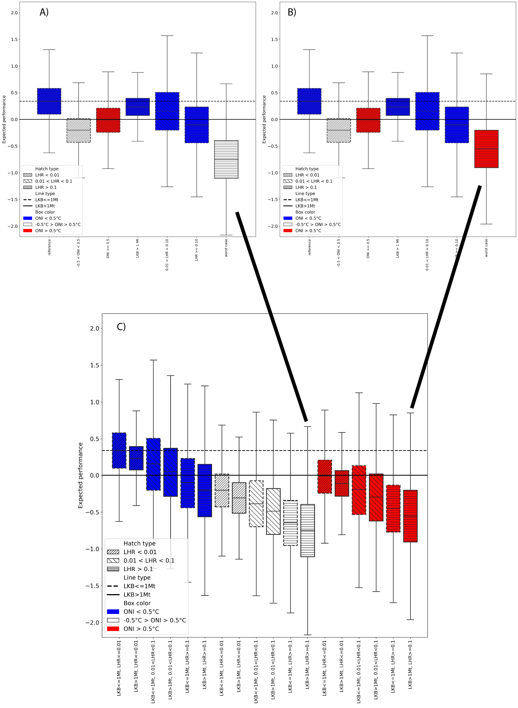

```{r setup, include=FALSE}
knitr::opts_chunk$set(echo = TRUE, comment=NA)
#options(knitr.kable.NA = '\\-')
library(trip)
library(raster)
#library(rgdal)
library(lubridate)
library(tidyverse)
library(sf)
library(raster)
#options(kableExtra.latex.load_packages = FALSE)
library(kableExtra)
library(RefManageR)
library(bibtex)
#library(rbbt)
library(pander)
library(track2KBA)
library(knitr)
library(lmerTest)
library(tabulapdf)
library(formatR)
```

```{r read in content, include=FALSE}
#table original
d.org = read_csv("./not necessary files/hr_derived_s_original.csv",col_types="dddfd")
#table 37a
d37a = read_csv("./not necessary files/hr_derived_s_37.csv",col_types="dddfd")
#table 37b
d37b = read_csv("./not necessary files/hr_derived_s_37b.csv",col_types="dddfd")
#table 38
d38 = read_csv("./not necessary files/hr_derived_s_38.csv",col_types="dddfd")
#table 39
#d39 = read_csv("hr_derived_s_39.csv",col_types="dddfd")
#table 40
#d40 = read_csv("hr_derived_s_40.csv",col_types="dddfd")
#table 41
#d41 = read_csv("hr_derived_s_41.csv",col_types="dddfd")
#source('KrugerAnalyses.R')
messy = c("37a.R")

```

# Introduction

Concerns over the potential impact of localised depletion of krill
through concentrated fishing effort on krill-dependent predators has
been a topic of debate within the Antarctic science community for many
years. Recently, one study has been presented that suggest that local
harvesting rates can impact predator performance to the same degree as
poor environmental conditions (Watters, Hinke, and Reiss 2020) by
matching various performance indices of krill-dependent penguins
relative to estimates of krill biomass, fishing pressure and broad scale
climate variability. The penguin performance indices were collected at
two sites (Cape Shireff on Livingstone Island and Copacabana on King
George Island, South Shetland Islands; Figure 1) in the period 1982 -
2016 whereas krill abundance data, which cover the at-sea distributions
of chinstrap, gentoo and Adélie penguins, were collected during summer
(1996 - 2011) and winter (2012, 2014 and 2015). By drawing in monthly
krill catches from Catch and Effort data reported to CCAMLR and climate
data (ONI), the authors use a hierarchical analysis of variance approach
to estimate the variance in these indices as a function of Local Krill
Biomass (LKB), Local Harvesting Rates (LHR; the ratio of krill catch to
LKB) and the Oceanic Niño Index (ONI). The study drew the conclusion
that local harvesting levels of krill adversely impact penguins, and the
degree of impact can either be similar to that of poor environmental
conditions or have a synergistic impact when high local harvesting
coincides with poor conditions. The conclusions of this paper, which at
the time of writing has accumulated 162 citations, have been used by
CCAMLR in support of developing Marine Protected Area proposals and
fisheries management strategies as well as being used in the review
process of the Marine Stewardship Council fisheries certification
process for Antarctic krill. In other words, the outcomes of this study
have been propagated into geopolitical and socioeconomic environments
that are having real-world impacts beyond a scientific debate. However,
we have identified six critical issues that undermine the validity
of Watters et al. (2020). We provide a brief description of the
background behind each issue and a summarizing statement of the problem.

## *Continuing spatial and temporal mismatches predators and fishing activity*

A key goal for Watters et al. (2020) was to highlight the consequences
of mismatching scales at which the Antarctic krill fishery is managed
with the scales at which ecological interactions between fishing
extractions and dependent predators occur. To do this, the authors
created two strata aligned with groups of SSMU (gSSMU); gSSMU #1
including those SSMU inside the Bransfield Strait (APBSE and APBSW) and
gSSMU #2 incorporating SSMU north of the South Shetlands, including
Elephant Island (APDPE, APDPW and APEI) represented in Figure 1. These
gSSMU cover and , respectively, and are used to characterise both krill
biomass and harvesting rates that are “local” to the penguin colonies
for which performance data are used. The reasoning behind scaling to
gSSMU are linked to the foraging behaviour of the penguins for which
performance data area available i.e. breeding, adult pygoscelids. The
authors cite Hinke et al. (2017) as the evidence supporting usage of the
two gSSMU as appropriate strata. Pygoscelid penguins also exhibit
staggered breeding, with Adélies commencing first, followed by
chinstraps then gentoos (Black 2016). Adélie penguins are the first to
fledge their chicks and thus cease to be centrally foraging, typically
departing early February for their moulting grounds on the sea ice.
chinstrap penguins depart for a pre-moult foraging trip towards the
start of February and return to land in order to moult, before departing
again for their overwinter trip mid-March (Hinke et al. 2015); Hinke et
al. 2019). Conversely, gentoo penguins appear to remain near their
breeding colonies overwinter (Korczak-Abshire et al. 2021).

*The model used by Watters et al. (2020) presumes that penguins occupy
the entire gSSMU they are assigned to throughout the entire year.*

## *Unsupported ecological assumptions*

The study’s conclusions are also compromised by unvalidated ecological
assumptions, particularly the assertion that krill biomass at spatial
scales relevant to penguins varies with the phase of the Southern
Annular Mode (SAM). While SAM is known to influence large-scale
atmospheric circulation and sea ice extent (REF), its direct
relationship to local krill biomass, especially at the scales relevant
to penguin foraging, has not been empirically validated. The assumption
that SAM-driven variability in krill biomass uniformly affects penguin
performance across broad regions ignores the complexity of local
oceanographic and biological processes. For instance, krill recruitment
and aggregation are influenced by a multitude of factors,
including local prey availability, predation pressure, and fine-scale
hydrodynamic features, which are not captured by SAM alone (REF).
Without robust empirical support for this assumption, the study’s
findings regarding the interaction between climate, krill biomass, and
penguin performance remain speculative. Addressing this gap
requires finer-scale data on krill distribution and environmental
drivers to validate, or refute, the proposed mechanisms underlying the
study’s conclusions.

*KEY PROBLEM STATEMENT - JAVIER*

## *Coding errors*

A coding error further distorts the study’s findings: the "Worst Case"
scenario is described in the text as having a neutral Oceanic Niño Index
(ONI) but is incorrectly coded using a warm ONI parameter set
(Supplementary Material 1, lines 661–663). This misclassification
affects the interpretation of the model’s outputs, particularly the
marginal probabilities associated with the "Worst Case" scenario.

*Structural coding errors have created misleading results presented in
the published article.*

## *Omission of competing species*

Another significant limitation of Watters et al. (2020) is its failure
to account for competing krill-dependent predators, such as recovering
whale populations (Baines et al.2021; Biuw et al. 2024) and migratory
male Antarctic fur seals (Lowther et al.2020). These species compete
directly with penguins for krill, particularly in key foraging areas
like the Bransfield Strait and Gerlache Strait (e.g. Hückstädt et al.
2012; Johannessen et al. 2022). By ignoring the presence and consumption
demands of these predators, the study overestimates the relative impact
of the krill fishery on penguin performance. For example, whales and
seals can substantially reduce local krill availability, potentially
exacerbating any effects of fishing pressure. Without considering these
competing factors, the study’s conclusions about the impacts of
localized krill harvesting on penguins are incomplete and potentially
misleading. A comprehensive assessment of fishery impacts must
incorporate the full suite of krill-dependent predators to accurately
evaluate competition dynamics and their consequences for penguin
populations.

T*he model used by Watters et al. (2020) neglects the impact of
recovering populations of large-bodied krill eating predators that
overlap in time and space with penguins beyond a cursory discussion.*

## *Model bias*

The analysis in Watters et al. (2020) suffers from two critical
methodological flaws that undermine its conclusions. First, the model
includes both Local Krill Biomass (LKB) and Local Harvest Rate (LHR) as
separate predictors, despite LHR being mathematically derived from LKB
(LHR = Catch / LKB). This structural
confounding introduces multicollinearity, making it impossible to
isolate the independent effects of krill availability and fishing
pressure on penguin performance. For example, areas with low LKB will
inherently yield higher LHR values even for modest catches, artificially
inflating the perceived impact of fishing pressure.

*PROBLEM STATEMENT - ULF*

## *Over-reliance on broad-scale climate indices*

A further limitation of Watters et al. (2020) is its reliance on
macroscale climate indices, such as the Oceanic Niño Index (ONI) and
the Southern Annular Mode (SAM), to explain variability in krill
availability and penguin performance. the utilisation of broad-scale
climatological phenomena to characterise impacts at scales that
predators are dependent upon is problematic. The Amundsen Sea Low (ASL)
is the dominant climate feature for the western Antarctic Peninsula. The
El Niño-Southern Oscillation (captured in the ONI predictor) modulates
the ASL, with El Niño (La Niña) shallowing (deepening) its pressure,
causing more northwesterly (southeasterly) winds and upwelling
(restricted influx) of Circumpolar Deep Water onto the shelf. The SAM
also influences the pressure of the ASL, with the current trend of
negative SAM constructively (destructively) interfering with ASL when in
phase with El Niño (La Niña) events (e.g. Clem et al. 2016). The result
is a set of above-surface climate conditions that drive changes in water
mass intrusion that is in turn dependent on interactions between two
climate processes as well as the geographical orientation of the
coastline involved, all of which have been shown to impact the foraging
trajectories and trip durations of Chinstrap penguins (Andrew D. Lowther
et al. 2018). The bathymetry of the Antarctic Peninsula, which also
influences the hydrographic conditions, is complex particularly at
scales that are important to centrally-foraging predators such as
penguins. The structuring of krill aggregations in time and space in the
WAP have also been linked to mesoscale circulation processes (Santora et
al. 2012), which are unlikely to be uniformly affected by macroscale
processes given variation in local bathymetric and coastal orientation.
It is also worth noting that the study considers neither the impact of
climate on the terrestrial breeding grounds, such as chick mortality
through “wetting down” by increased rainfall (Chapman et al. 2011) nor
the unaccounted-for measurement inaccuracies in the foraging trip
durations used by Watters et al. 2020 (Lowther et al. 2015). While these
indices provide useful insights into large-scale atmospheric and
oceanographic patterns, they fail to capture the finer-scale
processes that directly influence krill distribution and predator-prey
interactions. For example, mesoscale oceanographic features, such as
local upwelling, sea ice dynamics, and bathymetric influences, play a
critical role in determining krill aggregation and accessibility to
penguins (REF). However, these processes operate at spatial and temporal
scales that are not adequately reflected by broad indices like ONI or
SAM (REF). As a result, the study’s conclusions about the impacts of
climate variability on penguin performance may be oversimplified or
misrepresented, particularly in regions where local environmental
conditions deviate from large-scale climate patterns. This overreliance
on coarse climate indices limits the study’s ability to accurately
assess the true drivers of krill availability and, consequently, penguin
responses to environmental change. As such, the general structure of the
study does not appear to be appropriate for answering the research
questions raised.

*The model used by Watters et al. (2020) relies exclusively on
ocean-scale climate indices as environmental predictors of LKB and
penguin performance.*

## 

Herein, we conduct analyses and discuss these to demonstrate the
inappropriate or unsupported conclusions related to Issues #1 to #3 and
the potential impact that Issue #4 raises in understanding the drivers
of penguin performance. We then discuss Issues #5 and #6 qualitatively,
with no associated numerical analyses.

# Materials and Methods

## *Continuing spatial and temporal mismatches*

predators and fishing activity We use the Argos-CLS PTT telemetry data
provided by the supporting studies in Watters et al. (2020) to
characterise the actual at-sea habitat used, in the context of the
relative stage of breeding for each species, though we also recommend
Warwick-Evans et al. (2018) and Lowther et al. (2018) amongst other
work, for further quantification of foraging behaviour of breeding
penguins in this area. For each species, we refrain from undertaking
extensive state-space modelling of location errors and merely exclude
locations with a “Z” error class, accepting the remaining locations had
varying degrees of uncertainty around them. We then calculated the 99%
Minimum Convex Polygon (home range) using the R package adehabitatHR and
calculate their associated areas in , with the resulting MCP likely
being larger than the area actually exploited, given the remaining
inaccuracy in the underlying locations used.

We then scale the gSSMU LKB to the SSMU that the summer tracking data
indicate penguins occupied. To do this, we calculate the area () of the
SSMU for which the predator occupies and the gSSMU to which it is
assigned, then create a scaling ratio. For example, we scale LKB for
Cape Shireff chinstrap penguins solely to ADPDW (Figure 1) by
multiplying the gSSMU LKB by the areal ratio of ADPDW/gSSMU #2. We then
select the corresponding SSMU catch values provided in Watters et al.
(2020) (Supplementary Info) to estimate SSMU-scale LHR. We also caution
that while considering the gSSMU scale of harvesting as inappropriate
for “local” effects, even the SSMU-scale catch levels likely do not
reflect pressures at scales relevant to breeding penguins. The authors
place LKB/LHR values in March into the “summer” period, thus effectively
incorporating fishing pressure into the summer breeding season in the
context of penguin performance metrics. However fishing effort over the
period that performance indices are available is not uniform over the
thirty year period, with catch over the preceding decade tending towards
a nonlinear increase from the middle of March and three years where
catch rates increased rapidly from the beginning of March (Figure 4).
Given the highly variable rates of catch throughout the study period, we
run scenarios that classify March as either summer or winter to reflect
the linkage between March and the breeding state of penguins i.e. Adélie
and chinstrap penguins have either migrated out of the area or have
ceased to be centrally foraging species by March (HINKE REFS GALORE,
INCLUDING 2025 Scientific Reports).

Thus we reformulate the underlying assumptions above into a new model
construct, in which performance indices from gentoo, chinstrap and
Adélie penguins during the summer are included, but Adélie and chinstrap
penguins cease to be centrally foraging species after breeding and
migrate out of the area. The performance indices are matched in space
and time but using SSMU level estimates of LKB and LHR. We re-run the
model twice 1) using gappy survey data and 2) including imputed values
for LKB in years where survey data are missing. We further consider two
alternatives for considering March, either in a) summer or b) winter on
each model run.

We present the outputs both in the same boxplot format as Figure 2 in
the original manuscript, and as individual cases grouped and
colour-coded as ONI “warm” ( 0.5; red), ONI “neutral” (-0.5 \< ONI \>
+0.5; white) and ONI “cold” (\< -0.5; blue). We also recreate the
original marginal probabilities in Table 1 of Watters et al. (2020), and
two additional tables in the same format with the probabilities
extracted from our reformulated model, the difference between the latter
two tables reflecting whether March is in summer or winter.

## *Unvalidated Ecological Assumptions*

## *Model coding error*

We also note an additional coding error that may influence how the
original, unmodified results are interpreted. In summarising the model
outputs into boxplots, the text in the paper seemingly classifies the
“Worst Case” with “neutral” ONI ( oC \< ONI \< 0.5 oC; LKB \> 1 Mt; and
LHR 0.1) and the code relating to developing the original manuscript
Figure 2 uses Parameter set 36 from the output dataframe, which actually
reflects a “warm” ONI component (\> 0.5 oC; LKB \> 1 Mt; and LHR 0.1).
Yet the discussion in Watters, Hinke, and Reiss (2020) also suggests
that the likelihood of their “Worst Case” includes future warming (see
Figure 3 below)

We agree that any “Worst Case” should reflect ENSO conditions into the
future under a warming climate. However, climate change is likely to
increase ENSO in amplitude - both El Niño (ONI “warm”) and La Niña (ONI
“cold”) (Capotondi et al. 2015). How this increasing amplitude can be
integrated appropriately into the presented modelling framework to match
with long-term predicted mean performance of predators has not been
explored yet. As such, and for the sake of comparison with the original
study, we maintain the authors designation of ONI “neutral” when
rendering the “Worst Case” boxplots, though caution that this is
unlikely to be a realistic assumption

## *Omission of competing species*

In order to provide numerical context on the potential role baleen
whales and Antarctic fur seals may play in regulating penguin
performance, we conduct two analyses. Firstly, we use published
estimates of the time-evolving abundance and distribution of humpback
whales (Megaptera novaeangliae) throughout the Bransfield Strait
(Johannessen et al. 2022) to estimate the number of whales present in
the SSMU occupied by penguins from Copacabana. We then use conservative
per-capita consumption estimates (REF) to derive monthly krill
consumption rates and compare these to the SSMU krill catch provided in
Watters et al. (2020). Secondly, we use per-capita krill consumption
rates for adult male Antarctic fur seals which are known to migrate into
the region from as early as January until the beginning of the following
summer breeding season (Lowther et al. 2020). The catch limit in the
management unit in which the Watters et al. (2020) is conducted was
155,000tonnes/year, and we back-calculate the number of Antarctic fur
seals that would need to be present to at least equal the krill removal
rate of the fishery.

All analyses are conducted in the R statistical software environment (R
4.5.1), using the original data provided in Watters et al. (2020) or in
the published articles cited as supporting evidence. To faciliate
reproducibility, the Supplementary Material from the original Watters et
al. (2020) article and the Supplementary Material from all necessary
supporting articles are hosted in Zenodo repositories (record ID 5040114
and record ID 17347172). A dedicated R script allowing for these data
and scripts to be downloaded directly from the repositories is provided
in Appendix I. Fully annotated R code, highlighting the modifications
and justifications, as well as the code needed to fully reproduce the
figures and tables presented here, are also included in the Zenodo
repositories.

# Results

## *Continuing spatial and temporal mismatches*

Comparing the original model outputs with ours, relative to the “Best
Case”, the probability of negative impacts to penguins due to high LHR
dropped precipitously from 93% to 37% (Table 3). In other words, when
considering the migration of penguins in accordance with their known
ecology (Figure 2), the relative probability of negative impact of LHR
drops from a near-certainty to 1-in-3 (Table 2 and 3). At this point, we
clarify that the probability of negative impact is not a measure of the
scale of the expected impact (i.e. a measure of population decline), but
a measure of whether any negative impact is likely to occur. Given the
temporal separation between fishing and penguin breeding over the
preceding decade, our results are unsurprising.

## *Unvalidated Ecological Assumptions*

## *Model coding error*

## *Omission of competing species*

```         
• Figure 1: Impact of Spatial and Temporal Adjustments on Expected Penguin Performance. Illustrate the combined effect of spatial and temporal corrections on model outputs. Highlight that LHR impacts are overestimated in the original model.
```

Content: • Boxplots comparing expected penguin performance under: ◦
Original model (gSSMU scales, Adélie/chinstrap penguins included in
winter, March as summer). ◦ Revised model (SSMU scales, Adélie/chinstrap
penguins excluded in winter, March as winter). • Color-coded by ONI
conditions: ◦ Warm (≥0.5°C; red). ◦ Neutral (-0.5°C \< ONI \< 0.5°C;
white). ◦ Cold (\<-0.5°C; blue).

```         
• Table 1: Marginal Probabilities of Negative Impacts on Penguin Performance
```

Content: • Comparison of marginal probabilities for: ◦ Original
model (Watters et al., 2020). ◦ Revised model (spatial rescaling to
SSMU, temporal adjustments, March as winter). • What to include: •
Probability of negative impact from high LHR (original: 93%; revised:
37%). • Probability under "Worst Case" (neutral ONI, high LHR, high
LKB). • Dominance of ONI effects in revised model.

Unvalidated Ecological Assumptions • Figure 1: Relationship Between SAM
Phases and Local Krill Biomass (LKB). Visually confirm the lack of
correlation between SAM and LKB. Support the argument that local
processes (e.g., upwelling, bathymetry) are more influential than
broad-scale climate indices. Content: • Scatter plots or regression
plots showing: ◦ SAM index values (x-axis) vs. Local Krill Biomass
(LKB) (y-axis). ◦ Data points for different SAM phases (positive,
neutral, negative). ◦ Regression line with R² and p-values indicating no
significant relationship (F \< 0.975, p \> 0.33). • Highlight: Visual
demonstration that LKB does not vary predictably with SAM phases.

```         
• Table 1: Statistical Tests for SAM-LKB and Low LKB-Small Krill Relationships
```

Content:

# Discussion

Our reanalysis of Watters et al. (2020) reveals that the study’s
conclusions are based on assumptions not supported by empirical data. By
addressing spatial and temporal mismatches, unvalidated ecological
assumptions, and methodological biases, we demonstrate that
the perceived impacts of krill fishing on penguin performance are
significantly overestimated. Specifically, rescaling spatial units
from gSSMUs to SSMUs and accounting for penguin migration
patterns reduced the probability of negative impacts from high Local
Harvest Rates (LHR) from 93% to 37%. Additionally, our findings
highlight that broad-scale climate indices (ONI, SAM) are less
influential than local oceanographic processes in determining krill
availability and penguin performance.

## *Spatial and temporal mismatches undermine study conclusions*

The spatial scales used in Watters et al. (2020) are 4–15 times
larger than the actual foraging ranges of penguins. For example, Adélie
penguins forage within 1,139 nm², yet the study used gSSMUs of
15,500–20,600 nm² to define "local" krill biomass and harvest rates.
This mismatch leads to overestimated localized depletion effects, as the
broad spatial units fail to capture the fine-scale interactions between
penguins and their prey. Similarly, the study’s temporal
assumptions incorrectly associate winter fishing pressure with penguin
performance, despite Adélie and chinstrap penguins migrating away from
breeding colonies by late February. By excluding these species from
winter analyses, we show that the original model’s conclusions about
seasonal fishing impacts are misassigned.

## *Unvalidated ecological assumptions*

Watters et al. (2020) assumes that krill biomass varies with the
Southern Annular Mode (SAM), yet our statistical tests reveal no
significant correlation between SAM phases and Local Krill Biomass
(LKB). Similarly, the assumption that low LKB (\<1 Mt) correlates with
small krill is unsupported. The study’s reliance on SAM and ONI thus
oversimplifies the complex, fine-scale interactions driving
krill-penguin dynamics. Additionally, the study overlooks the role of
krill life-stage dynamics in shaping availability and accessibility for
penguins and other predators. Krill populations consist of multiple size
classes and age cohorts, each with distinct spatial distributions,
seasonal behaviors, and energetic values for predators (REF). For
instance, small juvenile krill, which may dominate recruitment pulses,
are often less energetically valuable to penguins than larger, older
krill (REF). Seasonal and spatial variability in krill size structure
(e.g., due to recruitment events or environmental conditions) can
significantly influence predator performance (REF), yet these dynamics
are not explicitly considered in Watters et al. (2020). By treating
krill biomass as a homogeneous metric, the authors ignore critical
variations in krill quality and availability that may drive penguin
foraging success or failure. Addressing this gap
requires life-stage-specific data on krill distribution and predator
preferences to refine assessments of how fishing and environmental
changes affect penguin populations. Together, these oversights highlight
the need for finer-scale ecological data to validate, or refute, the
mechanisms underlying the study’s conclusions.

## *Model coding error*

The coding error distorts the study’s findings. The "Worst Case"
scenario is described in the text as having a neutral Oceanic Niño Index
(ONI) but was incorrectly coded using parameters for a warm ONI. This
misclassification inflates the perceived severity of neutral ONI
conditions, leading to misinterpretation of the model’s outputs,
particularly the marginal probabilities associated with the "Worst Case"
scenario. The coding error reduces the probability of negative impacts
from high LHR from 93% to 37% (Table 3). This adjustment highlights that
fishing pressure effects depend on krill abundance, where low LKB
amplifies the perceived impact of LHR, while high LKB masks it.
Furthermore, the revised model clarifies that the dominance of ONI over
LHR in driving penguin performance becomes evident when structural
biases are removed.

## *Omission of competing krill predators*

A major limitation of Watters et al. (2020) is its failure to account
for competing krill-dependent predators, such as recovering whale
populations and migratory male Antarctic fur seals. Using available
abundance, distribution and consumption estimates for competing species,
we show that humpback whales consume over five times the amount of krill
than taken by the fishery per month. We show that the number of male
Antarctic fur seals required to match the LHR of the fishery for each
year of the study ranges from as few as zero to as many as 72,000 seals;
given the number of seals that are recorded at only two sites in the
South Orkney Islands (32,000 individuals) and their movements into the
Antarctic Peninsula are well documented (Lowther et al. 2020), there are
likely to be significant competitive interactions between migrating
seals and breeding penguins. The consumption by whales also overlaps
temporally with penguin breeding, unlike the fishery which since 2010
has shifted to a winter fishery (REF). Intuitively then, ignoring the
vast amount more krill removed by whales at the same time as breeding
penguins are foraging is likely to be greatly overestimating the
relative impact of fisheries removal on penguin performance. Future
assessments must incorporate multi-species interactions to accurately
evaluate the cumulative pressures on krill-dependent predators.

## *Model Bias*

The presence of structural model bias arising from the confounding
relationship between covariates (LHR and LKB; LHR=Catch/LKB) was not
explicitly explored in this study. This dependency, however, masks the
isolated effects of krill availability (LKB) and fishing pressure
(Catch) on penguin performance, potentially leading to misleading
conclusions about the relative importance of these factors. This
structural confounding in the model results in artificial inflation of
fishing impacts in areas with low LKB, where even modest catches yield
high LHR values, thereby exaggerating the perceived impact of fishing
pressure on penguin performance. Conversely, in areas with high LKB,
substantial catches may be masked because the same absolute catch
results in a lower LHR, underestimating the true effects of fishing.
This structural bias undermines the study’s ability to disentangle the
true ecological drivers of penguin performance, necessitating a
reevaluation of the model’s specifications and assumptions. These
findings underscore the necessity for methodological rigor in ecological
modeling. Future studies should avoid multicollinearity by using Catch
and LKB as separate predictors instead of LHR to isolate the effects of
fishing pressure and krill availability. Additionally, validating coding
and assumptions is crucial to ensure that scenario classifications align
with described conditions and prevent misinterpretation. Finally,
reevaluating model specifications to account for structural biases will
enable more accurate assessments of the impacts of fishing on predator
performance. 6 Over-reliance on broad-scale climate indices Watters et
al. (2020) relies on macroscale climate indices (ONI, SAM) to explain
variability in krill availability, yet these indices fail to
capture finer-scale oceanographic processes (e.g., local upwelling, sea
ice dynamics) that directly influence krill aggregation. Our reanalysis
shows that local environmental predictors (e.g., sea ice concentration,
chlorophyll-a) explain more variance in penguin performance than ONI or
SAM. This over-reliance on broad-scale indices limits the study’s
ability to accurately assess the true drivers of krill availability and
penguin responses to environmental change.

## *Implications for fisheries management*

The real-world implications of Watters et al. (2020) are substantial, as
its conclusions have influenced CCAMLR’s Marine Protected Area
proposals and fisheries certification processes. However, our findings
suggest that the study’s methodological limitations—spatial/temporal
mismatches, unvalidated assumptions, and omitted competitors—compromise
its validity as a management tool. We recommend that future
assessments: 1. Use spatial scales aligned with penguin foraging
ranges (SSMUs rather than gSSMUs). 2. Account for penguin migration and
seasonal fishing effort. 3. Incorporate competing predators and local
environmental drivers. By addressing these issues, managers can
develop more robust, evidence-based strategies for balancing krill
fisheries with predator conservation.

## *Broader concerns and future directions*

While Watters et al. (2020) raises important questions about fishery
impacts, its boundary conditions, focusing solely on fishing and
climate, are inadequate for disentangling the relative impacts of
multiple stressors on krill-dependent predators. Over 20 years ago,
CCAMLR acknowledged that its CEMP program could not distinguish between
fishing and climate effects (REF), yet no modifications have been made.
Moving forward, integrated monitoring programs that account
for competition, local oceanography, and fine-scale predator-prey
interactions are essential for informing sustainable fisheries
management in the Antarctic.

## *Conclusion*

Our reanalysis demonstrates that the conclusions of Watters et al.
(2020) are overly pessimistic due to spatial/temporal mismatches,
unsupported ecological assumptions, omitted confounding impacts of
competitive predators and methodological biases. While climate
variability (ONI) remains a dominant driver of penguin performance,
the impacts of krill fishing are far less severe when analyzed
at ecologically relevant scales. To ensure objective scientific
advice for CCAMLR, future studies must adopt finer spatial/temporal
resolutions, incorporate competing predators, and avoid structural
biases. Only then can we accurately assess the true impacts of
fishing on Antarctic krill-dependent predators.\newpage

```{r, results='asis', echo=FALSE}
table_data <- data.frame(
  Statement = c(
    "Does LKB vary with SAM sign and strata ?",
    "Is low LKB (<1Mt) correlated with small krill ?",
    "Are penguin indices related to ONI/SAM ?"
  ),
  Analytical_approach = c(
    "Appendix I",
    "Appendix II",
    "Appendix III"
  ),
  Support_and_Significance = c(
    "No; F < 0.975, p >0.33 all cases",
    "No; F < 2.175, p >0.154 all cases",
    "No; see Appendix III Table 1"
  ),
  Conclusions = c(
    "LKB does not vary predictably with SAM",
    "Low LKB in Best Case scenario is inappropriate",
    "Penguin indices are not correlated to climate variability indices"
  ),
  stringsAsFactors = FALSE
)

if (knitr::is_latex_output()) {
  cat("\\begin{table}[ht]\n\\centering\n")
  cat("\\resizebox{\\textwidth}{!}{%\n")
  print(
    knitr::kable(
      table_data,
      format = "latex",
      booktabs = TRUE,
      escape = TRUE,
      align = "lccc",
      col.names = c(
        "Statement/Question",
        "Data Source",
        "Support & Significance",
        "Conclusions"
      )
    ),
    row.names = FALSE
  )
  cat("}\n")
  cat("\\caption{Summary Table showing what was bullshit, and where to find the analysis and data in our paper.}\n")
  cat("\\end{table}\n")
} else {
  knitr::kable(
    table_data,
    format = "html",
    caption = "Summary Table showing what was bullshit, and where to find the analysis and data in our paper.",
    align = "lccc",
    col.names = c(
      "Statement/Question",
      "Data Source",
      "Support & Significance",
      "Appendix Reference"
    )
  )
}
```

```{r Penguin distribution plots, out.width="65%",fig.align="centre",fig.cap="Penguin foraging behaviour during summer breeding, derived from available ARGOS-CLS PTT data presented in Hinke et al. 2017. A) Chinstrap penguins from Cape Shireff (blue) and Copacabana (green) truncated at $10^{th}$ March in line with known phenology (Black 2016; Lowther et al.(this meeting).  Elongated grey track represents a single animal) B) Adélie penguins truncated to the end of January and C) gentoo penguins until \\textasciitilde{}August, representing all available PTT data provided. The SSMU are combined and coloured according to gSSMU (red; gSSMU 2, purple; gSSMU 1) with chinstrap and Adélie penguin 99\\% MCP home ranges occupying between 7-19\\% of the gSSMU to which they were assigned.", echo=FALSE}

knitr::include_graphics("./Watters EMM figures/Penguin distributions.png")

```

```{r Overwinter penguin  plots, fig.align="centre", fig.cap="A) Distribution of overwinter movement for chinstrap penguins, relative to the gSSMU's to which they were attributed, created from telemetry data available in Hinke et al. 2019.  B) Adélie and chinstrap penguin movement recorded by light geolocators, highlighting the large longitudinal range both species disperse through at the end of breeding (taken from Hinke et al. 2015).  In the original model formulation by Watters et al. 2020, the winter performance indices for both species are matched to macroscale levels of ONI variability but gSSMU-scale estimates of LKB and LHR.", out.width="75%", echo=FALSE}

knitr::include_graphics("./Watters EMM figures/Overwinter pengo distributions.png")
```

```{r Watters original and mistake, echo=FALSE, fig.align="centre", out.width="75%", fig.cap="Original Figure 1 plot from Watters et al. 2020 with A) Neutral ONI and B) B) Warm ONI constituting the Worst Case selected.  C) Displays the original case-by-case plots recreated from the paper, with Case 12 representing the intention while data from Case 18 was selected for rendering the boxplot.  Note that the expected performance under neutral ONI Worst Case is poorer than under the warm ONI that was presented in the original paper.  Henceforth, to facilitate comparison, we refer to the ONI Neutral plot however we consider this unrealistic if the intention is to portray a Worst Case of a continuing warming climate."}



```

```{r Scenario plot 1, out.width="100%", fig.align="left", echo=FALSE, fig.cap="Model output for the alternatve Watters et al. 2020 scenario outlined above (all species initially present, Adélie and chinstrap penguins migrate out of the area after breeding, LKB and LHR rescaled to SSMU and March included in summer or winter).   Selected cases as per Watters et al. 2020 for March in A) Summer and B) Winter are provided, with the corresponding case-by-case boxplots presented beneath.  Boxplots are colour-coded by ONI state (red=warm, white=neutral, blue=cold).  In all cases, the marginal effect of ONI dominated the expected performance of penguins against their long-term mean, irrespective of LKB or LHR."}

knitr::include_graphics("./Watters EMM figures/All spp summer then winter 37.png")
```

```{r Scenario plot 2, out.width="100%", fig.align="left", echo=FALSE, eval=FALSE, fig.cap="Model output for Watters et al. 2020 Scenario \\#2 outlined above (all species initially present,Adélie and chinstrap penguins migrate out of the area after breeding, LKB and LHR rescaled to SSMU and March included in summer or winter).   Selected cases as per Watters et al. 2020 for March in A) Summer and B) Winter are provided, with the corresponding case-by-case boxplots presented beneath.  Boxplots are colour-coded by ONI state (red;warm, white;neutral, blue;cold).  In all cases, the marginal effect of ONI dominated the expected performance of penguins against their long-term mean, irrespective of LKB or LHR."}

knitr::include_graphics("./Watters EMM figures/ADE and CHIN summer 40 41.png")
```

```{r Scenario plot 3, out.width="100%", fig.align="left", echo=FALSE, eval=FALSE, fig.cap="Model output for Scenario \\#3 outlined above (all species initially present,Adélie and chinstrap penguins migrate out of the area after breeding, LKB and LHR rescaled to SSMU and March included in summer or winter).   Selected cases as per Watters et al. 2020 for March in A) Summer and B) Winter are provided, with the corresponding case-by-case boxplots presented beneath.  Boxplots are colour-coded by ONI state (red;warm, white;neutral, blue;cold).  In all cases, the marginal effect of ONI dominated the expected performance of penguins against their long-term mean, irrespective of LKB or LHR."}

knitr::include_graphics("./Watters EMM figures/Gentoo only 38 39.png")
```

```{r March Subarea 48.1 fishing plot, out.width="60%", fig.align="centre", fig.cap="Daily accumulated catch (and fitted LOESS smooth curves) in Subarea 48.1 between 20$^{th}$ February and March 31$^{st}$ between A) 1990-2010 and B) 2010 to 2020. Catch in the Subarea was relatively consistent during the latter stages of penguin breeding at approximately 250tonnes/d (NOTE: different scaling of catch on y-axis between plots).  However, since 2010 there has been a tendency for the fishery to increase its effort in the Subarea, starting around the middle of March. C) During this latter period, the fishery increased effort earlier on three occasions (2013, 2015 and 2016), starting before the beginning of March.", echo=FALSE}

#knitr::include_graphics("./Watters EMM figures/catch march 481.png")
```

\blandscape

```{r Table 1 Scenario Original, warning=FALSE, echo=FALSE}
###Summary Table 1 to replicate Watters----
keepers = c(37:74)
pt = d.org %>%
  dplyr::group_by(Parameter) %>%
  dplyr::summarize(mean(value)) %>%
  dplyr::rename(.,c(mean = `mean(value)`)) %>%
  dplyr::slice(37:74)

best.case.names = c("Best case", "ONI Neutral", "ONI warm", "LKB High", "LHR medium", "LHR high", "Worst case")
best.case = c(NA,pt$mean[4], pt$mean[5], pt$mean[1], pt$mean[2], pt$mean[3], pt$mean[6])
oni.range = c(NA,NA,NA, pt$mean[9], pt$mean[7], pt$mean[8], NA)
oni.warm = c(NA, NA, NA, pt$mean[12], pt$mean[10], pt$mean[11], NA)
long.term.posterior = c(pt$mean[13], pt$mean[17], pt$mean[18], pt$mean[14], pt$mean[15], pt$mean[16], pt$mean[19])
long.term.predicted = c(pt$mean[32], pt$mean[36], pt$mean[37], pt$mean[33], pt$mean[34], pt$mean[35], pt$mean[38])

table.original.scenario = round(tibble(best.case, oni.range, 
                                oni.warm, long.term.posterior,long.term.predicted),2) %>%
  dplyr::mutate(Effects = best.case.names) %>%
  dplyr::select(6,1,2,3,4,5)

knitr::kable(table.original.scenario, booktabs=TRUE,  col.names = c("Effects", 
             "Best Case", 
              "-0.5 $^\\circ$ C < ONI < +0.5 $^\\circ$ C",
              "ONI $\\geqslant+0.5$", 
             "Long-term $\\mu$", 
              "Long-term predicted $\\mu$"),
             longtable=TRUE, align="lccccc", caption = "Original table in Watters et al. 2020.  In this and all subsequent tables below, the posterior and posterior predictive probabilities that the expected performance of penguins given the effects in the left hand column are less than the expected performance given the drivers in the column headings are provided. Worst Case is represented by neutral ONI; LHR  $\\geqslant$ 0.1; and LKB $\\geqslant$ 1Mt.  The Best Case is represented by La Niña conditions, low LKB and low LHR.", escape=FALSE) %>%
   kable_styling(bootstrap_options = "striped", full_width = F)

```

```{r Table 1 Scenario 37a, warning=FALSE, echo=FALSE}
####Scenario 37a Table 1----
keepers = c(37:74) #keep just Prob and Prob.new parameters
pt = d37a %>%
  dplyr::group_by(Parameter) %>%
  dplyr::summarize(mean(value)) %>%
  dplyr::rename(.,c(mean = `mean(value)`)) %>%
  dplyr::slice(37:74)

best.case.names = c("Best case", "ONI Neutral", "ONI warm", "LKB High", "LHR medium", "LHR high", "Worst case")
best.case = c(NA,pt$mean[4], pt$mean[5], pt$mean[1], pt$mean[2], pt$mean[3], pt$mean[6])
oni.range = c(NA,NA,NA, pt$mean[9], pt$mean[7], pt$mean[8], NA)
oni.warm = c(NA, NA, NA, pt$mean[12], pt$mean[10], pt$mean[11], NA)
long.term.posterior = c(pt$mean[13], pt$mean[17], pt$mean[18], pt$mean[14], pt$mean[15], pt$mean[16], pt$mean[19])
long.term.predicted = c(pt$mean[32], pt$mean[36], pt$mean[37], pt$mean[33], pt$mean[34], pt$mean[35], pt$mean[38])

table.scenario.37a = round(tibble(best.case, oni.range, 
                                oni.warm, long.term.posterior,long.term.predicted),2) %>%
  dplyr::mutate(Effects = best.case.names) %>%
  dplyr::select(6,1,2,3,4,5)

names(table.scenario.37a) = c("Effects", 
                         "Best Case", 
                         "-0.5 $^\\circ$ C < ONI < +0.5 $^\\circ$ C",
                         "ONI $\\geqslant+0.5$", 
                         "Long-term $\\mu$", 
                         "Long-term predicted $\\mu$")

knitr::kable(table.scenario.37a, booktabs=TRUE,  col.names = c("Effects", 
             "Best Case", 
              "-0.5 $^\\circ$ C < ONI < +0.5 $^\\circ$ C",
              "ONI $\\geqslant+0.5$", 
             "Long-term $\\mu$", 
              "Long-term predicted $\\mu$"),
             longtable=TRUE, align="lccccc", caption = "Posterior and posterior predictive probabilities extracted from the model output for alternatve Watters et al. 2020 scenario outlined above with March attributed to winter (Adélie and chinstrap penguins migrate out of the area after breeding, LKB and LHR rescaled to SSMU). Under this scenario, performance against the long term mean is worst for neutral and warm ONI conditions.", escape=FALSE) %>%
  kable_styling(bootstrap_options = "striped", full_width = F)# %>%
 # row_spec(2:3, color="red")

```

\elandscape
\blandscape

```{r Table 1 Scenario 37b, warning=FALSE, echo=FALSE}
###Summary Table 1 to replicate Watters----
keepers = c(37:74)
pt = d37b %>%
  dplyr::group_by(Parameter) %>%
  dplyr::summarize(mean(value)) %>%
  dplyr::rename(.,c(mean = `mean(value)`)) %>%
  dplyr::slice(37:74)

best.case.names = c("Best case", "ONI Neutral", "ONI warm", "LKB High", "LHR medium", "LHR high", "Worst case")
best.case = c(NA,pt$mean[4], pt$mean[5], pt$mean[1], pt$mean[2], pt$mean[3], pt$mean[6])
oni.range = c(NA,NA,NA, pt$mean[9], pt$mean[7], pt$mean[8], NA)
oni.warm = c(NA, NA, NA, pt$mean[12], pt$mean[10], pt$mean[11], NA)
long.term.posterior = c(pt$mean[13], pt$mean[17], pt$mean[18], pt$mean[14], pt$mean[15], pt$mean[16], pt$mean[19])
long.term.predicted = c(pt$mean[32], pt$mean[36], pt$mean[37], pt$mean[33], pt$mean[34], pt$mean[35], pt$mean[38])

table.scenario.37b = round(tibble(best.case, oni.range, 
                                oni.warm, long.term.posterior,long.term.predicted),2) %>%
  dplyr::mutate(Effects = best.case.names) %>%
  dplyr::select(6,1,2,3,4,5)

knitr::kable(table.scenario.37b, booktabs=TRUE,  col.names = c("Effects", 
             "Best Case", 
              "-0.5 $^\\circ$ C < ONI < +0.5 $^\\circ$ C",
              "ONI $\\geqslant+0.5$", 
             "Long-term $\\mu$", 
              "Long-term predicted $\\mu$"),
             longtable=TRUE, align="lccccc", caption = "Posterior and posterior predictive probabilities extracted from the model output for alternatve Watters et al. 2020 scenario outlined above with March attributed to summer (Adélie and chinstrap penguins migrate out of the area after breeding, LKB and LHR rescaled to SSMU). Under this scenario performance against the long term mean is also worst for neutral and warm ONI conditions.", escape=FALSE) %>%
   kable_styling(bootstrap_options = "striped", full_width = F)# %>%
#  row_spec(2:3, color="red")

```

```{r Table 1 Scenario 40 Chin Adel only plus migration March winter, eval=FALSE, warning=FALSE, echo=FALSE}
####Scenario 37a Table 1----
keepers = c(37:74) #keep just Prob and Prob.new parameters
pt = d40 %>%
  dplyr::group_by(Parameter) %>%
  dplyr::summarize(mean(value)) %>%
  dplyr::rename(.,c(mean = `mean(value)`)) %>%
  dplyr::slice(37:74)

best.case.names = c("Best case", "ONI Neutral", "ONI warm", "LKB High", "LHR medium", "LHR high", "Worst case")
best.case = c(NA,pt$mean[4], pt$mean[5], pt$mean[1], pt$mean[2], pt$mean[3], pt$mean[6])
oni.range = c(NA,NA,NA, pt$mean[9], pt$mean[7], pt$mean[8], NA)
oni.warm = c(NA, NA, NA, pt$mean[12], pt$mean[10], pt$mean[11], NA)
long.term.posterior = c(pt$mean[13], pt$mean[17], pt$mean[18], pt$mean[14], pt$mean[15], pt$mean[16], pt$mean[19])
long.term.predicted = c(pt$mean[32], pt$mean[36], pt$mean[37], pt$mean[33], pt$mean[34], pt$mean[35], pt$mean[38])

table.scenario.40 = round(tibble(best.case, oni.range, 
                                oni.warm, long.term.posterior,long.term.predicted),2) %>%
  dplyr::mutate(Effects = best.case.names) %>%
  dplyr::select(6,1,2,3,4,5)

names(table.scenario.40) = c("Effects", 
                         "Best Case", 
                         "-0.5 $^\\circ$ C < ONI < +0.5 $^\\circ$ C",
                         "ONI $\\geqslant+0.5$", 
                         "Long-term $\\mu$", 
                         "Long-term predicted $\\mu$")

knitr::kable(table.scenario.40, booktabs=TRUE,  col.names = c("Effects", 
             "Best Case", 
              "-0.5 $^\\circ$ C < ONI < +0.5 $^\\circ$ C",
              "ONI $\\geqslant+0.5$", 
             "Long-term $\\mu$", 
              "Long-term predicted $\\mu$"),
             longtable=TRUE, align="lccccc", caption = "Posterior and posterior predictive probabilities extracted from the model output for Scenario 2a (Adélie and chinstrap penguins migrate out of the area after breeding, gentoo penguins not included at all, LKB and LHR rescaled to SSMU and March included in WINTER). Under this scenario, performance against the long term mean is worst for neutral and warm ONI conditions.", escape=FALSE) %>%
  kable_styling(bootstrap_options = "striped", full_width = F) %>%
  row_spec(2:3, color="red")

```

\elandscape
\blandscape

```{r Table 1 Scenario 41 Chin Adel only plus migration March summer, eval=FALSE, warning=FALSE, echo=FALSE}
###Summary Table 1 to replicate Watters----
keepers = c(37:74)
pt = d41 %>%
  dplyr::group_by(Parameter) %>%
  dplyr::summarize(mean(value)) %>%
  dplyr::rename(.,c(mean = `mean(value)`)) %>%
  dplyr::slice(37:74)

best.case.names = c("Best case", "ONI Neutral", "ONI warm", "LKB High", "LHR medium", "LHR high", "Worst case")
best.case = c(NA,pt$mean[4], pt$mean[5], pt$mean[1], pt$mean[2], pt$mean[3], pt$mean[6])
oni.range = c(NA,NA,NA, pt$mean[9], pt$mean[7], pt$mean[8], NA)
oni.warm = c(NA, NA, NA, pt$mean[12], pt$mean[10], pt$mean[11], NA)
long.term.posterior = c(pt$mean[13], pt$mean[17], pt$mean[18], pt$mean[14], pt$mean[15], pt$mean[16], pt$mean[19])
long.term.predicted = c(pt$mean[32], pt$mean[36], pt$mean[37], pt$mean[33], pt$mean[34], pt$mean[35], pt$mean[38])

table.scenario.41 = round(tibble(best.case, oni.range, 
                                oni.warm, long.term.posterior,long.term.predicted),2) %>%
  dplyr::mutate(Effects = best.case.names) %>%
  dplyr::select(6,1,2,3,4,5)

knitr::kable(table.scenario.41, booktabs=TRUE,  col.names = c("Effects", 
             "Best Case", 
              "-0.5 $^\\circ$ C < ONI < +0.5 $^\\circ$ C",
              "ONI $\\geqslant+0.5$", 
             "Long-term $\\mu$", 
              "Long-term predicted $\\mu$"),
             longtable=TRUE, align="lccccc", caption = "Posterior and posterior predictive probabilities extracted from the model output for Scenario 1a (all species initially present,Adélie and chinstrap penguins migrate out of the area after breeding, LKB and LHR rescaled to SSMU and March included in summer). Under this scenario, performance against the long term mean is worst for neutral and warm ONI conditions.", escape=FALSE) %>%
   kable_styling(bootstrap_options = "striped", full_width = F)

```

\elandscape
\blandscape

```{r Table 1 Scenario 38 gentoo only March Winter, eval=FALSE, warning=FALSE, echo=FALSE}
####Scenario 38 Table 1----
keepers = c(37:74) #keep just Prob and Prob.new parameters
pt = d38 %>%
  dplyr::group_by(Parameter) %>%
  dplyr::summarize(mean(value)) %>%
  dplyr::rename(.,c(mean = `mean(value)`)) %>%
  dplyr::slice(37:74)

best.case.names = c("Best case", "ONI Neutral", "ONI warm", "LKB High", "LHR medium", "LHR high", "Worst case")
best.case = c(NA,pt$mean[4], pt$mean[5], pt$mean[1], pt$mean[2], pt$mean[3], pt$mean[6])
oni.range = c(NA,NA,NA, pt$mean[9], pt$mean[7], pt$mean[8], NA)
oni.warm = c(NA, NA, NA, pt$mean[12], pt$mean[10], pt$mean[11], NA)
long.term.posterior = c(pt$mean[13], pt$mean[17], pt$mean[18], pt$mean[14], pt$mean[15], pt$mean[16], pt$mean[19])
long.term.predicted = c(pt$mean[32], pt$mean[36], pt$mean[37], pt$mean[33], pt$mean[34], pt$mean[35], pt$mean[38])

table.scenario.38 = round(tibble(best.case, oni.range, 
                                oni.warm, long.term.posterior,long.term.predicted),2) %>%
  dplyr::mutate(Effects = best.case.names) %>%
  dplyr::select(6,1,2,3,4,5)

names(table.scenario.38) = c("Effects", 
                         "Best Case", 
                         "-0.5 $^\\circ$ C < ONI < +0.5 $^\\circ$ C",
                         "ONI $\\geqslant+0.5$", 
                         "Long-term $\\mu$", 
                         "Long-term predicted $\\mu$")

knitr::kable(table.scenario.38, booktabs=TRUE,  col.names = c("Effects", 
             "Best Case", 
              "-0.5 $^\\circ$ C < ONI < +0.5 $^\\circ$ C",
              "ONI $\\geqslant+0.5$", 
             "Long-term $\\mu$", 
              "Long-term predicted $\\mu$"),
             longtable=TRUE, align="lccccc", caption = "Posterior and posterior predictive probabilities extracted from the model output for Scenario 1a (all species initially present,Adélie and chinstrap penguins migrate out of the area after breeding, LKB and LHR rescaled to SSMU and March included in summer). Under this scenario, performance against the long term mean is worst for neutral and warm ONI conditions.", escape=FALSE) %>%
  kable_styling(bootstrap_options = "striped", full_width = F) %>%
  row_spec(2:3, color="red")

```

```{r Table 1 Scenario 39 gentoo only March Summer, eval=FALSE, echo=FALSE, warning=FALSE}
###Summary Table 1 to replicate Watters----
keepers = c(37:74)
pt = d39 %>%
  dplyr::group_by(Parameter) %>%
  dplyr::summarize(mean(value)) %>%
  dplyr::rename(.,c(mean = `mean(value)`)) %>%
  dplyr::slice(37:74)

best.case.names = c("Best case", "ONI Neutral", "ONI warm", "LKB High", "LHR medium", "LHR high", "Worst case")
best.case = c(NA,pt$mean[4], pt$mean[5], pt$mean[1], pt$mean[2], pt$mean[3], pt$mean[6])
oni.range = c(NA,NA,NA, pt$mean[9], pt$mean[7], pt$mean[8], NA)
oni.warm = c(NA, NA, NA, pt$mean[12], pt$mean[10], pt$mean[11], NA)
long.term.posterior = c(pt$mean[13], pt$mean[17], pt$mean[18], pt$mean[14], pt$mean[15], pt$mean[16], pt$mean[19])
long.term.predicted = c(pt$mean[32], pt$mean[36], pt$mean[37], pt$mean[33], pt$mean[34], pt$mean[35], pt$mean[38])

table.scenario.39 = round(tibble(best.case, oni.range, 
                                oni.warm, long.term.posterior,long.term.predicted),2) %>%
  dplyr::mutate(Effects = best.case.names) %>%
  dplyr::select(6,1,2,3,4,5)

knitr::kable(table.scenario.39, booktabs=TRUE,  col.names = c("Effects", 
             "Best Case", 
              "-0.5 $^\\circ$ C < ONI < +0.5 $^\\circ$ C",
              "ONI $\\geqslant+0.5$", 
             "Long-term $\\mu$", 
              "Long-term predicted $\\mu$"),
             longtable=TRUE, align="lccccc", caption = "Posterior and posterior predictive probabilities extracted from the model output for Scenario 1a (all species initially present,Adélie and chinstrap penguins migrate out of the area after breeding, LKB and LHR rescaled to SSMU and March included in summer). Under this scenario, performance against the long term mean is worst for neutral and warm ONI conditions.", escape=FALSE) %>%
   kable_styling(bootstrap_options = "striped", full_width = F)

```

\elandscape

```{r dataCompare, eval=F, echo=F}
pander::pander(compMat, caption='Number of colonies in final data subsets from data downloaded directly from MAAPD and the data in Kruger et al. 2021 supplementary material.', justify='center')
```

\newpage
\beginsupplement
\blandscape

# Supplementary material

```{r Supplementary Figure 1, echo=FALSE, fig.align="centre", out.width="80%", fig.cap="C1 Catch and Effort data for 2010 - 2018, for all catches during the period of the austral summer relating to Adélie and chinstrap penguins in Subarea 48.1 (i.e. up to $10^{th}$ March).  The telemetry data presented in Hinke et al. 2017 for chinstrap penguins at both Cape Shireff and Copacabana and the gSSMU used in the Watters et al. 2020 paper are superimposed to highlight the extreme variability in actual catch, relative to the scale of LHR used to reflect interactions with penguins.  Our reanalysis re-scaled LHR to the SSMU level, though we contend that for the purposes of matching predator data at appropriate spatial scales even this is too coarse a resolution."}

knitr::include_graphics("./Watters EMM figures/summer catch/Year by year catch.png")
```

\elandscape

```{r Supplementary Figure 2 other species plots, out.width="100%", fig.align="left", fig.cap="The summer distribution of foraging effort by A) adult female Antarctic fur seals (adapted from telemetry data available in Hinke et al. 2017), B) migratory adult male Antarctic fur seals (adapted from Lowther et al. 2020) C) humpback whales throughout December (adapted from Johannessen et al., this meeting) and D) nonbreeding adult Adélie penguins during the breeding season (adapted from data in Oosthuizen et al., this meeting). Potential effects of competitive overlap between pygoscelid penguins and other krill dependent predators, particularly those who have increased their abundance dramatically over the preceding 40 years, are excluded from both approaches, creating an unrealistic set of boundary conditions for interpreting the variance in penguin vital rates.", echo=FALSE}


```

\newpage

```{r Supplementary Info Code, echo=FALSE, eval=FALSE, attr.source='.numberLines', caption="Code and modifications"}
####DATA PREP AND MODEL CODE (IMPUTATION OF BIOMASS = TRUE)----
#original paper here:
#https://doi.org/10.1038/s41598-020-59223-9
#requirements - raw Supplementary Files from original Watters et al. (2020) publication available here:
#https://www.nature.com/articles/s41598-020-59223-9#Sec8
# the analyses with imputation takes several hours - the scenarios outlined in the paper are provided as .csv
# files in the Zenodo repository provided which is open access via the DOI here (https://doi.org/10.5281/zenodo.5040114)
# and provided in the manuscript.
# the raw files to conduct the analyses from first prinicples are also available from the Watters et al.2020 manuscript 
#SCRIPT MODIFICATIONS:
#L. 225 - 233.  These changes modify the Acoustic biomass estimates by the ratio of SSMU / gSSMU
#L. 253.  Alter March to either Summer or Winter.  Currently set to Winter.
#L. 255 - 258.  Modify the gSSMU configurations to reflect only SSMU
#L. 284, 286 & 290.  Set CHPE and ADPE in WINTER to NA - removing from model / migration out of area
#L. 666.  Incorrect parameter set selection for "Worst Case" Fig 2 / "Selected Cases" plot.
library(tidyverse)
make.localhr.data<-function(trim=1,plot.winter=FALSE){
 # fledge weight (fwt)
 # bigger indicates better summer
 fwt<-read.csv("fweight.csv",header=TRUE,stringsAsFactors = FALSE)
 fwt<-tapply(fwt$WT,list(fwt$YEAR,fwt$PROJECT,fwt$SPECIES),mean)
 fwt<-data.frame(YEAR=rep(dimnames(fwt)[[1]],dim(fwt)[2]*dim(fwt)[3]),
                 PROJECT=rep(rep(dimnames(fwt)[[2]],each=dim(fwt)[1]),dim(fwt)[3]),
                 SPECIES=rep(dimnames(fwt)[[3]],each=dim(fwt)[1]*dim(fwt)[2]),
                 fwt=c(fwt),stringsAsFactors = FALSE)
 fwt$matchme<-paste(fwt$PROJECT,fwt$SPECIES,sep="|")
 tt<-tapply(fwt$fwt,list(fwt$matchme),mean,na.rm=TRUE)
 ttt<-tapply(fwt$fwt,list(fwt$matchme),sd,na.rm=TRUE)
 mean.fwt<-tt[match(fwt$matchme,names(tt))]
 sd.fwt<-ttt[match(fwt$matchme,names(ttt))]
 fwt$std.mean.fwt<-(fwt$fwt-mean.fwt)/sd.fwt
 fwt<-fwt[,-c(4:5)]
 #omits<-(fwt$SPECIES=="ADPE"&fwt$PROJECT=="CS")|(fwt$SPECIES=="CHPE"&fwt$PROJECT=="COPA")
 #fwt<-fwt[!omits,]
 names(fwt)[4]<-"index"
 fwt$param=rep("FWT",dim(fwt)[1])
 fwt$season=rep("S",dim(fwt)[1])
 # make stuff reference the correct "calendar year" for matching up with krill survey and catch data
 # summer indices are relevant to the second year in the split-season designation
 fwt$cal.yr<-as.numeric(substr(fwt$YEAR,1,4))+1
 #print(str(fwt))
 #
 # post-hatch success (phs) (numbers of chicks creched/numbers of chicks hatched)
 # bigger indicates better summer
 phs<-read.csv("success.csv",header=TRUE,stringsAsFactors = FALSE)
 phs$phs<-phs$N_CRECHE/phs$N_CHICKS
 phs$phs<-log(phs$phs/(1-phs$phs))
 phs$matchme<-paste(phs$PROJECT,phs$SPECIES,sep="|")
 tt<-tapply(phs$phs,list(phs$matchme),mean,na.rm=TRUE)
 ttt<-tapply(phs$phs,list(phs$matchme),sd,na.rm=TRUE)
 mean.phs<-tt[match(phs$matchme,names(tt))]
 sd.phs<-ttt[match(phs$matchme,names(ttt))]
 phs$std.logit.phs<-(phs$phs-mean.phs)/sd.phs
 phs<-phs[,-c(4:9)]
 names(phs)[4]<-"index"
 phs$param=rep("PHS",dim(phs)[1])
 phs$season=rep("S",dim(phs)[1])
 # summer indices are relevant to the second year in the split-season designation
 phs$cal.yr<-as.numeric(substr(phs$YEAR,1,4))+1
 #print(str(phs))
 #
 # trip duration (td)
 # smaller indicates better summer (thus need to switch direction of index)
 td<-read.csv("tripduration.csv",header=TRUE,stringsAsFactors = FALSE)
 td<-td[,c(1:3,8)]
 # next line is to make trip duration point in same direction as fwt and phs (max td is 59.95 for all trips)
 # call this "revtd" for "reversed" trip duration
 td[,4]<-60-td[,4]
 names(td)[4]<-"revtd"
 td<-tapply(td$revtd,list(td$YEAR,td$PROJECT,td$SPECIES),mean)
 td<-data.frame(YEAR=rep(dimnames(td)[[1]],dim(td)[2]*dim(td)[3]),
                PROJECT=rep(rep(dimnames(td)[[2]],each=dim(td)[1]),dim(td)[3]),
                SPECIES=rep(dimnames(td)[[3]],each=dim(td)[1]*dim(td)[2]),
                revtd=c(td),stringsAsFactors = FALSE)
 td$matchme<-paste(td$PROJECT,td$SPECIES,sep="|")
 tt<-tapply(td$revtd,list(td$matchme),mean,na.rm=TRUE)
 ttt<-tapply(td$revtd,list(td$matchme),sd,na.rm=TRUE)
 mean.revtd<-tt[match(td$matchme,names(tt))]
 sd.revtd<-ttt[match(td$matchme,names(ttt))]
 td$std.revtd<-(td$revtd-mean.revtd)/sd.revtd
 td<-td[,-c(4:5)]
 names(td)[4]<-"index"
 #omits<-(td$SPECIES=="ADPE"&td$PROJECT=="CS")|(td$SPECIES=="CHPE"&td$PROJECT=="COPA")
 #td<-td[!omits,]
 td$param=rep("REVTD",dim(td)[1])
 td$season=rep("S",dim(td)[1])
 # summer indices are relevant to the second year in the split-season designation
 td$cal.yr<-as.numeric(substr(td$YEAR,1,4))+1
 #print(str(td))
 #
 # generate the winter indices
 #
 # adult male mass at E1 lay (mml)
 # bigger indicates better winter
 ade1<-read.csv("massatlay.csv",header=TRUE,stringsAsFactors = FALSE)
 mml<-ade1[,c(1:3,5)]
 mml<-tapply(mml$WT_MALE,list(mml$YEAR,mml$PROJECT,mml$SPECIES),mean,na.rm=TRUE)
 mml<-data.frame(YEAR=rep(dimnames(mml)[[1]],dim(mml)[2]*dim(mml)[3]),
                 PROJECT=rep(rep(dimnames(mml)[[2]],each=dim(mml)[1]),dim(mml)[3]),
                 SPECIES=rep(dimnames(mml)[[3]],each=dim(mml)[1]*dim(mml)[2]),
                 mml=c(mml),stringsAsFactors = FALSE)
 mml$matchme<-paste(mml$PROJECT,mml$SPECIES,sep="|")
 tt<-tapply(mml$mml,list(mml$matchme),mean,na.rm=TRUE)
 ttt<-tapply(mml$mml,list(mml$matchme),sd,na.rm=TRUE)
 mean.mml<-tt[match(mml$matchme,names(tt))]
 sd.mml<-ttt[match(mml$matchme,names(ttt))]
 mml$std.mean.mml<-(mml$mml-mean.mml)/sd.mml
 mml<-mml[,-c(4:5)]
 names(mml)[4]<-"index"
 #omits<-(mml$SPECIES=="ADPE"&mml$PROJECT=="CS")|(mml$SPECIES=="CHPE"&mml$PROJECT=="COPA")
 #mml<-mml[!omits,]
 mml$param=rep("MML",dim(mml)[1])
 mml$season=rep("W",dim(mml)[1])
 # most winter indices (except rec) are relevant to the first year in the split-season designation
 mml$cal.yr<-as.numeric(substr(mml$YEAR,1,4))
 #print(str(mml))
 #
 #
 # adult female mass at E1 lay (fml)
 # bigger indicates better winter
 fml<-ade1[,c(1:3,6)]
 fml<-tapply(fml$WT_FEMALE,list(fml$YEAR,fml$PROJECT,fml$SPECIES),mean,na.rm=TRUE)
 fml<-data.frame(YEAR=rep(dimnames(fml)[[1]],dim(fml)[2]*dim(fml)[3]),
                 PROJECT=rep(rep(dimnames(fml)[[2]],each=dim(fml)[1]),dim(fml)[3]),
                 SPECIES=rep(dimnames(fml)[[3]],each=dim(fml)[1]*dim(fml)[2]),
                 fml=c(fml),stringsAsFactors = FALSE)
 fml$matchme<-paste(fml$PROJECT,fml$SPECIES,sep="|")
 tt<-tapply(fml$fml,list(fml$matchme),mean,na.rm=TRUE)
 ttt<-tapply(fml$fml,list(fml$matchme),sd,na.rm=TRUE)
 mean.fml<-tt[match(fml$matchme,names(tt))]
 sd.fml<-ttt[match(fml$matchme,names(ttt))]
 fml$std.mean.fml<-(fml$fml-mean.fml)/sd.fml
 fml<-fml[,-c(4:5)]
 names(fml)[4]<-"index"
 #omits<-(fml$SPECIES=="ADPE"&fml$PROJECT=="CS")|(fml$SPECIES=="CHPE"&fml$PROJECT=="COPA")
 #fml<-fml[!omits,]
 fml$param=rep("FML",dim(fml)[1])
 fml$season=rep("W",dim(fml)[1])
 # most winter indices (except rec) are relevant to the first year in the split-season designation
 fml$cal.yr<-as.numeric(substr(fml$YEAR,1,4))
 #print(str(fml))
 #
 #
 # avg egg density using both eggs (egg)
 # bigger indicates better winter
 e1e2<-read.csv("egg.csv",header=TRUE,stringsAsFactors = FALSE)
 egg<-e1e2[,c(1:3)]
 egg$egg<-(e1e2[,5]+e1e2[,7])/(e1e2[,6]+e1e2[,8])
 egg<-tapply(egg$egg,list(egg$YEAR,egg$PROJECT,egg$SPECIES),mean,na.rm=TRUE)
 egg<-data.frame(YEAR=rep(dimnames(egg)[[1]],dim(egg)[2]*dim(egg)[3]),
                 PROJECT=rep(rep(dimnames(egg)[[2]],each=dim(egg)[1]),dim(egg)[3]),
                 SPECIES=rep(dimnames(egg)[[3]],each=dim(egg)[1]*dim(egg)[2]),
                 egg=c(egg),stringsAsFactors = FALSE)
 egg$matchme<-paste(egg$PROJECT,egg$SPECIES,sep="|")
 tt<-tapply(egg$egg,list(egg$matchme),mean,na.rm=TRUE)
 ttt<-tapply(egg$egg,list(egg$matchme),sd,na.rm=TRUE)
 mean.egg<-tt[match(egg$matchme,names(tt))]
 sd.egg<-ttt[match(egg$matchme,names(ttt))]
 egg$std.mean.egg<-(egg$egg-mean.egg)/sd.egg
 egg<-egg[,-c(4:5)]
 names(egg)[4]<-"index"
 #omits<-(egg$SPECIES=="ADPE"&egg$PROJECT=="CS")|(egg$SPECIES=="CHPE"&egg$PROJECT=="COPA")
 #egg<-egg[!omits,]
 egg$param=rep("EGG",dim(egg)[1])
 egg$season=rep("W",dim(egg)[1])
 # most winter indices (except rec) are relevant to the first year in the split-season designation
 egg$cal.yr<-as.numeric(substr(egg$YEAR,1,4))
 #print(str(egg))
 #
 #
 # clutch initiation date (cid)
 # earlier indicates better winter
 cid<-read.csv("cid.csv",header=TRUE,stringsAsFactors = FALSE)[,1:4]
 # next line is to make CID point in same direction as other 
 #indices where bigger indicates better conditions (take diff from Dec 31)
 # call this "revcid" for "reversed" CID
 cid[,4]<-as.vector(as.POSIXlt(paste(substr(cid$YEAR,1,4),"-12-31",sep=""))-strptime(cid[,4],"%m/%e/%Y"))
 names(cid)[4]<-"revcid"
 cid$matchme<-paste(cid$PROJECT,cid$SPECIES,sep="|")
 tt<-tapply(cid$revcid,list(cid$matchme),mean,na.rm=TRUE)
 ttt<-tapply(cid$revcid,list(cid$matchme),sd,na.rm=TRUE)
 mean.cid<-tt[match(cid$matchme,names(tt))]
 sd.cid<-ttt[match(cid$matchme,names(ttt))]
 cid$std.revcid<-(cid$revcid-mean.cid)/sd.cid
 cid<-cid[,-c(4:5)]
 names(cid)[4]<-"index"
 cid$param=rep("REVCID",dim(cid)[1])
 cid$season=rep("W",dim(cid)[1])
 # most winter indices (except rec) are relevant to the first year in the split-season designation
 cid$cal.yr<-as.numeric(substr(cid$YEAR,1,4))
 # uncomment next line if decide to remove gentoos because of their more plastic breeding phenology
 #cid<-cid[cid$SPECIES!="GEPE",]
 #print(str(cid))
 #
 # cohort recruitment (rec)
 # bigger indicates better winter
 rec<-read.csv("recruitment.csv",header=TRUE,stringsAsFactors = FALSE)[,1:4]
 names(rec)[4]<-"rec"
 rec$rec<-log(rec$rec/(1-rec$rec))
 rec$matchme<-paste(rec$PROJECT,rec$SPECIES,sep="|")
 tt<-tapply(rec$rec,list(rec$matchme),mean,na.rm=TRUE)
 ttt<-tapply(rec$rec,list(rec$matchme),sd,na.rm=TRUE)
 mean.rec<-tt[match(rec$matchme,names(tt))]
 sd.rec<-ttt[match(rec$matchme,names(ttt))]
 rec$std.logit.rec<-(rec$rec-mean.rec)/sd.rec
 rec<-rec[,-c(4:5)]
 names(rec)[4]<-"index"
 rec$param=rep("REC",dim(rec)[1])
 rec$season=rep("W",dim(rec)[1])
 # recruitment is relevant to the second year in the split-season designation (the winter of first independence)
 rec$cal.yr<-as.numeric(substr(rec$YEAR,1,4))+1
 #print(str(rec))
 #
 # read in the krill survey and fishery data
 #
 # krill survey biomass
 survey<-read.csv("krillsurveywithJoinville.csv",header=TRUE,stringsAsFactors = FALSE)
 # use next line if want to filter acoustic data to have minimum number of miles (comment out if not desired)
 # as per CSR, 80 nmi would be about equivalent of 2 tracklines in the Bransfield
 #survey<-survey[survey$nmi.count>=80,]
 # could try changing "biomass" in following line to "mean.density.gm2" or "median.density.gm2" but haven't done that
 # change here
 survey.mod = as_tibble(survey) %>%
  group_split(gSSMU)
 # 28.7/(28.7+22) #fraction of nmi area # change here
 survey.mod[[1]]$biomass = survey.mod[[1]]$biomass * 0.566075 
 # 15.8/(15.8+16.4+36.2)fraction of nmi area # change here 
 survey.mod[[2]]$biomass = survey.mod[[2]]$biomass * 0.230994 
 # 22.0/(28.7+22.0) change here
 survey.mod[[3]]$biomass = survey.mod[[3]]$biomass * 0.433925 
 # change here
 survey.mod[[4]]$biomass = survey.mod[[4]]$biomass * 1 
 # change here
 survey = data.frame(bind_rows(survey.mod[[1]],survey.mod[[2]],survey.mod[[3]],survey.mod[[4]]))  
 
 # use next line if want to filter acoustic data to have minimum number of miles (comment out if not desired)
 # as per CSR, 80 nmi would be about equivalent of 2 tracklines in the Bransfield
 #survey<-survey[survey$nmi.count>=80,]
 # could try changing "biomass" in following line to "mean.density.gm2" or "median.density.gm2" but haven't done that
 survey<-tapply(survey$biomass,list(survey$Year,survey$gSSMU),mean,na.rm=TRUE)
 survey<-data.frame(cal.yr=rep(dimnames(survey)[[1]],dim(survey)[2]),
                    gSSMU=rep(dimnames(survey)[[2]],each=dim(survey)[1]),
                    survey=c(survey),stringsAsFactors = FALSE)
 survey$season<-ifelse(survey$cal.yr<2012,"S","W")
 # use next line if want to remove winter survey data altogether (comment out if not desired)
 #survey<-survey[survey$season=="S",]
 survey$matchme<-paste(survey$cal.yr,survey$season,survey$gSSMU,sep="|")
 #print(str(survey))
 #
 #
 # krill fishery catches
 fishery<-read.csv("c1.csv",header=TRUE,stringsAsFactors = FALSE)
 # change here - current modification for March in Winter permutation
 fishery$season<-ifelse(is.element(fishery$Month,c(10:12,1:2)),"S","W") #1:3 if March in Summer
 gSSMU1<-c("APBSE") # change here
 gSSMU2<-c("APDPW") # change here
 gSSMU3<-"APBSW" # change here
 gSSMU4<-c("APW","APE") # change here
 fishery$gSSMU<-rep(NA,dim(fishery)[1])
 fishery$gSSMU<-ifelse(is.element(fishery$AssignedSSMU,gSSMU1),1,fishery$gSSMU)
 fishery$gSSMU<-ifelse(is.element(fishery$AssignedSSMU,gSSMU2),2,fishery$gSSMU)
 fishery$gSSMU<-ifelse(is.element(fishery$AssignedSSMU,gSSMU3),3,fishery$gSSMU)
 fishery$gSSMU<-ifelse(is.element(fishery$AssignedSSMU,gSSMU4),4,fishery$gSSMU)
 fishery<-fishery[!is.na(fishery$gSSMU),]
 fishery<-tapply(fishery$TotalCatch,list(fishery$CalendarYear,fishery$gSSMU,fishery$season),sum)
 fishery<-data.frame(cal.yr=rep(dimnames(fishery)[[1]],dim(fishery)[2]*dim(fishery)[3]),
                     gSSMU=rep(rep(dimnames(fishery)[[2]],each=dim(fishery)[1]),dim(fishery)[3]),
                     season=rep(dimnames(fishery)[[3]],each=dim(fishery)[1]*dim(fishery)[2]),
                     catch=c(fishery),stringsAsFactors = FALSE)
 fishery$cal.yr<-as.numeric(as.character(fishery$cal.yr))
 fishery$gSSMU<-as.numeric(as.character(fishery$gSSMU))
 fishery$matchme<-paste(fishery$cal.yr,fishery$season,fishery$gSSMU,sep="|")
 #print(str(fishery))
 # now match predator data with krill data
 out<-rbind(fwt,phs,td,mml,fml,egg,cid,rec,make.row.names=FALSE)
 # all birds from Copa always forage in gSSMU 1 (Bransfield SSMUs)
 # CHPE from Cape Shirreff always forage in gSSMU 2 (Drake Passage SSMUs)
 # GEPE from Cape Shirreff forage in gSSMU 2 during summer and gSSMU 1 during winter
 #out$gSSMU<-ifelse(out$PROJECT=="COPA",1,
 #                  ifelse(out$SPECIES=="CHPE",2,
 #                         ifelse(out$SPECIES=="GEPE"&out$PROJECT=="CS"&out$season=="S",2,1)))
 out$gSSMU<-rep(NA,dim(out)[1])
 out$gSSMU<-ifelse(out$SPECIES=="ADPE"&out$PROJECT=="COPA"&out$season=="S",1,out$gSSMU)
 out$gSSMU<-ifelse(out$SPECIES=="ADPE"&out$PROJECT=="COPA"&out$season=="W",NA,out$gSSMU)
 out$gSSMU<-ifelse(out$SPECIES=="CHPE"&out$PROJECT=="COPA"&out$season=="S",1,out$gSSMU)
 out$gSSMU<-ifelse(out$SPECIES=="CHPE"&out$PROJECT=="COPA"&out$season=="W",NA,out$gSSMU)
 out$gSSMU<-ifelse(out$SPECIES=="GEPE"&out$PROJECT=="COPA"&out$season=="S",1,out$gSSMU)
 out$gSSMU<-ifelse(out$SPECIES=="GEPE"&out$PROJECT=="COPA"&out$season=="W",1,out$gSSMU)
 out$gSSMU<-ifelse(out$SPECIES=="CHPE"&out$PROJECT=="CS"&out$season=="S",2,out$gSSMU)
 out$gSSMU<-ifelse(out$SPECIES=="CHPE"&out$PROJECT=="CS"&out$season=="W",NA,out$gSSMU)
 out$gSSMU<-ifelse(out$SPECIES=="GEPE"&out$PROJECT=="CS"&out$season=="S",2,out$gSSMU)
 # use following line if GEPE at CS forage in gSSMU 2 during winter
 #out$gSSMU<-ifelse(out$SPECIES=="GEPE"&out$PROJECT=="CS"&out$season=="W",2,out$gSSMU)
 # use following line if GEPE at CS forage in gSSMU 1 during winter
 out$gSSMU<-ifelse(out$SPECIES=="GEPE"&out$PROJECT=="CS"&out$season=="W",3,out$gSSMU)
 #
 out$matchme<-paste(out$cal.yr,out$season,out$gSSMU,sep="|")
 out$survey<-survey$survey[match(out$matchme,survey$matchme)]
 out$catch<-fishery$catch[match(out$matchme,fishery$matchme)]
 #
 out<-out[!is.na(out$gSSMU),]
 
 # pull in the environmental indices
 #
 # SOUTHERN ANNULAR MODE
 sam<-read.csv("sam.csv")
 names(sam)<-c("yr","mo","sam")
 sam$season<-ifelse(is.element(sam$mo,c(10:12,1:3)),"S","W")
 sam$YEAR<-ifelse(is.element(sam$mo,10:12),sam$yr+1,sam$yr)
 sam<-tapply(sam$sam,list(sam$YEAR,sam$season),mean)
 sam<-data.frame(YEAR=rep(dimnames(sam)[[1]],2),season=rep(dimnames(sam)[[2]],each=dim(sam)[1]),sam=c(sam))
 out$sam<-sam$sam[match(paste(out$cal.yr,out$season,sep="|"),paste(sam$YEAR,sam$season,sep="|"))]
 out$sam.sign<-ifelse(out$sam<0,"Neg","Pos")
 #
 # OCEANIC NINO INDEX
 oni<-read.csv("oni.csv",stringsAsFactors = FALSE)
 oni$yr<-ifelse(is.element(oni$SEAS,c("OND","NDJ")),oni$YR+1,oni$YR)
 oni$season<-ifelse(is.element(oni$SEAS,c("OND","NDJ","DJF","JFM")),"S",NA)
 oni$season<-ifelse(is.element(oni$SEAS,c("AMJ","MJJ","JJA","JAS")),"W",oni$season)
 oni<-na.omit(oni)
 oni<-tapply(oni$ANOM,list(oni$yr,oni$season),mean)
 oni<-data.frame(yr=rep(dimnames(oni)[[1]],2),season=rep(dimnames(oni)[[2]],each=dim(oni)[1]),oni=c(oni))
 out$oni<-oni$oni[match(paste(out$cal.yr,out$season,sep="|"),paste(oni$yr,oni$season,sep="|"))]
 out$oni.class<-ifelse(out$oni <= -0.5, "Cool","Neutral")
 out$oni.class<-ifelse(out$oni >=0.5, "Warm",out$oni.class)
 #
 #
 # some clean up
 #
 out$catch[is.na(out$catch)]<-0
 out<-out[!is.na(out$sam),]
 out<-out[!is.nan(out$index),]
 out<-out[!is.na(out$index),]
 
 write.csv(out, file = "out.csv")  
 # will not try to impute missing winter surveys
 # but will keep winter performance indices if want to plot them
 if(!plot.winter){out<-out[!(is.na(out$survey)&out$season=="W"),]}
 #
 # if require minimum number of data points per study
 if(!is.null(trim)){
  study<-as.numeric(factor(paste(out$PROJECT,out$SPECIES,out$param,sep="|")))
  study.n<-table(study)
  keepers<-as.numeric(as.vector(dimnames(study.n[study.n>trim])[[1]]))
  out<-out[is.element(study,keepers),]
 }
 out
}
junk<-make.localhr.data()
# write out data
write.csv(junk, file = "junk.csv")  
modelstring<-"
 
      model{
    for(i in 1:nsummerobs){
      lower[i]<-max(10000,catch[i])
      summer[i]~dlnorm(mulogsummer[gssmu[i],samclass[i]],taulogsummer) T(lower[i],100000000)
    }
    
    for(i in 1:2){ # two gSSMUs #change here
      for(j in 1:2){ # two SAM classes
        mulogsummer[i,j]~dunif(0.1*meanlogsummer[i,j],10*meanlogsummer[i,j])
      }
    }
    taulogsummer<-pow(sigmalogsummer,-2)
    sigmalogsummer~dunif(0.1*sdlogsummer,10*sdlogsummer)
    for(i in 1:nsummerobs){
      hr.summer[i]<-ifelse(impute.me[i]==1,catch[i]/summer[i],1)
      bmass.summer[i]<-ifelse(impute.me[i]==1,summer[i],1)
    }
    for(i in (nsummerobs+1):nobs){
      hr.summer[i]<-0
      bmass.summer[i]<-0 
    }

    for(i in 1:nobs){
      hr[i]<-ifelse(impute.me[i]==1,hr.summer[i],catch[i]/survey[i])
      hrclass[i]<-ifelse(hr[i]<=0.01,1,ifelse(hr[i]>=0.1,3,2))
      bmass[i]<-ifelse(impute.me[i]==1,bmass.summer[i],survey[i])
      bclass[i]<-ifelse(bmass[i]<=1000000,1,2) 
    }

   
    for(i in 1:nobs){
      X[i,1]<-1.0     # intercept
      X[i,2]<-equals(bclass[i],2)-equals(bclass[i],1) # b2
      X[i,3]<-equals(hrclass[i],2)-equals(hrclass[i],1) # hr2
      X[i,4]<-equals(hrclass[i],3)-equals(hrclass[i],1) # hr3
      X[i,5]<-equals(oniclass[i],2)-equals(oniclass[i],1) # o2
      X[i,6]<-equals(oniclass[i],3)-equals(oniclass[i],1) # o3
    }
  
 
    for(i in 1:nobs){
      index[i]~dnorm(mu[i],tau.index)
      mu[i] <- inprod(X[i,],beta[])
    }
    
    beta[1]~dnorm(0, 0.0001)
    
    beta[2]~dnorm(0, 0.0001)
    
    beta[3]~dnorm(0, 0.0001)
    beta[4]~dnorm(0, 0.0001)

    beta[5]~dnorm(0, 0.0001)
    beta[6]~dnorm(0, 0.0001)
    

    # half-cauchy for variation among indices
    tau.index<-pow(sd.index,-2)
    #sd.index~dunif(0,10)
    sd.index~dt(0,t.tau.index,1)T(0,)
    t.tau.index<-pow(t.sd.index,-2)
    # hyperprior for half-cauchy scale
    t.sd.index~dunif(0,2)


    # derived quantities
    # first the design matrix for easily interpreting effects
    # row 1 -- ONI=cool, LKB<=1Mt, LHR<=0.01 (reference or best case)
    # row 2 -- ONI=cool, LKB>1Mt, 0.01<LHR<0.1
    # row 3 -- ONI=cool, LKB<=1Mt, LHR>=0.1
    # row 4 -- ONI=cool, LKB>1Mt, LHR<=0.01
    # row 5 -- ONI=cool, LKB<=1Mt, 0.01<LHR<0.1
    # row 6 -- ONI=cool, LKB>1Mt, LHR>=0.1
    # row 7 -- ONI=neutral, LKB<=1Mt, LHR<=0.01
    # row 8 -- ONI=neutral, LKB>1Mt, 0.01<LHR<0.1
    # row 9 -- ONI=neutral, LKB<=1Mt, LHR>=0.1
    # row 10 -- ONI=neutral, LKB>1Mt, LHR<=0.01
    # row 11 -- ONI=neutral, LKB<=1Mt, 0.01<LHR<0.1
    # row 12 -- ONI=neutral, LKB>1Mt, LHR>=0.1 (worst case)
    # row 13 -- ONI=warm, LKB<=1Mt, LHR<=0.01
    # row 14 -- ONI=warm, LKB>1Mt, 0.01<LHR<0.1
    # row 15 -- ONI=warm, LKB<=1Mt, LHR>=0.1
    # row 16 -- ONI=warm, LKB>1Mt, LHR<=0.01
    # row 17 -- ONI=warm, LKB<=1Mt, 0.01<LHR<0.1
    # row 18 -- ONI=warm, LKB>1Mt, LHR>=0.1
    for(i in 1:18){
      mu.new[i]<-inprod(predX[i,],beta[]) # posterior expectation at new data points
      index.new[i]~dnorm(mu.new[i],tau.index) # posterior predictive
    }
    
    # some interesting probabilities
    
    # that effects change expected performance relative to the reference case
    # high biomass
    prob[1]<-ifelse(mu.new[2]<mu.new[1],1,0)
    prob.new[1]<-ifelse(index.new[2]<index.new[1],1,0)
    # med hr
    prob[2]<-ifelse(mu.new[3]<mu.new[1],1,0)
    prob.new[2]<-ifelse(index.new[3]<index.new[1],1,0)
    # high hr
    prob[3]<-ifelse(mu.new[5]<mu.new[1],1,0)
    prob.new[3]<-ifelse(index.new[5]<index.new[1],1,0)
    # neutral ONI
    prob[4]<-ifelse(mu.new[7]<mu.new[1],1,0)
    prob.new[4]<-ifelse(index.new[7]<index.new[1],1,0)
    # warm ONI
    prob[5]<-ifelse(mu.new[13]<mu.new[1],1,0)
    prob.new[5]<-ifelse(index.new[13]<index.new[1],1,0)
    # worst case
    prob[6]<-ifelse(mu.new[12]<mu.new[1],1,0)
    prob.new[6]<-ifelse(index.new[12]<index.new[1],1,0)
    
    # that other effects are more extreme than environmental effects
    # med hr has more negative effect than neutral ONI
    prob[7]<-ifelse(mu.new[3]<mu.new[7],1,0)
    prob.new[7]<-ifelse(index.new[3]<index.new[7],1,0)
    # that high hr has more negative effect than neutral ONI
    prob[8]<-ifelse(mu.new[5]<mu.new[7],1,0)
    prob.new[8]<-ifelse(index.new[5]<index.new[7],1,0)
    # that high krill biomass has more negative effect than neutral ONI
    prob[9]<-ifelse(mu.new[2]<mu.new[7],1,0)
    prob.new[9]<-ifelse(index.new[2]<index.new[7],1,0)
    # that med hr has more negative effect than warm ONI
    prob[10]<-ifelse(mu.new[3]<mu.new[13],1,0)
    prob.new[10]<-ifelse(index.new[3]<index.new[13],1,0)
    # that high hr has more negative effect than warm ONI
    prob[11]<-ifelse(mu.new[5]<mu.new[13],1,0)
    prob.new[11]<-ifelse(index.new[5]<index.new[13],1,0)
    # that high krill biomass has more negative effect than warm ONI
    prob[12]<-ifelse(mu.new[2]<mu.new[13],1,0)
    prob.new[12]<-ifelse(index.new[2]<index.new[13],1,0)
    
    
    # that effects change expected performance relative to long-term mean
    # reference case
    prob[13]<-ifelse(mu.new[1]<0,1,0)
    prob.new[13]<-ifelse(index.new[1]<0,1,0)
    # high biomass
    prob[14]<-ifelse(mu.new[2]<0,1,0)
    prob.new[14]<-ifelse(index.new[2]<0,1,0)
    # med hr
    prob[15]<-ifelse(mu.new[3]<0,1,0)
    prob.new[15]<-ifelse(index.new[3]<0,1,0)
    # high hr
    prob[16]<-ifelse(mu.new[5]<0,1,0)
    prob.new[16]<-ifelse(index.new[5]<0,1,0)
    # neutral ONI
    prob[17]<-ifelse(mu.new[7]<0,1,0)
    prob.new[17]<-ifelse(index.new[7]<0,1,0)
    # warm ONI
    prob[18]<-ifelse(mu.new[13]<0,1,0)
    prob.new[18]<-ifelse(index.new[13]<0,1,0)
    # worst case
    prob[19]<-ifelse(mu.new[12]<0,1,0)
    prob.new[19]<-ifelse(index.new[12]<0,1,0)

  }
"
# objects needed to fit the model and monitor variables of interest
# there's a trick here -- if is.na(survey) then make survey a big number to prevent
# division by zero during imputation procedure these will either be replaced
# by imputed values (summer surveys) or not used (winter surveys)
#

pred.matrix<-matrix(c(1,-1,-1,-1,-1,-1,
                      1,1,-1,-1,-1,-1,
                      1,-1,1,0,-1,-1,
                      1,1,1,0,-1,-1,
                      1,-1,0,1,-1,-1,
                      1,1,0,1,-1,-1,
                      1,-1,-1,-1,1,0,
                      1,1,-1,-1,1,0,
                      1,-1,1,0,1,0,
                      1,1,1,0,1,0,
                      1,-1,0,1,1,0,
                      1,1,0,1,1,0,
                      1,-1,-1,-1,0,1,
                      1,1,-1,-1,0,1,
                      1,-1,1,0,0,1,
                      1,1,1,0,0,1,
                      1,-1,0,1,0,1,
                      1,1,0,1,0,1),nrow=18,ncol=6,byrow=TRUE)
hr.data<-list(index=as.vector(junk$index),
              survey=ifelse(is.na(junk$survey),1E12,junk$survey),
              catch=junk$catch,
              gssmu=junk$gSSMU,
              oniclass=as.numeric(factor(junk$oni.class)),
              samclass=as.numeric(factor(junk$sam.sign)),
              summer=junk$survey[junk$season=="S"],
              impute.me=ifelse(is.na(junk$survey)&junk$season=="S",1,0),
              meanlogsummer=tapply(log(junk$survey[junk$season=="S"]),
                                   list(junk$gSSMU[junk$season=="S"],junk$sam.sign[junk$season=="S"]),
                                   mean,na.rm=TRUE),
              sdlogsummer=sd(log(junk$survey[junk$season=="S"]),na.rm=TRUE),
              nobs=dim(junk)[1],
              nsummerobs=as.vector(table(junk$season)[1]),
              predX=pred.matrix)

#Plot the input

plot(as.vector(junk$index))
plot(ifelse(is.na(junk$survey),1E12,junk$survey))
plot(junk$catch)
plot(junk$gSSMU)
plot(as.numeric(factor(junk$oni.class)))
plot(as.numeric(factor(junk$sam.sign)))
plot(junk$survey[junk$season=="S"])
plot(ifelse(is.na(junk$survey)&junk$season=="S",1,0))
plot(tapply(log(junk$survey[junk$season=="S"]),list(junk$gSSMU[junk$season=="S"],
                                                    junk$sam.sign[junk$season=="S"]),
            mean,na.rm=TRUE))
plot(sd(log(junk$survey[junk$season=="S"]),na.rm=TRUE))
plot(dim(junk)[1])
plot(as.vector(table(junk$season)[1]))

hr.params<-c("beta","mulogsummer","sigmalogsummer","sd.index","t.sd.index")

beta.init1<-rep(-1,6)
beta.init2<-rep(0,6)
beta.init3<-rep(1,6)


hr.inits<-list(list(beta=beta.init1,t.sd.index=0.1,.RNG.seed=123,
                    .RNG.name="base::Super-Duper"),
               list(beta=beta.init2,t.sd.index=1.0,.RNG.seed=456,
                    .RNG.name="base::Super-Duper"),
               list(beta=beta.init3,t.sd.index=1.9,.RNG.seed=789,
                    .RNG.name="base::Super-Duper"))

hr.derived<-c("index.new","mu.new","prob","prob.new")

hr.imputed<-"hr"

# write out the input (to check how we are doing)
write.csv(hr.data$index, file = "index.csv")
write.csv(hr.data$survey, file = "survey.csv")
write.csv(hr.data$catch, file = "catch.csv")
write.csv(hr.data$gssmu, file = "gssmu.csv")
write.csv(hr.data$oniclass, file = "oniclass.csv")
write.csv(hr.data$samclass, file = "samclass.csv")
write.csv(hr.data$summer, file = "summer.csv")
write.csv(hr.data$impute.me, file = "imputeme.csv")

write.csv(hr.data$meanlogsummer, file = "meanlogsummer.csv")
write.csv(hr.data$sdlogsummer, file = "sdlogsummer.csv")
write.csv(hr.data$nobs, file = "nobs.csv")
write.csv(hr.data$nsummerobs, file = "nsummerobs.csv")
write.csv(hr.data$predX, file = "predX.csv")


# now do the analysis

library(coda)
library(rjags)

hr.jags<-jags.model(textConnection(modelstring),hr.data,hr.inits,n.chains=3,
                    n.adapt=250000)
# burn in for 150000 iterations
update(hr.jags, n.iter=500000)
hr.params.post<-coda.samples(hr.jags,hr.params,n.iter=125000,thin=25)
hr.derived.post<-coda.samples(hr.jags,hr.derived,n.iter=125000,thin=25)
hr.imputed.post<-coda.samples(hr.jags,hr.imputed,n.iter=125000,thin=25)
hr.params.summ<-summary(hr.params.post)
hr.derived.summ<-summary(hr.derived.post)
hr.imputed.summ<-summary(hr.imputed.post)

# write input/output
# cat(capture.output(print(hr.params.post), file="hr_params_post.txt"))
sink("hr_params.txt")
print(hr.params.post)
sink()
sink("hr_derived.txt")
print(hr.derived.summ)
sink()
sink("hr_imputed.txt")
print(hr.imputed.summ)
sink()


require(ggmcmc)
hr.params.s<-ggs(hr.params.post)
hr.derived.s<-ggs(hr.derived.post)
#load in pre-processed mcmc objects to save time
# just want to copy hr.params.s to work with it for plotting diagnostics without screwing up the original object
# also get rid of chains for t.sd.index since this is not really a parameter of interest
HR.labels<-data.frame(Parameter=dimnames(hr.params.post[[1]])[[2]],
                      Label=c("alpha","beta[3]","beta[4]","beta[5]","beta[1]",
                              "beta[2]","K[B,-]","K[D,-]","K[B,+]","K[D,+]",
                              "sigma","phi","exclude"))

hr.params2.s<-ggs(hr.params.post,par_labels = HR.labels)
hr.params2.s<-hr.params2.s[hr.params2.s$ParameterOriginal!="t.sd.index",]

ggmcmc(hr.params.s,file="diagnostics_hr_params_final.pdf")
ggmcmc(hr.derived.s,file="diagnostics_hr_derived_final.pdf")

# plot posterior expectations of marginal effects

# Figure 2

# reference (best case)
boxplot(value~I(as.numeric(Parameter)),data=hr.derived.s,subset=(as.numeric(hr.derived.s$Parameter)==19),
        range=0,ylim=c(-2,2),xaxt="n",xlim=c(0.5,7.5),ylab="expected performance",whisklty=1,boxwex=1,at=1)
# ONI
boxplot(value~I(as.numeric(Parameter)),data=hr.derived.s,subset=(is.element(as.numeric(hr.derived.s$Parameter),c(25,31))),
        range=0,xaxt="n",yaxt="n",whisklty=1,boxwex=0.5,add=TRUE,at=2:3,col="gray80")
# biomass
boxplot(value~I(as.numeric(Parameter)),data=hr.derived.s,subset=(as.numeric(hr.derived.s$Parameter)==20),
        range=0,xaxt="n",yaxt="n",whisklty=1,boxwex=1,add=TRUE,at=4,col="gray40",medcol="white")
# harvest rate
boxplot(value~I(as.numeric(Parameter)),data=hr.derived.s,subset=(is.element(as.numeric(hr.derived.s$Parameter),c(21,23))),
        range=0,yaxt="n",xaxt="n",whisklty=1,boxwex=0.5,add=TRUE,at=5:6,col="black",medcol="white")
# worst case with PARAMETER 36 chosen - so with "warm" ONI.  Should be (hr.derived.s$Parameter)==12
boxplot(value~I(as.numeric(Parameter)),data=hr.derived.s,subset=(as.numeric(hr.derived.s$Parameter)==36),
        range=0,xaxt="n",yaxt="n",whisklty=1,boxwex=1,add=TRUE,at=7)
axis(1,at=1:7,labels=c("reference","-0.5 < ONI < 0.5","ONI >= 0.5","LKB > 1 Mt","0.01 < LHR < 0.10","LHR >= 0.10","worst case"))
abline(h=mean(hr.derived.s$value[as.numeric(hr.derived.s$Parameter)==19]),lty=2)
abline(h=0)

write.csv(hr.derived.s, file = "hr_derived_s.csv")  
# #  Added by me - plot all cases*
# # reference (best case)
boxplot(value~I(as.numeric(Parameter)),data=hr.derived.s,subset=(as.numeric(hr.derived.s$Parameter)==19),
        range=0,ylim=c(-2,2),xaxt="n",xlim=c(0.5,18.5),ylab="expected performance",whisklty=1,boxwex=1,at=1)

boxplot(value~I(as.numeric(Parameter)),data=hr.derived.s,subset=(is.element(as.numeric(hr.derived.s$Parameter),c(20:36))),
        range=0,xaxt="n",yaxt="n",whisklty=1,boxwex=0.5,add=TRUE,at=2:18,col="gray80")

axis(1,at=1:18,labels=c("1","2","3","4","5","6","7","8","9","10","11","12","13","14","15","16","17","18"))
abline(h=mean(hr.derived.s$value[as.numeric(hr.derived.s$Parameter)==19]),lty=2)
abline(h=0)

# Supplementary Figures

# S1 -- trace plots of main model parameters
ggs_traceplot(hr.params2.s) + facet_wrap(~ Parameter, ncol = 3, scales="free")

# S2 -- scale-reduction factors
ggs_Rhat(hr.params2.s)

# S3 -- Geweke Z-scores
ggs_geweke(hr.params2.s,shadow_limit = 1.96)

# S4 -- autocorrelation plots
ggs_autocorrelation(hr.params2.s)

# S5 -- crosscorrelations
ggs_crosscorrelation(hr.params2.s)
#hr.params2.s<-ggs(hr.params.post)
#hr.params2.s<-hr.params2.s[hr.params2.s$Parameter!="t.sd.index",]
#ggs_pairs(hr.params2.s,lower=list(continuous="density"))

# S6 -- posterior distributions
ggs_histogram(hr.params2.s) + facet_wrap(~ Parameter, ncol = 3, scales="free")
#ggs_density(hr.params2.s) + facet_wrap(~ Parameter, ncol = 3, scales="free")

# S7 -- plot posterior predictive distributions over data for visual posterior predictive check
xx<-junk
xx$impute.me<-ifelse(is.na(xx$survey) & xx$season=="S",1,0)
xx$imputed.hr<-hr.imputed.summ$statistics[,1]
xx$survey[xx$impute.me==1]<-xx$catch[xx$impute.me==1]/xx$imputed.hr[xx$impute.me==1]
xx$hr.class<-ifelse(xx$catch/xx$survey<=0.01,1,ifelse(xx$catch/xx$survey>=0.1,3,2))
xx$kb.class<-ifelse(xx$survey<=1000000,1,2) 
xx$oni.class<-as.numeric(factor(xx$oni.class))
xx$case<-ifelse(xx$oni.class==1 & xx$kb.class==1 & xx$hr.class==1,1,
                ifelse(xx$oni.class==1 & xx$kb.class==2 & xx$hr.class==1,2,
                       ifelse(xx$oni.class==1 & xx$kb.class==1 & xx$hr.class==2,3,
                              ifelse(xx$oni.class==1 & xx$kb.class==2 & xx$hr.class==2,4,
                                     ifelse(xx$oni.class==1 & xx$kb.class==1 & xx$hr.class==3,5,
                                            ifelse(xx$oni.class==1 & xx$kb.class==2 & xx$hr.class==3,6,
                                                   ifelse(xx$oni.class==2 & xx$kb.class==1 & xx$hr.class==1,7,
                                                          ifelse(xx$oni.class==2 & xx$kb.class==2 & xx$hr.class==1,8,
                                                                 ifelse(xx$oni.class==2 & xx$kb.class==1 & xx$hr.class==2,9,
                                                                        ifelse(xx$oni.class==2 & xx$kb.class==2 & xx$hr.class==2,10,
                                                                               ifelse(xx$oni.class==2 & xx$kb.class==1 & xx$hr.class==3,11,
                                                                                      ifelse(xx$oni.class==2 & xx$kb.class==2 & xx$hr.class==3,12,
                                                                                             ifelse(xx$oni.class==3 & xx$kb.class==1 & xx$hr.class==1,13,
                                                                                                    ifelse(xx$oni.class==3 & xx$kb.class==2 & xx$hr.class==1,14,
                                                                                                           ifelse(xx$oni.class==3 & xx$kb.class==1 & xx$hr.class==2,15,
                                                                                                                  ifelse(xx$oni.class==3 & xx$kb.class==2 & xx$hr.class==2,16,
                                                                                                                         ifelse(xx$oni.class==3 & xx$kb.class==1 & xx$hr.class==3,17,18)))))))))))))))))
# plot the data
plot(jitter(xx$case[xx$impute.me==0],amount=0.25),xx$index[xx$impute.me==0],type="n",xlim=c(0.65,18.35),
     ylim=c(-3.5,3.5),
     xlab="case",xaxt="n",ylab="std performance index",pch=16)
# add posterior predictive distributions as box plots
for(i in 1:18){
 boxplot(value~I(as.numeric(Parameter)),data=hr.derived.s,subset=(as.numeric(hr.derived.s$Parameter)==i),
         range=1.5,outline=FALSE,xaxt="n",whisklty=1,boxwex=1,at=i,add=TRUE)
}
# plot the data
points(jitter(xx$case[xx$impute.me==0&xx$season=="S"],amount=0.2),xx$index[xx$impute.me==0&xx$season=="S"],
       cex=0.5,col="red",pch=16)
points(jitter(xx$case[xx$impute.me==0&xx$season=="W"],amount=0.2),xx$index[xx$impute.me==0&xx$season=="W"],
       cex=0.5,col="blue",pch=16)
points(jitter(xx$case[xx$impute.me==1],amount=0.2),xx$index[xx$impute.me==1],cex=0.5,col="red")
axis(1,at=1:18)
abline(h=0)

# misc stuff

junk2<-make.localhr.data(plot.winter=TRUE)
junk2$impute.me<-ifelse(is.na(junk2$survey)&junk2$season=="S",1,0)
junk2$imputed<-exp(ifelse(junk2$impute.me==0,NA,ifelse(junk2$gSSMU==1&junk2$sam.sign=="Neg",
                                                       hr.params.summ$statistics[7,1],
                                                       ifelse(junk2$gSSMU==2&junk2$sam.sign=="Neg",hr.params.summ$statistics[8,1],
                                                              ifelse(junk2$gSSMU==1&junk2$sam.sign=="Pos",hr.params.summ$statistics[9,1],
                                                                     hr.params.summ$statistics[10,1])))))

library(lattice)
# plot the time series
xyplot(index~cal.yr|season,data=junk2,horizontal=FALSE,aspect=0.25,panel=function(x,y,subscripts,...,Z=junk2$survey,IMP=junk2$imputed){
 z<-(Z[subscripts]-mean(c(Z[subscripts],IMP[subscripts]),na.rm=TRUE))/sd(c(Z[subscripts],IMP[subscripts]),na.rm=TRUE)
 imp<-(IMP[subscripts]-mean(c(Z[subscripts],IMP[subscripts]),na.rm=TRUE))/sd(c(Z[subscripts],IMP[subscripts]),na.rm=TRUE)
 panel.xyplot(x,y,...,pch=16,col="black")
 panel.points(as.numeric(x),z,col="red",pch=16,cex=1.25)
 panel.points(as.numeric(x),imp,col="red",pch=1,cex=1.25)
 panel.abline(h=0,lty=2)},
 ylim=c(-3.5,4.5),layout=c(1,2),xlab="year",ylab="std monitoring index")

# plot the time series with env indices (panel for Fig 1)
xyplot(index~cal.yr|season+PROJECT,data=junk2,horizontal=FALSE,aspect=0.5,panel=function(x,y,subscripts,...,Z=junk2$survey,
                                                                                         IMP=junk2$imputed,ONI=junk2$oni,SAM=junk2$sam){
 z<-(Z[subscripts]-mean(c(Z[subscripts],IMP[subscripts]),na.rm=TRUE))/sd(c(Z[subscripts],IMP[subscripts]),na.rm=TRUE)
 imp<-(IMP[subscripts]-mean(c(Z[subscripts],IMP[subscripts]),na.rm=TRUE))/sd(c(Z[subscripts],IMP[subscripts]),na.rm=TRUE)
 panel.xyplot(x,y,...,pch=16,col="black")
 panel.points(as.numeric(x),z,col="red",pch=16,cex=1.25)
 panel.points(as.numeric(x),imp,col="red",pch=1,cex=1.25)
 tt.oni<-data.frame(as.numeric(x),ONI[subscripts])
 tt.oni<-tt.oni[order(tt.oni[,1]),]
 panel.lines(tt.oni[,1],tt.oni[,2],col="blue")
 tt.sam<-data.frame(as.numeric(x),SAM[subscripts])
 tt.sam<-tt.sam[order(tt.sam[,1]),]
 panel.lines(tt.sam[,1],tt.sam[,2],col="dark green")
 panel.abline(h=0,lty=2)},
 ylim=c(-3.5,4.5),layout=c(2,2),xlab="year",ylab="index")


# some stuff to tablulate local harvest rates by year (including imputed estimates)

junk$impute.me<-ifelse(is.na(junk$survey)&junk$season=="S",1,0)
junk$survey<-ifelse(junk$impute.me==0,junk$survey,exp(ifelse(junk$gSSMU==1&junk$sam.sign=="Neg",
                                                             hr.params.summ$statistics[7,1],
                                                             ifelse(junk$gSSMU==2&junk$sam.sign=="Neg",hr.params.summ$statistics[8,1],
                                                                    ifelse(junk$gSSMU==1&junk$sam.sign=="Pos",hr.params.summ$statistics[9,1],
                                                                           hr.params.summ$statistics[10,1])))))
junk$hr<-junk$catch/junk$survey
junk$hihr<-(junk$hr>=0.10)

# table for supplementary info
jj<-unique(junk[,c(7,8,6,11,17,16)])
names(jj)<-c("calendar.year","stratum","season","catch","LHR","imputed")
jj$stratum<-ifelse(jj$stratum==1,"Bransfield","Drake")
jj$season<-ifelse(jj$season=="S","Summer","Winter")
jj$imputed<-ifelse(jj$imputed==1,"Yes","No")
# no catch data for 2016
jj<-jj[jj$calendar.year!=2016,]
write.csv(jj[order(jj[,1],jj[,2],jj[,3]),],file="hr.csv",row.names = FALSE)

# variation in catch by season and decade (panel for Fig 3)
tt<-read.csv("c1.csv",header=TRUE,stringsAsFactors = FALSE)
tt<-tt[is.element(tt$AssignedSSMU,c("APBSE","APBSW","APDPE","APDPW","APE","APEI","APPA","APW")),]
tt$FishingSeason<-ifelse(tt$Month==12,tt$CalendarYear+1,tt$CalendarYear)
tt$season<-ifelse(is.element(tt$Month,c(10:12,1:3)),"S","W")
tt$decade<-ifelse(tt$FishingSeason<1990,"before 1990",
                  ifelse(tt$FishingSeason>1989&tt$FishingSeason<2000,"1990-1999",
                         ifelse(tt$FishingSeason>1999&tt$FishingSeason<2010,"2000-2009","after 2009")))
tt$decade<-ordered(tt$decade,levels=c("before 1990","1990-1999","2000-2009","after 2009"))
tt<-tapply(tt$TotalCatch,list(tt$decade,tt$season),sum)
tt<-data.frame(catch=as.numeric(tt),decade=rep(dimnames(tt)[[1]],dim(tt)[2]),season=rep(dimnames(tt)[[2]],
                                                                                        each=dim(tt)[1]))
tt$decade<-ordered(tt$decade,levels=c("before 1990","1990-1999","2000-2009","after 2009"))
#
barchart(I(catch/1000)~season|decade,data=tt,layout=c(4,1),aspect=1,xlab="Season",ylab="Total catch (1000 t)")
```

# Citations
