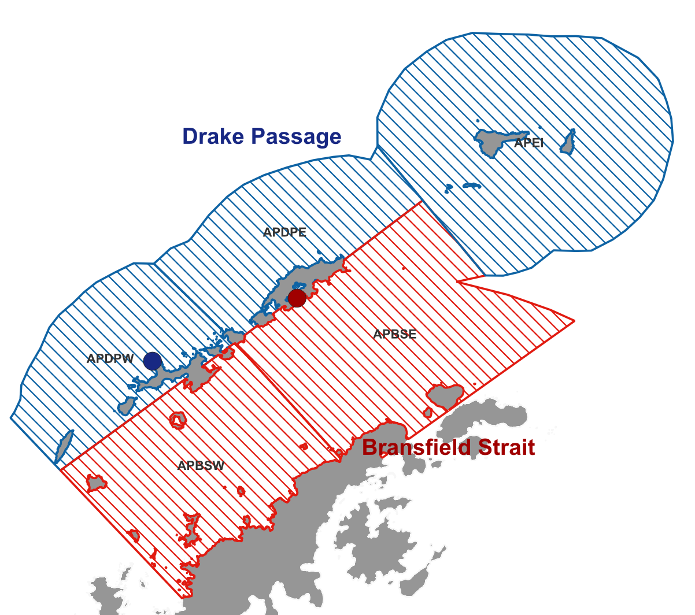
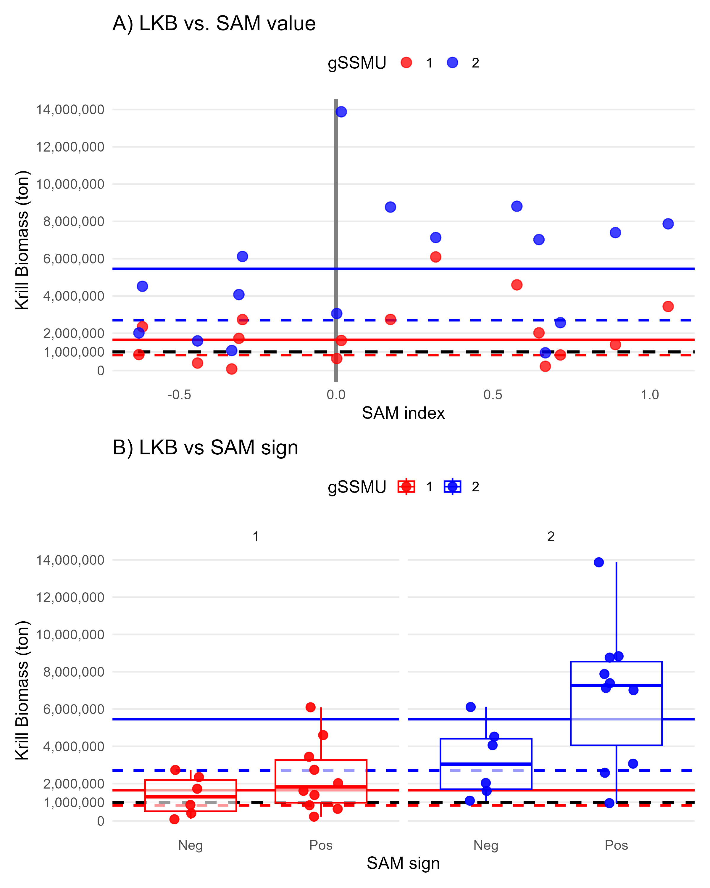
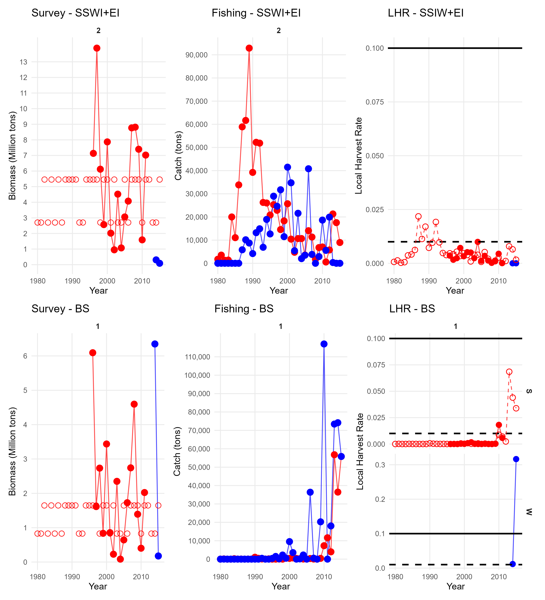
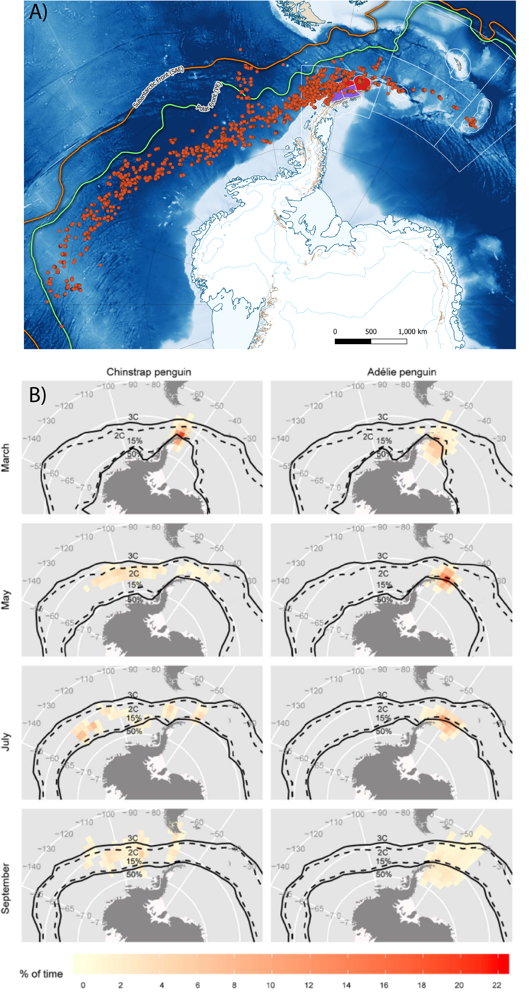
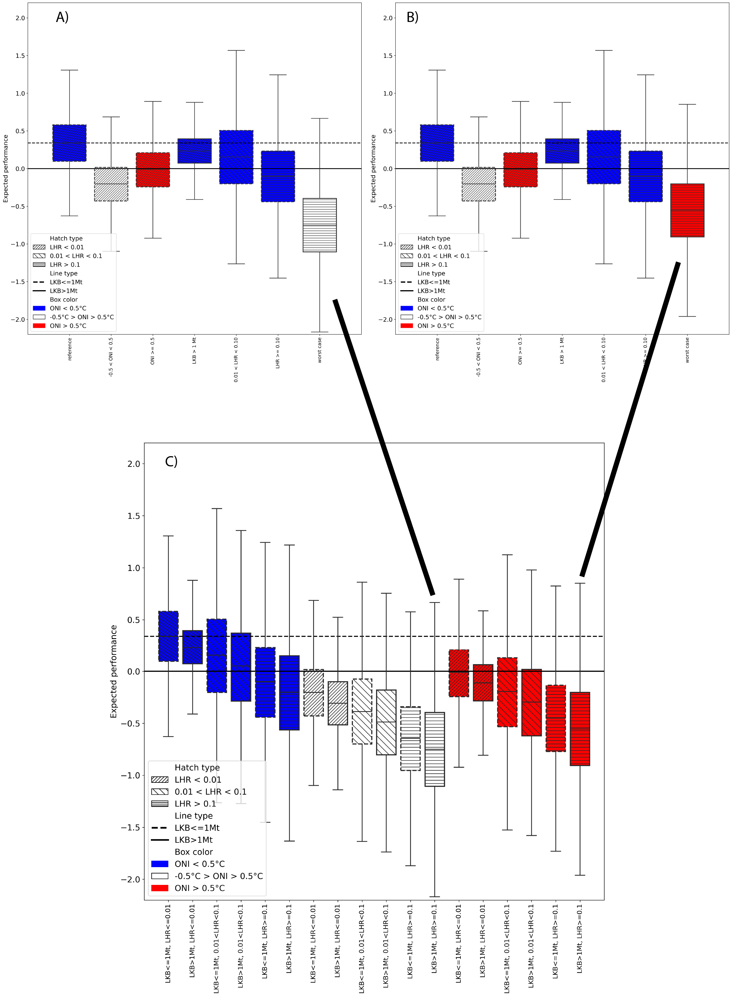
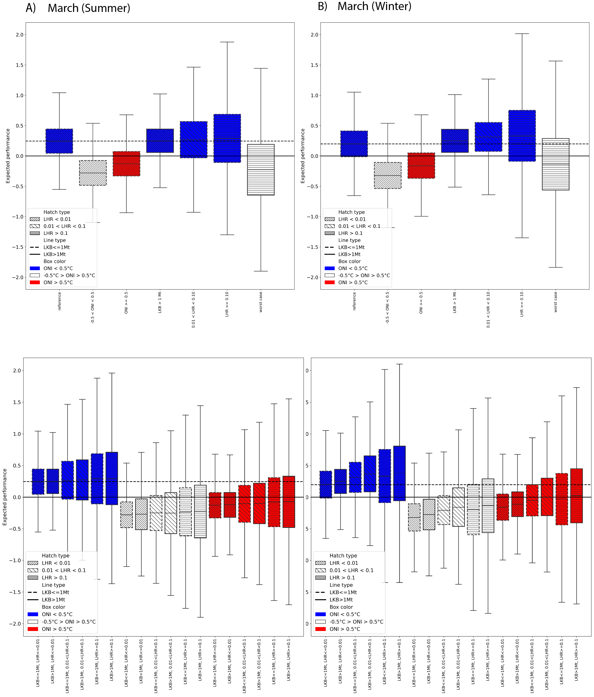
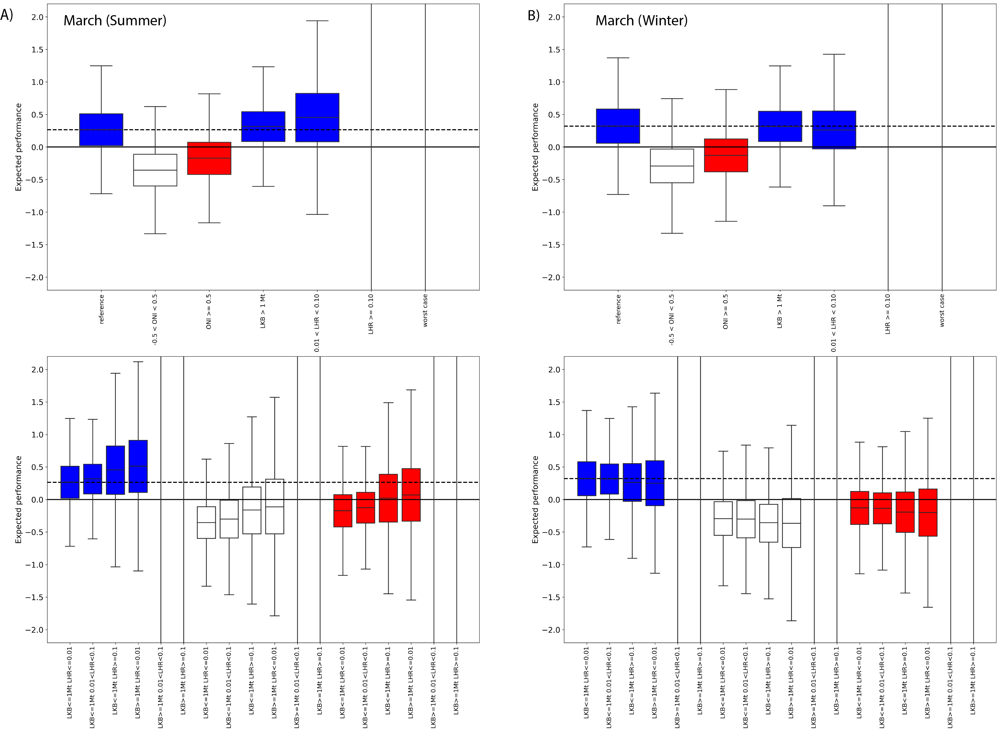
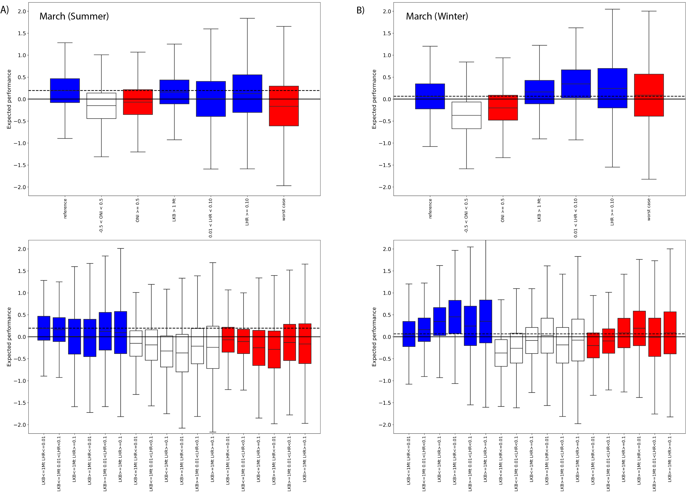
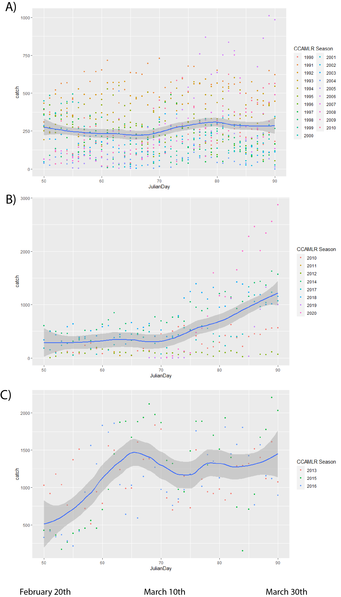

```{r setup, include=FALSE}
knitr::opts_chunk$set(echo = TRUE, comment=NA)
#options(knitr.kable.NA = '\\-')
library(trip)
#library(raster)
#library(rgdal)
library(lubridate)
library(tidyverse)
library(sf)
library(raster)
#options(kableExtra.latex.load_packages = FALSE)
library(kableExtra)
library(bibtex)
#library(rbbt)
library(pander)
library(track2KBA)
library(knitr)
library(lmerTest)
#library(officedown)
library(flextable)
library(tabulapdf)
library(formatR)
library(ggplot2)
library(patchwork)
library(scales)
```

# Tables:

Table 1. Estimates of the mean (mu) and standard deviation (sd) of
summer Ln(LKB) by gSSMU and SAM sign, derived from Equation (2) of Watters et
al. (2020). Statistical results from the nonparametric one-way ANOVA are
reported as follows: p-value_1 compares SAM sign within each gSSMU, and
p-value_2 compares gSSMUs within each SAM sign. The corresponding LKB
estimates appear in the column labelled median-LKB.

```{r Table.01, results='asis', warning=FALSE, echo=FALSE, message=FALSE, comment=NA}

# Load script without printing anything to the document
invisible(
  capture.output(
  source("./A_Results/Table_1_Figure_2_3.R"),
  type = "output"
  )
)

kable(Table.01, digits = 3)

```

\newpage

# Figures:

```{r Map colonies, out.width="100%", echo=FALSE}



```

Figure 1. Locations of penguin colonies and spatial management units in the study area. COPA is shown in red and SHIRREF in blue. The two gSSMUs are indicated by dashed outlines, gSSMU 1 in red and gSSMU 2 in blue. Surrounding SSMUs are also shown: APEI, Antarctic Peninsula Elephant Island; APDPE, Antarctic Peninsula Drake Passage East; APDPW, Antarctic Peninsula Drake Passage West; APBSE, Antarctic Peninsula Bransfield Strait East; APBSW, Antarctic Peninsula Bransfield Strait West.

```{r LKB vs SAM, fig.width=7.5, fig.asp=0.65, out.width="80%",fig.align="centre", warning=FALSE, echo=FALSE}



```

Figure 2. (A) Observed and imputed LKB (local krill biomass) by gSSMU
and summer SAM value. The dashed black line marks 1 Mt. Red and blue
dashed lines show mean values during negative SAM summers, and red and
blue solid lines show mean values during positive SAM summers (see Table
1). (B) Boxplots of observed LKB by gSSMU and SAM sign. Black, blue and
red lines as in figure (A). gSSMU 1 is shown in red and gSSMU 2 in blue.

```{r LKB vs LHR, fig.width=10, fig.asp=0.9, out.width="100%", echo=FALSE, warning=FALSE}




```

Figure 3. Krill survey estimates (LKB) (left), fishing catch (center)
and Local Harvest Rate (LHR) (right) for the study period. Top
panel:gSSMU 2 (SSIW-EI). Bottom panel: gSSMU 1 (BS). Filled circles show
survey data from Watters et al. 2020. Open circles show the mean imputed
median LKB values for negative and positive SAM, as per Table 1. Color
code: red = summer; blue = winter. Dash black line: LHR = 0.01; solid
black line: LHR = 0.10.

```{r Penguin distribution plots, out.width="65%",fig.align="centre", echo=FALSE}

knitr::include_graphics("./Watters EMM figures/Penguin distributions.png")

```

Figure 4. Penguin foraging behaviour during summer breeding, derived
from available ARGOS-CLS PTT data presented in Hinke et al. 2017. A)
Chinstrap penguins from Cape Shireff (blue) and Copacabana (green)
truncated at $10^{th}$ March in line with known phenology (Black 2016;
***Lowther et al.(this meeting).*** Elongated grey track represents a
single animal) B) Adélie penguins truncated to the end of January and C)
Gentoo penguins until August, representing all available PTT data
provided. The SSMU are combined and coloured according to gSSMU (red:
gSSMU 2; purple: gSSMU 1) with Chinstrap and Adélie penguin 99% MCP home
ranges occupying between 7-19% of the gSSMU to which they were assigned.

```{r Overwinter penguin  plots, fig.align="centre", out.width="75%", echo=FALSE}


```

Figure 5. A) Distribution of overwinter movement for Chinstrap penguins,
relative to the gSSMU's to which they were attributed, created from
telemetry data available in Hinke et al. 2019. B) Adélie and Chinstrap
penguin movement recorded by light geolocators, highlighting the large
longitudinal range both species disperse through at the end of breeding
(taken from Hinke et al. 2015). In the original model formulation by
Watters et al. 2020, the winter performance indices for both species are
matched to macroscale levels of ONI variability but gSSMU-scale
estimates of LKB and LHR.

```{r Watters original and mistake, fig.align="centre", out.width="75%", echo=FALSE}



```

Figure 6. Original Figure 1 plot from Watters et al. 2020 with A)
Neutral ONI and B) B) Warm ONI constituting the "Worst Case" selected.
C) Displays the original case-by-case plots recreated from the paper,
with Case 12 representing the intention while data from Case 18 was
selected for rendering the boxplot. Note that the expected performance
under neutral ONI "Worst Case" is poorer than under the warm ONI that
was presented in the original paper. Henceforth, to facilitate
comparison, we refer to the ONI Neutral plot however we consider this
unrealistic if the intention is to portray a "Worst Case" of a
continuing warming climate.

```{r Scenario plot 1, out.width="100%", fig.align="left", echo=FALSE}


```

Figure 7. Model output for the alternatve Watters et al. 2020 scenario
outlined above (all species initially present, Adélie and Chinstrap
penguins migrate out of the area after breeding, LKB and LHR rescaled to
SSMU and March included in summer or winter). Selected cases as per
Watters et al. 2020 for March in A) Summer and B) Winter are provided,
with the corresponding case-by-case boxplots presented beneath. Boxplots
are colour-coded by ONI state (red=warm, white=neutral, blue=cold). In
all cases, the marginal effect of ONI dominated the expected performance
of penguins against their long-term mean, irrespective of LKB or LHR.

```{r Scenario plot 2, out.width="100%", fig.align="left", echo=FALSE, eval=FALSE}


```

Figure 8. Model output for Watters et al. 2020 Scenario #2 outlined
above (all species initially present, Adélie and Chinstrap penguins
migrate out of the area after breeding, LKB and LHR rescaled to SSMU and
March included in summer or winter). Selected cases as per Watters et
al. 2020 for March in A) Summer and B) Winter are provided, with the
corresponding case-by-case boxplots presented beneath. Boxplots are
colour-coded by ONI state (red:warm; white:neutral; blue:cold). In all
cases, the marginal effect of ONI dominated the expected performance of
penguins against their long-term mean, irrespective of LKB or LHR.

```{r Scenario plot 3, out.width="100%", fig.align="left", echo=FALSE, eval=FALSE}


```

Figure 9. Model output for Scenario \\#3 outlined above (all species
initially present,Adélie and chinstrap penguins migrate out of the area
after breeding, LKB and LHR rescaled to SSMU and March included in
summer or winter). Selected cases as per Watters et al. 2020 for March
in A) Summer and B) Winter are provided, with the corresponding
case-by-case boxplots presented beneath. Boxplots are colour-coded by
ONI state (red;warm, white;neutral, blue;cold). In all cases, the
marginal effect of ONI dominated the expected performance of penguins
against their long-term mean, irrespective of LKB or LHR.

```{r March Subarea 48.1 fishing plot, out.width="60%", fig.align="centre", echo=FALSE}

#
```

Figure 10. Daily accumulated catch (and fitted LOESS smooth curves) in
Subarea 48.1 between 20$^{th}$ February and March 31$^{st}$ between A)
1990-2010 and B) 2010 to 2020. Catch in the Subarea was relatively
consistent during the latter stages of penguin breeding at approximately
250tonnes/d (NOTE: different scaling of catch on y-axis between plots).
However, since 2010 there has been a tendency for the fishery to
increase its effort in the Subarea, starting around the middle of March.
C) During this latter period, the fishery increased effort earlier on
three occasions (2013, 2015 and 2016), starting before the beginning of
March.
