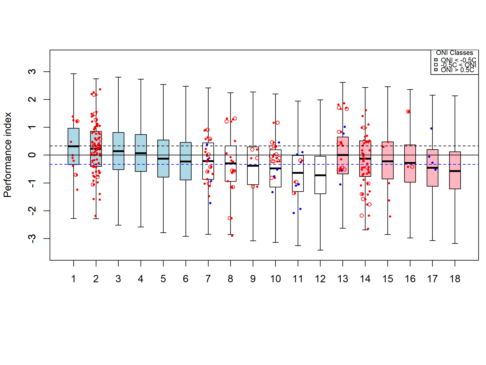
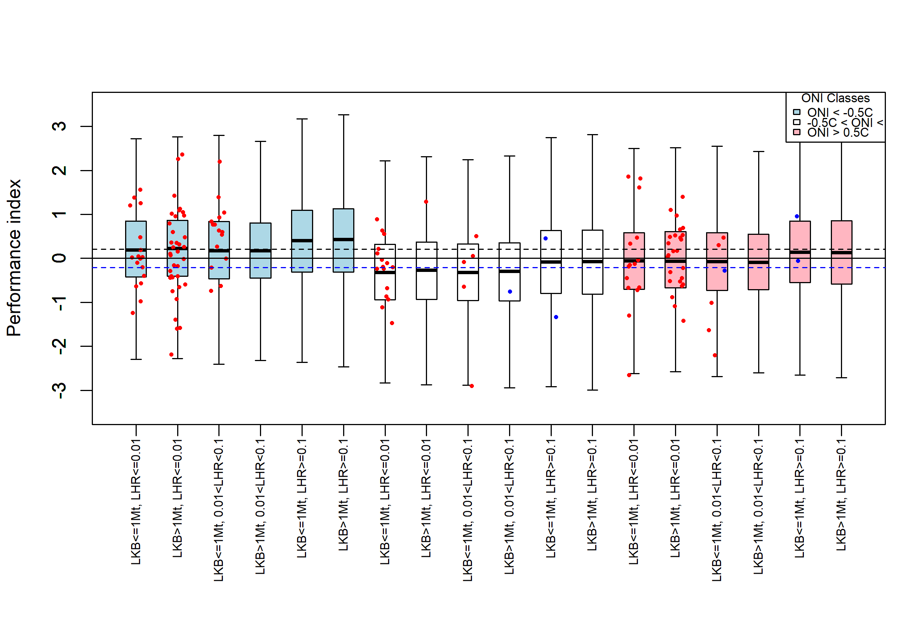
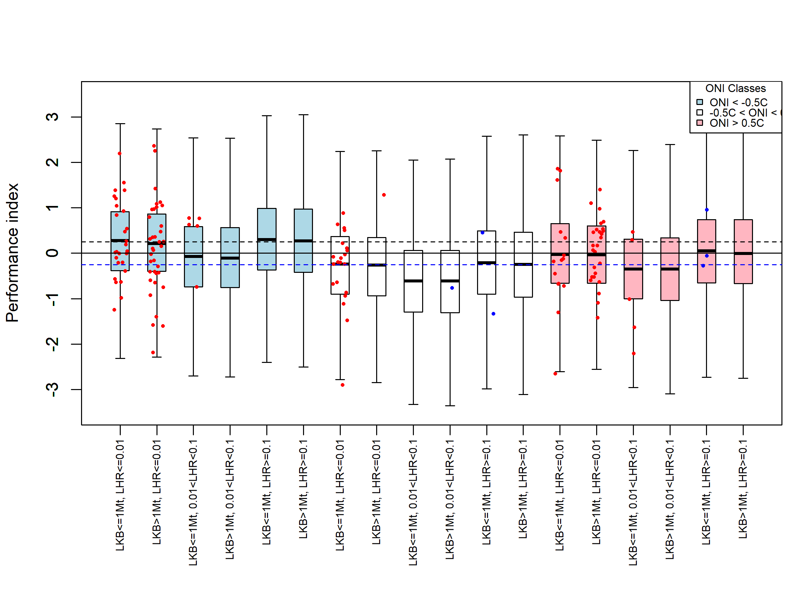
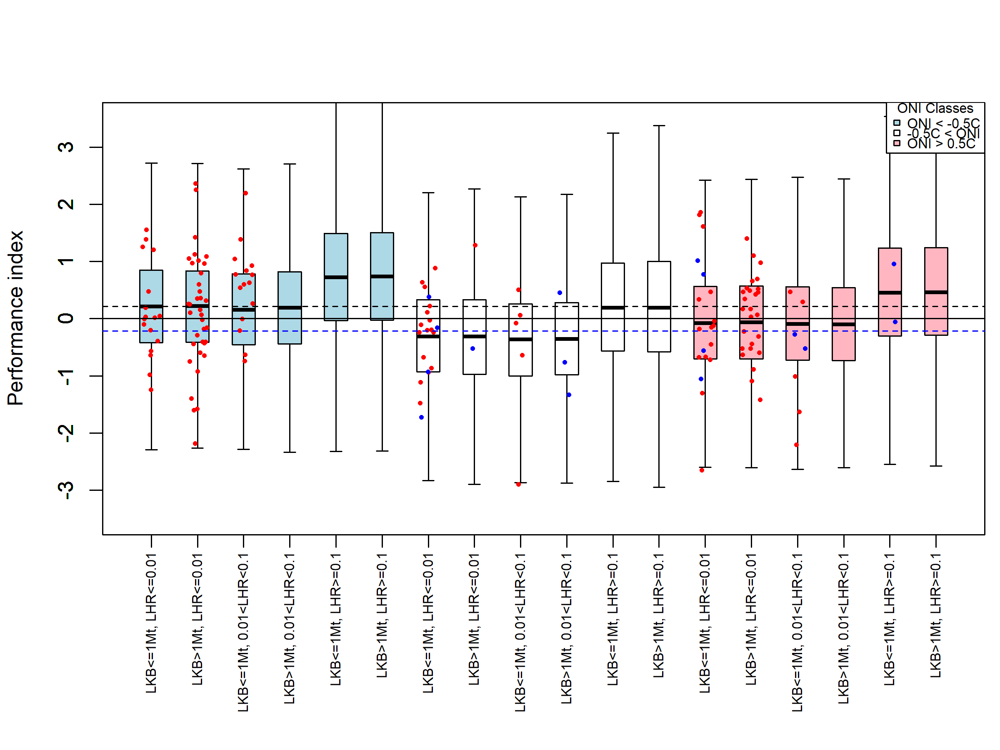

```{r setup, include=FALSE}
knitr::opts_chunk$set(echo = TRUE, comment=NA)
#options(knitr.kable.NA = '\\-')
library(trip)
library(raster)
#library(rgdal)
library(lubridate)
library(tidyverse)
library(sf)
library(raster)
#options(kableExtra.latex.load_packages = FALSE)
library(kableExtra)
library(RefManageR)
library(bibtex)
#library(rbbt)
library(pander)
library(track2KBA)
library(knitr)
library(lmerTest)
library(formatR)
library(tinytex)
library(patchwork)
library(tibble)
library(ggplot2)
library(scales)
library(stringr)
library(webshot2)
library(flextable)
library(dplyr)

```

# A. Analysis of Survey Coverage

Survey coverage, expressed as nautical miles surveyed within each gSSMU
and survey leg, varied among years and between legs. In most years, two
survey legs were conducted. Watters et al. (2020) proposed excluding
surveys with transect coverage of 80 nm or less, but did not apply this
criterion.

Rather than applying a fixed threshold, we examined the frequency
distribution of surveyed transect lengths for gSSMUs 1 and 2 separately
and excluded surveys falling below the lower 10th percentile. This
approach resulted in the exclusion of four survey legs in gSSMU 1 (≤10
nm; 1996, 1999, 2010, and 2012) and three survey legs in gSSMU 2 (≤200
nm; 2010, 2011 and 2012) (Figure S1).

```{r Survey cover effort, fig.width=7.5, fig.asp=0.6, out.width="80%",fig.align="centre", warning=FALSE, echo=FALSE}

# load script that produces fig_g1 and fig_g2
suppressMessages(
  suppressWarnings(
    source("./A_Results_Suppl/Figure_S1_Survey_analysis.R")
  )
)

print(fig_g1)

print(fig_g2)

```

Figure S1. Annual survey coverage (total transect length surveyed) by
gSSMU, year and survey leg [top panel]. Frequency distribution of summed
transect lengths across all surveys, with the 10th percentile marked by
the dashed line [bottom panel].

\newpage

# B. Distribution of observed vs imputed summer ln*LKB* values

```{r data reading, results='asis', warning=FALSE, echo=FALSE, message=FALSE, comment=NA}

# load script that produces results
suppressMessages(
  suppressWarnings(
    source("./A_Results_Suppl/Figure_S2_S4_Table_S1_S5.R")
  )
)
```

We evaluated the procedure used to impute LKB values in years without survey data. First, we assessed whether lnLKB from survey observations followed a normal distribution, as assumed during the imputation process. We fitted a log-normal distribution to the survey-based LKB data and assessed normality of lnLKB using the Shapiro–Wilk test. Survey data stratified by gSSMU and SAM sign all fitted a log-normal distribution (Table S1). 
We then compared three sets of LKB and LHR distributions: (i) imputed values from Watters et al. (2020); (ii) observed survey data filtered by survey coverage, with LHR estimated from the filtered data; and (iii) LKB and LHR assigned to SSMUs (Model SSMU; this paper) (Fig. S2).
The distribution of LKB and LHR categories across gSSMUs and SAM sign categories was similar across the three estimation methods. However, the use of smaller management units (SSMU) resulted in a higher frequency of seasons with LKB ≤ 1 Mt, particularly in gSSMU #2. However, because fishing catches are aggregated at the same SSMU scale, LHR values remained predominantly ≤ 0.01. The main difference was the increased frequency of seasons with intermediate LHR (0.01 – 0.10) in gSSM#2 (Fig. S3).


```{r Table S1, results='asis', warning=FALSE, echo=FALSE, message=FALSE, comment=NA}

shapiro_results1 |>
  flextable() |>
  set_header_labels(
    gSSMU = "gSSMU",
    sam.sign = "SAM sign",
    n = "n",
    W = "W",
    p_value = "p"
  ) |>
  colformat_num(j = 3) |>
  fontsize(size = 8, part = "all") |>
  padding(padding = 1, part = "all") |>
  autofit() |>
  set_caption("Table S1. Shapiro–Wilk test results for normality of log-transformed observed LKB values (lnLKB), stratified by gSSMU and SAM sign. Columns report sample size (n), the Shapiro-Wilk W statistic, and the associated p-value.")
```


\newpage
```{r hist.LKBs, fig.show="hold", out.width="55%", echo=FALSE}

knitr::include_graphics(c(
  "./A_Results_Suppl/Model01_filtered/hist_LKB_obs_imp.png"))
```

Figure S2. Frequency distribution of summer ln(LKB) for observed (LKB.obs; red) and imputed (LKB.imp; blue) data. 

\newpage
```{r fig-s3, fig.show="hold", out.width="55%", echo=FALSE}

knitr::include_graphics(c(
  "./A_Results/Watters_model/Imputed/freq_dist_summer_biomass.png",
  "./A_Results/Watters_model/Imputed/freq_dist_summer_hr.png"))
knitr::include_graphics(c(
  "./A_Results_Suppl/Model01_filtered/obs_freq_dist_summer_biomass.png",
  "./A_Results_Suppl/Model01_filtered/obs_freq_dist_summer_hr.png"))
knitr::include_graphics(c(
  "./A_Results/Model02_SSMU/obs_freq_dist_summer_biomass.png",
  "./A_Results/Model02_SSMU/obs_freq_dist_summer_hr.png"))
```

Figure S3. Frequency distribution of summer krill biomass (LKB; left panels) and summer harvest rate (LHR; right panels). Rows show imputed values from Watters et al. (2020) (top; blue), observed survey data filtered by survey coverage (middle; red), and Model SSMU estimates (this study; bottom; green). Results are shown separately for each SAM sign and gSSMU combination. 

\newpage
```{r fig-s4, fig.show="hold", out.width="55%", echo=FALSE}

knitr::include_graphics(c(
  "./A_Results/Watters_model/Imputed/freq_dist_bclass.png",
  "./A_Results/Watters_model/Imputed/freq_dist_hrclass.png"))
knitr::include_graphics(c(
  "./A_Results_Suppl/Model01_filtered/obs_freq_dist_bclass.png",
  "./A_Results_Suppl/Model01_filtered/obs_freq_dist_hrclass.png"))
knitr::include_graphics(c(
  "./A_Results/Model02_SSMU/obs_freq_dist_bclass.png",
  "./A_Results/Model02_SSMU/obs_freq_dist_hrclass.png"))
```

Figure S4. Frequency distribution of LKB categories (left panels) and LHR categories (right panels). Rows show imputed values from Watters et al. (2020) (top; blue), observed survey data filtered by survey coverage (middle; red), and Model SSMU estimates (this study; bottom; green). Results are shown separately for each SAM sign and gSSMU combination.


\newpage
# C. Relationship between penguin performance indices and environmental and krill related categories

We analysed the relationship between penguin indices and the variables used to assess its performance: SAM sign, ONI value (cold, neutral, warm), krill biomass (LKB) and harvest rate (LHR). 
Our results indicate that there was no significant relationship between summer or winter indices with either SAM, ONI, LKB and LHR categories (Table S2; Figs. S5-S6). When LKB and LHR actual values were used, fledgling weight (FWT) and trip duration (REVTD) were positivey corrated with summer LHR, although non significant. The only significant relationship was clutching initiation date (REVCID) and winter LHR (p = 0.0076), with clutching date being earlier as LHR increases, indictive of better performace (Table S3; Fig. S7-S8).  


```{r Table Peng Indices Categorical, results='asis', warning=FALSE, echo=FALSE, message=FALSE, comment=NA}

Table_Cat <- read.csv( "./A_Results_Suppl/Model01_filtered/Table_CatTests.csv")
Table_Cat <- Table_Cat %>% dplyr::select(-N) 

Table_Cat |>
  flextable() |>
            set_header_labels(
              Season = "Season", 
              Param = "Index", 
              Predictor = "Predictor",
              Test = "Test", 
              Comparison = "Comparison",
              Groups_N = "Groups (N)",
              Statistic = "Statistic",
              `p-value` = "p",
              Sig = "Significance") |>
            colformat_num(3) |>
            fontsize(size = 8, part = "all") |>
            padding(padding = 1, part = "all") |>
            autofit() |>
            set_caption("Table S2. Statistical analyses of penguin indices versus environmental and krill related categories. FWT: fledge weight; PHS: post-hatch success; REVTD: reverse trip duration; EGG: mean egg density; REVCID: reverse clutch initiation date.")

```


```{r Indices Correlations, results='asis', warning=FALSE, echo=FALSE, message=FALSE, comment=NA}

Table_Corr <- read.csv( "./A_Results_Suppl/Model01_filtered/Table_CorrTests.csv")
Table_Corr <- Table_Corr %>% dplyr::select(-Comparison, -Groups_N) 

Table_Corr |>
  flextable()|>
            set_header_labels(
              Season = "Season", 
              Param = "Index", 
              Predictor = "Predictor",
              Test = "Test", 
              N = "N",
              Statistic = "Statistic",
              `p-value` = "p",
              Sig = "Significance") |>
            colformat_num(3) |>
            fontsize(size = 8, part = "all") |>
            padding(padding = 1, part = "all") |>
            autofit() |>
            set_caption("Table S3. Statistical analyses of penguin indices versus environmental and krill related categories. FWT: fledge weight; PHS: post-hatch success; REVTD: reverse trip duration; EGG: mean egg density; REVCID: reverse clutch initiation date.")

```


```{r Peng summer indices categories, fig.show="hold", out.width="90%", echo=FALSE}

knitr::include_graphics(c(
  "./A_Results_Suppl/Model01_filtered/Fig_Boxplot_Summer.png"))
```

Figure S5. Boxplot of summer penguin indices in relationship to environmental variables (SAM, ONI) and krill biomass (LKB) and harvest rate (LHR). 


```{r Peng winter indices categories, fig.show="hold", out.width="90%", echo=FALSE}

knitr::include_graphics(c(
  "./A_Results_Suppl/Model01_filtered/Fig_Boxplot_Winter.png"))
```

Figure S6. Boxplot of winter penguin indices in relationship to environmental variables (SAM, ONI) and krill biomass (LKB) and harvest rate (LHR).


```{r summer Peng indices1 vs LKB LHR, fig.show="hold", out.width="90%", echo=FALSE}

knitr::include_graphics(c(
  "./A_Results_Suppl/Model01_filtered/Fig_Scatter_Summer_LKB.png"))
```

```{r summer Peng indices2 vs LKB LHR, fig.show="hold", out.width="90%", echo=FALSE}

knitr::include_graphics(c(
  "./A_Results_Suppl/Model01_filtered/Fig_Scatter_Summer_LHR.png"))
```

Figure S7. Scatter plot of summer penguin indices and krill biomass (LKB; top) and harvest rate (LHR; bottom).


```{r winter Peng indices1 vs LKB LHR, fig.show="hold", out.width="55%", echo=FALSE}

knitr::include_graphics(c(
  "./A_Results_Suppl/Model01_filtered/Fig_Scatter_Winter_LKB.png"))
```


```{r winter Peng indices2 vs LKB LHR, fig.show="hold", out.width="55%", echo=FALSE}

knitr::include_graphics(c(
  "./A_Results_Suppl/Model01_filtered/Fig_Scatter_Winter_LHR.png"))
```

Figure S8. Scatter plot of winter penguin indices and krill biomass (LKB; top) and harvest rate (LHR; bottom).


\newpage
# D. Effect of Survey filtering and imputed LKB values on penguin performance

Penguin performance and posterior predictive distributions were
re-analysed after excluding surveys with low spatial coverage. In this
initial sensitivity analysis, missing summer LKB values were not imputed
(Figures S4--S5). These analyses are directly comparable to
Supplementary Figures S7--S8 of Watters et al. (2020). We then repeated
the analysis with missing summer LKB values imputed using the median
summer LKB derived from surveyed years (Table 1; Figures S6--S7).

Posterior predictive distributions showed that only a subset of the
possible ONI--LKB--LHR combinations were supported by empirical
observations (Figure S4; Table S3). Most data were concentrated in
summer cases with low harvest rates (LHR ≤0.01) across all ONI
categories and both LKB classes, together with a limited number of
winter cases characterized by intermediate or high harvest rates.
Several combinations, including the nominal "worst case" scenario (−0.5
\< ONI \< 0.5; LKB \> 1 Mt; LHR ≥0.10), had no empirical observations.

Across supported cases, penguin performance varied most strongly among
ONI categories. Comparisons between otherwise identical cases differing
only in ONI (e.g., cases 1--2, 7--8, and 13--14) showed consistently
higher performance under negative ONI conditions and lower performance
under intermediate ONI conditions, based on summer-derived indices.
Winter observations were sparse but included the lowest performance
values observed, particularly for the combination −0.5 \< ONI \< 0.5,
LKB \> 1 Mt, and 0.01 \< LHR \< 0.10 (case 10).

Imputing missing summer LKB values resulted in only minor changes to
posterior predictive distributions of penguin performance (Figure S6).
The primary effect was increased support for reduced performance in case
9 (−0.5 \< ONI \< 0.5; LKB ≤ 1 Mt; 0.01 \< LHR \< 0.10). The nominal
"worst case" scenario (case 12) remained unsupported by either observed
or imputed data.

Posterior expectations of penguin performance after filtering for survey
coverage (Figure S5) were broadly similar to those reported by Watters
et al. (2020, Supplementary Figure S8), but differed in three key
respects. First, the nominal "worst case" scenario no longer produced
the lowest expected performance and instead lay close to the long-term
mean. Second, scenarios with high harvest rates (LHR ≥0.10) exhibited
median performance comparable to the "best case." Third, the lowest
median performance was associated with intermediate harvest rates (0.01
\< LHR \< 0.10; equivalent to case 3), followed by intermediate ONI
conditions (equivalent to case 7; Figure S5). These patterns were
maintained, and further accentuated, when missing summer LKB values were
imputed (Figure S7). Consistent with Watters et al. (2020), variation in
LKB (\<1 Mt versus \>1 Mt) exhibited the weakest association with
penguin performance.

Taken together, these results indicate that, once surveys with low
spatial coverage are excluded, penguin performance is most strongly
associated with intermediate ONI and intermediate LHR conditions. High
LKB (\>1 Mt) and high LHR (≥0.10) scenarios show limited influence on
expected performance, and the nominal "worst case" scenario remains
close to the long-term mean (Figures S5 & S7) and unsupported by
empirical data (Figures S4 and S6).

Table S4. The posterior predictive distributions shows that only some of
the potential combinations have actual data (Fig. S4). Specifically,
most data comes from the following combinations:

| Scenario        | ONI               | LKB     | LHR                | Season |
|-----------------|-------------------|---------|--------------------|--------|
| Case 1 ('best') | ≤ -0.5            | ≤ 1 Mt  | ≤ 0.01             | summer |
| Case 2          | ≤ -0.5            | \> 1 Mt | ≤ 0.01             | summer |
| Case 7          | -0.5 \< ONI \<0.5 | ≤ 1 Mt  | ≤ 0.01             | summer |
| Case 8          | -0.5 \< ONI \<0.5 | \> 1 Mt | ≤ 0.01             | summer |
| Case 10         | -0.5 \< ONI \<0.5 | \> 1 Mt | 0.01 \< LHR \< 0.1 | winter |
| Case 13         | ≥ 0.5             | ≤ 1 Mt  | ≤ 0.01             | summer |
| Case 14         | ≥ 0.5             | \> 1 Mt | ≤ 0.01             | summer |
| Case 17         | ≥ 0.5             | ≤ 1 Mt  | ≥ 0.1              | winter |

\newpage
```{r Posterior preductive Model01, fig.width=8.0, fig.asp=1.00, out.width="100%",fig.align="centre", warning=FALSE, echo=FALSE}

knitr::include_graphics("./A_Results_Suppl/Model01_filtered/Posterior_predictive_dist_mod01.png")


```

Figure S9. Posterior predictive distributions (boxplots) and jittered
observations (colored circles) of penguin performance, after removing
low coverage survey data; missing summer LKB were not imputed. Case 1 is
ONI ≤ -0.5°C; LKB ≤ 1 Mt; and LHR ≤ 0.01 (the "best case"). Case 2 is
ONI ≤ -0.5°C; LKB \> 1 Mt; and LHR ≤ 0.01. Case 3 is ONI ≤ -0.5°C; LKB ≤
1 Mt; and 0.01 \< LHR \< 0.1. Case 4 is ONI ≤ -0.5°C; LKB \> 1 Mt; and
0.01 \< LHR \< 0.1. Case 5 is ONI ≤ -0.5°C; LKB ≤ 1 Mt; and LHR ≥ 0.1.
Case 6 is ONI ≤ -0.5°C; LKB \> 1 Mt; and LHR ≥ 0.1. Cases 7-12 are the
same as Cases 1-6 except -0.5°C \< ONI \< 0.5°C; Case 12 is the "worst
case." Cases 13-18 are the same as Cases 1-6 except ONI ≥ 0.5°C. Filled
red circles represent summer observations from krill surveys. Blue
circles represent winter observations. Boxes characterize interquartile
ranges with medians indicated by bold horizontal lines and whiskers
extending to 1.5 times these ranges.

\newpage
```{r Peng Performance Model01, fig.width=8.0, fig.asp=0.5, out.width="100%",fig.align="centre", warning=FALSE, echo=FALSE}

knitr::include_graphics("./A_Results_Suppl/Model01_filtered/Penguin_performance_mod01.png")


```

Figure S10. Posterior expectations of penguin performance from the
sensitivity test in which: low coverage survey data was removed, and
missing summer LKB were not imputed. The "best case" is ONI ≤ -0.5; LKB
≤ 1 Mt; and LHR ≤ 0.01. The "worst case" is -0.5 \< ONI \< 0.5; LKB \> 1
Mt, and LHR ≥ 0.1. All other cases are marginal deviations from the best
case. The median, interquartile range, and range of the posterior
expectations are provided for each boxplot. Reference lines respectively
indicate the median expected performance in the best case (dashed line)
and the long-term mean performance (solid line). As per Supplementary
Fig. S8, Watters et al. (2020).

\newpage
```{r Posterior preductive Model01 imputed, fig.width=8.0, fig.asp=1.00, out.width="100%",fig.align="centre", warning=FALSE, echo=FALSE}

knitr::include_graphics("./A_Results_Suppl/Model01_imputed1/Posterior_predictive_dist_mod01imp.png")


```

Figure S11. Posterior predictive distributions (boxplots) and jittered
observations (colored circles) of penguin performance, after removing
low coverage survey data; missing summer LKB were imputed according to
values in Table 1. Case 1 is ONI ≤ -0.5°C; LKB ≤ 1 Mt; and LHR ≤ 0.01
(the "best case"). Case 2 is ONI ≤ -0.5°C; LKB \> 1 Mt; and LHR ≤ 0.01.
Case 3 is ONI ≤ -0.5°C; LKB ≤ 1 Mt; and 0.01 \< LHR \< 0.1. Case 4 is
ONI ≤ -0.5°C; LKB \> 1 Mt; and 0.01 \< LHR \< 0.1. Case 5 is ONI ≤
-0.5°C; LKB ≤ 1 Mt; and LHR ≥ 0.1. Case 6 is ONI ≤ -0.5°C; LKB \> 1 Mt;
and LHR ≥ 0.1. Cases 7-12 are the same as Cases 1-6 except -0.5°C \< ONI
\< 0.5°C; Case 12 is the "worst case." Cases 13-18 are the same as Cases
1-6 except ONI ≥ 0.5°C. Filled red circles represent summer observations
from krill surveys. Blue circles represent winter observations. Boxes
characterize interquartile ranges with medians indicated by bold
horizontal lines and whiskers extending to 1.5 times these ranges.

\newpage
```{r Peng Performance Model01 imputed, fig.width=8.0, fig.asp=1.00, out.width="100%",fig.align="centre", warning=FALSE, echo=FALSE}

knitr::include_graphics("./A_Results_Suppl/Model01_imputed1/Penguin_performance_mod01imp.png")


```

Figure S12. Posterior expectations of penguin performance from the
sensitivity test in which: low coverage survey data was removed; missing
summer LKB were imputed according to values in Table 1. The "best case"
is ONI ≤ -0.5; LKB ≤ 1 Mt; and LHR ≤ 0.01. The "worst case" is -0.5 \<
ONI \< 0.5; LKB \> 1 Mt, and LHR ≥ 0.1. All other cases are marginal
deviations from the best case. The median, interquartile range, and
range of the posterior expectations are provided for each boxplot.
Reference lines respectively indicate the median expected performance in
the best case (dashed line) and the long-term mean performance (solid
line). As per Supplementary Fig. S8, Watters et al. (2020).

\newpage
# D. Continuing spatial and temporal mismatches

```{r Table S5, results='asis', warning=FALSE, echo=FALSE, message=FALSE, comment=NA}

# load csv table
ssmu_table <- read.csv("./Supplementary files/SSMU48_area.csv")

knitr::kable(ssmu_table, digits = 3, booktabs=TRUE,  
      col.names = c("SSMU", 
             "Area (km2)", 
              "gSSMU",
              "Area fraction"),
      longtable=TRUE, align="lccc", caption = "Table S4. Size of SSMUs for Subarea 48.1 and its relative size to the gSSMU where they are located. CCAMLR Small-Scale Management Units (SSMUs) were download from CCAMLR Public repository (https://github.com/ccamlr/data).
CCAMLR. 2022. Geographical data layer: CCAMLR Fishery Small-Scale Management Units. Version 0.9, URL: <https://github.com/ccamlr/data/tree/main/geographical_data/ssmu/versions/v0.9>.", escape=FALSE)

```


Effect of Spatial and temporal mismatches in penguin performance.

```{r Peng posterior predictive Performance , fig.width=8.0, fig.asp=1.00, out.width="65%",fig.align="centre", warning=FALSE, echo=FALSE}









```

Figure S13. Posterior predictive distributions (boxplots) and jittered observations (colored circles) of penguin  76 performance. A) Watters model. B) Andy spatial. C) Andy SApatial, MArch = winter. D) Spatial and temporal SSMUs.


\newpage
# E. Krill consumption by main predator taxa


Estimates of krill consumption by major predator groups during the study
period have been previously summarized by Hill et al. (2007). During
summer, fish accounted for the largest proportion of krill consumption,
with estimated removals of
`r scales::comma(round(sum(Table.07$Fish_Krill_ton[3:4]), 0))` in the
Bransfield Strait (gSMSMU #1: APBSW + APBSE) and
`r scales::comma(round(sum(Table.07$Fish_Krill_ton[1:2]), 0))` in the
Drake Passage (gSSMU #2: APDPW + APDPE). Combined summer consumption by
penguins and whales was estimated at
`r scales::comma(round(sum(Table.06$Whale_Krill_ton[3:4])+sum(Table.06$Penguin_Krill_ton[3:4]), 0))`
in the Bransfield Strait and
`r scales::comma(round(sum(Table.06$Whale_Krill_ton[1:2])+sum(Table.06$Penguin_Krill_ton[1:2]), 0))`
in the Drake Passage. Total summer krill consumption therefore exceeded
1 Mt in both gSSMU 1 and gSSMU 2.

Watters et al. (2020) noted "krill biomass in the Antarctic Peninsula is
generally sufficient to support penguin production." Consistent with
this, no evidence of acute adult penguin mortality or complete lack of
bird attending nesting grounds has been documented in the region, unlike
patterns reported for other penguin species during severe starvation
events (Vianna et al. 2014, Crawford et al. 2025). In this context,
summer survey estimates below 1 million tonnes for each gSSMU are
inconsistent with observed predator dynamics and likely underestimate
krill availability.

As Watters et al. (2020) indicates, "krill biomass in the AP is
generally sufficient to support penguin production." As no evidene of
accute adult penguin mortality has been recorded for the region (as is
the case for other penguin species during accute starvation; Crawford et
al. 2025), summer survey estimates below 1 Million tonnes for each gSSMU
should be considered as gross subestimations of krill availability.

Winter consumption estimates were lower but more uncertain. Hill et al.
(2007) estimated fish consumption of
`r scales::comma(round(sum(Table.07$Fish_Krill_ton[3:4]), 0))` in the
Bransfield Strait and
`r scales::comma(round(sum(Table.07$Fish_Krill_ton[1:2]), 0))` in the
Drake Passage. Penguin consumption during winter was estimated at
`r scales::comma(round(sum(Table.07$Penguin_Krill_ton[3:4]), 0))` in the
Bransfield Strait and
`r scales::comma(round(sum(Table.07$Penguin_Krill_ton[1:2]), 0))` in the
Drake Passage. Combined winter consumption by fish and penguins
therefore exceeded 500,000 t and 350,000 for gSSMU #1 and #2.
respectively.


```{r Table S6, results='asis', warning=FALSE, echo=FALSE, message=FALSE, comment=NA}

flextable(Table.05) |>
  fontsize(size = 8, part = "all") |>
  padding(padding = 1, part = "all") |>
  autofit() |>
  set_caption("Table S6. Estimated whale abundance for gSSMU #1 and #2 during the study period.")

```


```{r Table S7, results='asis', warning=FALSE, echo=FALSE, message=FALSE, comment=NA}

flextable(Table.06) |>
  fontsize(size = 8, part = "all") |>
  padding(padding = 1, part = "all") |>
  autofit() |>
  set_caption("Table S7. Estimated krill consumption by major predator taxa during the
austral summer. Values from Hill et al. (2007), Table 15.")

```


```{r Table S8, results='asis', warning=FALSE, echo=FALSE, message=FALSE, comment=NA}

flextable(Table.07) |>
  fontsize(size = 8, part = "all") |>
  padding(padding = 1, part = "all") |>
  autofit() |>
  set_caption("Table S8. Estimated krill consumption by major predator taxa during the
austral winter. Values from Hill et al. (2007), Table 15.")


```

```{=tex}
\elandscape
\newpage
```
# Citations

Biuw, M., Lindstrøm, U., Jackson, J.A., Baines, M., Kelly, N., McCallum, G., Skaret, G., Krafft, B.A. Estimated summer abundance and krill consumption of fin whales throughout the Scotia Sea during the 2018/2019 summer season. Sci Rep 14, 7493 (2024).

Herr, H., Viquerat, S., Devas, F., Lees, A., Wells, L., Gregory, B., Giffords, T., Beecham, D., Meyer, B. Return of large fin whale feeding aggregations to historical whaling grounds in the Southern Ocean. Sci Rep 12, 9458 (2022).

Herr, H., Viquerat, S., Siegel, V., Kock, K.-H., Dorschel, B., Huneke, W.G.C., Bracher, A., Schröder, M., Gutt, J. Horizontal niche partitioning of humpback and fin whales around the West Antarctic Peninsula: evidence from a concurrent whale and krill survey. Polar Biol 39, 799–818 (2016).

Hill, S.L., Reid, K., Thorpe, S.E., Cb, C., Hinke, J., Watters, G.M., Grove, P. A compilation of parameters for ecosystem dynamics models of the Scotia Sea – Antarctic Peninsula region. CCAMLR Science 14, 1–25 (2007).

Johannessen, J.E.D., Biuw, M., Lindstrøm, U., Ollus, V.M.S., Martín López, L.M., Gkikopoulou, K.C., Oosthuizen, W.C., Lowther, A. Intra‐season variations in distribution and abundance of humpback whales in the West Antarctic Peninsula using cruise vessels as opportunistic platforms. Ecology and Evolution 12, e8571 (2022).

Reilly, S., Hedley, S., Borberg, J., Hewitt, R., Thiele, D., Watkins, J., Naganobu, M. Biomass and energy transfer to baleen whales in the South Atlantic sector of the Southern Ocean. Deep Sea Research Part II: Topical Studies in Oceanography 51, 1397–1409 (2004).

Seyboth, E., Meynecke, J.-O., De Bie, J., Roychoudhury, A., Findlay, K. A review of post-whaling abundance, trends, changes in distribution and migration patterns, and supplementary feeding of Southern Hemisphere humpback whales. Front. Mar. Sci. 10, 997491 (2023).

Vianna, J.A., Cortes, M., Ramos, B., Sallaberry-Pincheira, N., González, D., Dantas, G.P.M., Morgante, J., Simeone, A., Luna-Jorquera, G., 2014. Changes in abundance and distribution of Humboldt penguin Spheniscus humboldti. Marine Ornithology 42, 153–159 (2014).

Watters, G.M., Hinke, J.T., Reiss, C.S. Long-term observations from Antarctica demonstrate that mismatched scales of fisheries management and predator-prey interaction lead to erroneous conclusions about precaution. Sci Rep 10, 2314 (2020).


